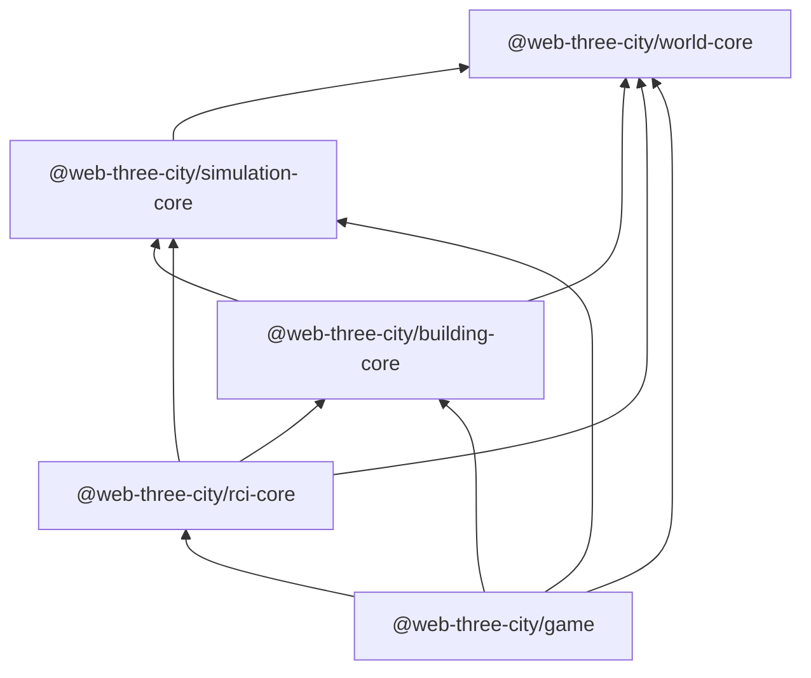
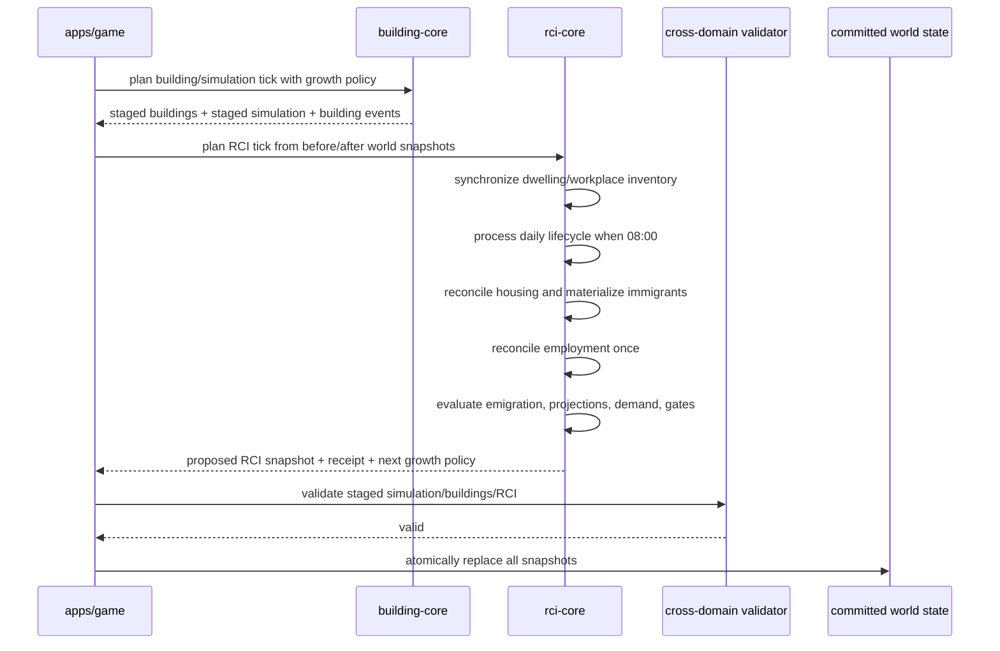

# RCI Demand & Occupancy Foundation v0.1 — Design Specification

**Status:** Approved design, pending written-spec review  
**Date:** 2026-08-06  
**Repository:** `petechatchawan/web-three-city`  
**Target branch:** `docs/rci-demand-occupancy-v0-1-planning`  
**Implementation package:** `packages/rci-core`  
**World persistence target:** `WorldSaveV5`

## 1. Decision Summary

RCI Demand & Occupancy Foundation v0.1 adds a deterministic, extensible city-population foundation without expanding into Economy, Utilities, Traffic, Education, City Services, Citizen AI, or full career simulation.

The authoritative model is citizen-based rather than aggregate-only:

- Citizens have stable identities and historical presence.
- Family relationships are first-class records.
- Households are flexible residence groups, separate from family relationships.
- Residential buildings expose versioned dwelling-unit capacity profiles.
- Commercial and industrial buildings expose versioned workplace position groups.
- Household membership, housing occupancy, qualifications, and employment are historical assignment records.
- Population, age histograms, employment totals, vacancies, and HUD statistics are derived projections.
- Birth, death, migration, housing reconciliation, employment reconciliation, demand evaluation, and growth-gate updates are deterministic.
- RCI growth is controlled by authoritative hysteresis gates and demand-weighted building selection.
- All tick work is planned, validated, and committed atomically.

### Locked product decisions

| Area | Decision |
|---|---|
| Scope | RCI Demand & Occupancy only |
| Population authority | Citizen Relationship Foundation |
| Historical records | Retain deceased and emigrated citizens |
| Age bands | EarlyChildhood 0–5, SchoolAge 6–17, WorkingAge 18–64, Seniors 65+ |
| Demographics | Citizen-level birth tick and extensible sex definitions; histograms are derived |
| Population lifecycle | Aging, birth, death, immigration, emigration |
| Fertility | Age-specific annual rates converted to deterministic daily hazard |
| Parenthood | Mother relationship required; father relationship optional |
| Relationships | Extensible first-class relationship records |
| Partner relationship | Canonical undirected record, max one active partner per citizen |
| Parent relationship | Directional parent-to-child record |
| Household | Flexible co-residence group |
| Housing | Dwelling units inside residential buildings |
| Residential capacity | Versioned content profile with fixed unit count and capacity |
| Employment | Stability-first best-fit matching with controlled upgrades |
| Job extensibility | Position groups and requirement definitions; occupations optional in v0.1 |
| Qualification bootstrap | Deterministic migration/cohort resolver, replaceable by Education later |
| Employment triggering | Deterministic end-of-tick invalidation queue |
| Housing loss | Immediate relocation, then displaced queue, then emigration |
| Displacement grace period | 720 ticks / 30 game days |
| General emigration | Lightweight multi-factor housing/employment pressure |
| Demand | Target-buffer model with fixed-point smoothing and factor registry |
| Growth control | Threshold + hysteresis gates and demand-weighted selection |
| Growth gate persistence | Authoritative and saved |
| Persistence | Lossless `RciSaveV1` inside `WorldSaveV5` |

## 2. Context

The current repository already has deterministic simulation time, building construction lifecycle, automatic development evaluation at 00:00, 06:00, 12:00, and 18:00, and `WorldSaveV4`. Buildings have geometry, zone compatibility, selection weight, and construction duration, but no residential occupancy or workplace capacity. Automatic growth currently evaluates eligible zoned land without a city-demand model.

This milestone introduces the minimum authoritative state needed for later systems such as Education, Occupations, Economy, Land Value, Services, Health, Traffic, Happiness, and Citizen AI while keeping those systems outside v0.1.

## 3. Goals

1. Make residential, commercial, and industrial growth respond to measurable city demand.
2. Model citizens, households, homes, workplaces, qualifications, and family relationships with stable identities.
3. Support deterministic aging, birth, death, immigration, relocation, displacement, employment, and emigration.
4. Preserve historical records needed for future family trees, careers, education, and city history.
5. Keep engine rules independent from DOM, Three.js, frame rate, wall-clock time, and callback order.
6. Maintain lossless save/load and continuous-run equivalence.
7. Expose narrow, documented APIs and bounded contexts that can be optimized independently.
8. Allow content expansion through registries rather than closed TypeScript unions.
9. Preserve the existing headless automatic-growth behavior: background simulation must never change the active player tool or cancel an input preview.

## 4. Non-Goals

The following are explicitly outside v0.1:

- Taxes, budgets, prices, wages, rent, or business profitability
- Utilities, healthcare, education facilities, police, fire, or other services
- Traffic, commute distance, trips, pathfinding, or transport accessibility
- Named occupations beyond optional content identifiers
- Education progression, degrees, licenses, skills, experience, salaries, or promotions
- Marriage-market simulation, divorce policy, adoption, guardianship, or social networks
- Citizen names, appearance, daily routines, agents, rendered pedestrians, or individual AI
- Homelessness gameplay; displaced residents remain in a bounded queue
- Building abandonment, demolition caused by negative demand, or density upgrading
- Runtime plugin loading, a generic ECS, a generic graph database, or event sourcing
- Parallel workers or incremental affected-set reconciliation in the first implementation

## 5. Architecture

### 5.1 Package dependency direction



Rules:

- `simulation-core` remains responsible only for clock, calendar, tick planning, and tick commit.
- `building-core` remains responsible for building definitions, placement, construction, activation, and bulldozing.
- `rci-core` owns population, relationship, household, housing, workplace, employment, migration, demand, and growth-gate state.
- `apps/game` composes immutable plans into one world-tick transaction.
- `building-core` and `simulation-core` must not import `rci-core`.
- UI, DOM, renderer, and Three.js code must not enter `rci-core`.

### 5.2 Internal bounded contexts

```text
packages/rci-core/src/
├─ contracts/
├─ definitions/
├─ population/
├─ relationships/
├─ households/
├─ housing/
├─ employment/
├─ migration/
├─ demand/
├─ events/
├─ projection/
├─ persistence/
├─ validation/
├─ rci-snapshot.ts
├─ rci-tick.ts
└─ index.ts
```

This is a responsibility map, not a requirement to create empty layers. Files must be split when they have more than one reason to change. Cross-context behavior is coordinated through plans, immutable records, and domain events rather than direct mutation.

### 5.3 Public API

`packages/rci-core/src/index.ts` exports only intentional contracts:

```ts
export {
  createInitialRciSnapshot,
  createRciSnapshot,
  planRciTick,
  commitRciTick,
  createRciProjection,
  createBuildingGrowthPolicy,
  encodeRciSaveV1,
  decodeRciSaveV1,
  validateRciSnapshot,
};

export type {
  RciConfiguration,
  RciDefinitionRegistries,
  RciSnapshot,
  RciTickInput,
  RciTickPlan,
  RciTickReceipt,
  RciProjection,
  RciSaveV1,
};
```

Internal helpers, mutable builders, indexes, sorting functions, and policy implementations are not public contracts.

## 6. Authority and Normalization

### 6.1 Authoritative state

- Citizen records
- Relationship records
- Household records
- Household membership history
- Citizen qualification history
- Dwelling-unit inventory
- Housing-assignment history
- Workplace inventory
- Employment-assignment history
- Incoming-household requests
- Displaced-household entries
- Demand state
- Growth-gate state
- deterministic seed, accumulators, and ID sequences

### 6.2 Derived projections

- Current household for a citizen
- Current members of a household
- Current dwelling for a household
- Current workplace and position group for a citizen
- Age and age band
- Age histograms by sex definition
- Household sizes
- Population and historical population counts
- Housing capacity, occupancy, vacancy, overcrowding, and displacement
- Workforce, employment, unemployment, underemployment, and vacancies
- RCI HUD statistics
- sibling, grandparent, and extended-family relationships

A value must not be persisted twice when it can be reconstructed exactly from authoritative records. Indexes and caches may exist at runtime but must be disposable and reproducible.

## 7. Stable Identifiers and Sequences

```ts
type CitizenId = string;
type HouseholdId = string;
type HouseholdMembershipId = string;
type RelationshipId = string;
type CitizenQualificationId = string;
type DwellingUnitId = string;
type HousingAssignmentId = string;
type WorkplaceId = string;
type EmploymentAssignmentId = string;
type IncomingHouseholdRequestId = string;

type SexDefinitionId = string;
type RelationshipTypeDefinitionId = string;
type QualificationDefinitionId = string;
type EmploymentRequirementDefinitionId = string;
type PositionGroupDefinitionId = string;
type OccupationDefinitionId = string;
type MigrationArchetypeDefinitionId = string;
type DemandFactorDefinitionId = string;
type CapacityProfileDefinitionId = string;
```

Generated IDs use persisted monotonic sequences:

```text
citizen:1
household:1
household-membership:1
relationship:1
citizen-qualification:1
housing-assignment:1
employment-assignment:1
incoming-household:1
```

Building-derived inventory uses canonical IDs:

```text
dwelling:<buildingInstanceId>:<unitIndex>
workplace:<buildingInstanceId>
```

IDs are never reused. A failed plan does not consume sequences.

## 8. Core Records and Invariants

### 8.1 Citizen

```ts
interface CitizenRecord {
  readonly citizenId: CitizenId;
  readonly presence: 'resident' | 'emigrated' | 'deceased';
  readonly sexDefinitionId: SexDefinitionId;
  readonly bornAtTick: number;
  readonly movedIntoCityAtTick: number;
  readonly movedOutOfCityAtTick: number | null;
  readonly diedAtTick: number | null;
}
```

Rules:

- `bornAtTick` may be negative for immigrants born before the city clock began.
- `bornAtTick` must be a safe integer and must not exceed the current simulation tick.
- `resident` has neither `movedOutOfCityAtTick` nor `diedAtTick`.
- `emigrated` has `movedOutOfCityAtTick` and no `diedAtTick` at the emigration transaction.
- `deceased` has `diedAtTick`; death is terminal.
- Deceased and emigrated records remain in the graph.
- Normal gameplay does not delete historical citizens.
- A deceased or emigrated citizen has no active household membership, housing assignment, or employment assignment.

Age is derived:

```text
ticksPerYear = 24 × 30 × 12 = 8,640
ageYears = floor((absoluteTick - bornAtTick) / 8,640)
```

Canonical bands:

| Band | Ages |
|---|---:|
| `age-band.early-childhood` | 0–5 |
| `age-band.school-age` | 6–17 |
| `age-band.working-age` | 18–64 |
| `age-band.senior` | 65+ |

### 8.2 Household

```ts
interface HouseholdRecord {
  readonly householdId: HouseholdId;
  readonly foundedAtTick: number;
  readonly dissolvedAtTick: number | null;
}
```

```ts
interface HouseholdMembershipRecord {
  readonly membershipId: HouseholdMembershipId;
  readonly householdId: HouseholdId;
  readonly citizenId: CitizenId;
  readonly startedAtTick: number;
  readonly endedAtTick: number | null;
  readonly endReasonDefinitionId: string | null;
}
```

Rules:

- A resident citizen has exactly one active household membership.
- Historical citizens have no active membership.
- A citizen cannot have overlapping active memberships.
- A household with resident members is active.
- A household with no resident members is dissolved in the same transaction.
- A dissolved household never reopens; a later co-residence group receives a new ID.
- Family relationship and co-residence are independent.
- Household identity does not change when the household relocates.

This normalized membership history is the authoritative replacement for duplicating `citizen.householdId` and `household.memberCitizenIds`.

### 8.3 Relationships

```ts
interface DirectionalRelationshipRecord {
  readonly relationshipId: RelationshipId;
  readonly orientation: 'directional';
  readonly typeDefinitionId: RelationshipTypeDefinitionId;
  readonly sourceCitizenId: CitizenId;
  readonly targetCitizenId: CitizenId;
  readonly startedAtTick: number;
  readonly endedAtTick: number | null;
}

interface UndirectedRelationshipRecord {
  readonly relationshipId: RelationshipId;
  readonly orientation: 'undirected';
  readonly typeDefinitionId: RelationshipTypeDefinitionId;
  readonly participantCitizenIds: readonly [CitizenId, CitizenId];
  readonly startedAtTick: number;
  readonly endedAtTick: number | null;
}
```

Built-in v0.1 definitions:

- `relationship.parent.biological.mother`
- `relationship.parent.biological.father`
- `relationship.partner`

Rules:

- Parent records are directional: parent is source, child is target.
- Partner records are undirected and store participant IDs in lexical canonical order.
- No self-reference.
- Every referenced citizen exists, including historical citizens.
- A child has at most one biological-mother record and one biological-father record.
- Biological parent age must be greater than child age.
- Parent records are permanent historical facts and are not ended by death or emigration.
- A citizen has at most one active partner record.
- Partner history may contain multiple non-overlapping records.
- Death closes an active partner record at `diedAtTick`.
- Ended records do not reopen; a new relationship uses a new ID.
- Sibling and grandparent links are derived, not persisted.

### 8.4 Citizen qualifications

```ts
interface CitizenQualificationRecord {
  readonly citizenQualificationId: CitizenQualificationId;
  readonly citizenId: CitizenId;
  readonly qualificationDefinitionId: QualificationDefinitionId;
  readonly awardedAtTick: number;
  readonly endedAtTick: number | null;
  readonly sourceDefinitionId: string;
}
```

v0.1 assigns exactly one active workforce-tier qualification to a working-age citizen, but the schema allows multiple non-conflicting future qualifications, degrees, licenses, or certifications.

Built-in content:

| ID | Rank |
|---|---:|
| `qualification.entry` | 10 |
| `qualification.skilled` | 20 |
| `qualification.professional` | 30 |

No employment engine branch may hard-code these IDs. Eligibility uses requirement and qualification registries.

Temporary v0.1 assignment distributions:

| Resolver context | Entry | Skilled | Professional |
|---|---:|---:|---:|
| Working-age immigrant | 55% | 32% | 13% |
| Resident reaching age 18 | 70% | 25% | 5% |

The resolver is replaceable. Education may later award or end qualification records without changing employment-assignment structure.

### 8.5 Dwelling-unit inventory

```ts
interface DwellingUnitRecord {
  readonly dwellingUnitId: DwellingUnitId;
  readonly buildingInstanceId: string;
  readonly capacityProfileDefinitionId: CapacityProfileDefinitionId;
  readonly unitIndex: number;
  readonly activatedAtTick: number;
  readonly retiredAtTick: number | null;
}
```

```ts
interface HousingAssignmentRecord {
  readonly housingAssignmentId: HousingAssignmentId;
  readonly householdId: HouseholdId;
  readonly dwellingUnitId: DwellingUnitId;
  readonly startedAtTick: number;
  readonly endedAtTick: number | null;
  readonly endReasonDefinitionId: string | null;
}
```

Rules:

- Dwelling inventory is created exactly once when a residential building becomes active.
- Unit IDs and indexes are deterministic.
- Active households have at most one active housing assignment.
- Active dwelling units have at most one active housing assignment.
- Incoming households materialize only into a unit with sufficient capacity.
- Birth may create overcrowding; birth is never rejected because of capacity.
- Displaced households have no active housing assignment but remain residents.
- Retiring a unit ends its active housing assignment in the same transaction.
- Retired units and ended assignments remain as history.

### 8.6 Workplace inventory

```ts
interface WorkplaceRecord {
  readonly workplaceId: WorkplaceId;
  readonly buildingInstanceId: string;
  readonly capacityProfileDefinitionId: CapacityProfileDefinitionId;
  readonly activatedAtTick: number;
  readonly retiredAtTick: number | null;
}
```

```ts
interface EmploymentAssignmentRecord {
  readonly employmentAssignmentId: EmploymentAssignmentId;
  readonly citizenId: CitizenId;
  readonly workplaceId: WorkplaceId;
  readonly positionGroupDefinitionId: PositionGroupDefinitionId;
  readonly startedAtTick: number;
  readonly endedAtTick: number | null;
  readonly endReasonDefinitionId: string | null;
}
```

Rules:

- Workplace inventory is created exactly once when a commercial or industrial building becomes active.
- A resident working-age citizen has at most one active employment assignment.
- Historical citizens have no active assignment.
- A workplace and its position group must be active and known.
- Active assignments cannot exceed position-group capacity.
- An employment requirement must be satisfied through the registry policy.
- Ended assignments remain immutable history.
- Controlled upgrade ends the old assignment and opens the new one atomically.

### 8.7 Migration queues

```ts
interface IncomingHouseholdRequest {
  readonly requestId: IncomingHouseholdRequestId;
  readonly archetypeDefinitionId: MigrationArchetypeDefinitionId;
  readonly requestedAtTick: number;
  readonly minimumResidentCapacity: number;
  readonly queuePriority: number;
  readonly deterministicSequence: number;
}

interface DisplacedHouseholdEntry {
  readonly householdId: HouseholdId;
  readonly displacedAtTick: number;
  readonly expiresAtTick: number;
  readonly minimumResidentCapacity: number;
  readonly displacementPressure: number;
  readonly deterministicSequence: number;
}
```

Rules:

- An incoming request is not city population and contains no citizen IDs.
- Materialization creates citizens, relationships, qualifications, household, memberships, and housing assignment atomically.
- A request materializes at most once.
- A household appears in the displaced queue at most once.
- A displaced household has resident members and no active housing assignment.
- Displaced allocation has priority over incoming requests.
- Queue ordering is stable and independent of input-array order.
- Incoming requests do not expire in v0.1.
- Request generation pauses at the configured queue cap; existing requests remain.
- Displaced entries expire after 720 ticks. Expiry causes relocation or household emigration in the same transaction.

### 8.8 Demand and growth gates

Demand uses fixed-point thousandths:

```ts
type DemandMilliPoint = number; // -100_000..100_000

interface RciDemandState {
  readonly residentialMilli: DemandMilliPoint;
  readonly commercialMilli: DemandMilliPoint;
  readonly industrialMilli: DemandMilliPoint;
  readonly evaluatedAtTick: number;
}

interface RciGrowthGateState {
  readonly residentialOpen: boolean;
  readonly commercialOpen: boolean;
  readonly industrialOpen: boolean;
  readonly evaluatedAtTick: number;
}
```

Rules:

- Demand and growth gates are authoritative.
- Demand is clamped to `-100_000..100_000`.
- Factor contributions are sorted by stable factor ID before aggregation.
- All weighting and smoothing use integer fixed-point arithmetic.
- Gate opening threshold is `+15_000`.
- Gate closing threshold is `+5_000`.
- Values between thresholds retain the prior gate state.
- Save/load preserves gates exactly.

## 9. Definition Registries

All expandable taxonomies use immutable validated registries.

```ts
interface RciDefinitionRegistries {
  readonly sexes: DefinitionRegistry<SexDefinition>;
  readonly relationshipTypes: DefinitionRegistry<RelationshipTypeDefinition>;
  readonly qualifications: DefinitionRegistry<QualificationDefinition>;
  readonly employmentRequirements: DefinitionRegistry<EmploymentRequirementDefinition>;
  readonly positionGroups: DefinitionRegistry<PositionGroupDefinition>;
  readonly occupations: DefinitionRegistry<OccupationDefinition>;
  readonly migrationArchetypes: DefinitionRegistry<MigrationArchetypeDefinition>;
  readonly capacityProfiles: DefinitionRegistry<CapacityProfileDefinition>;
  readonly demandFactors: DefinitionRegistry<DemandFactorDefinition>;
  readonly populationRateProfiles: DefinitionRegistry<PopulationRateProfileDefinition>;
}
```

Registry rules:

- IDs are non-empty stable strings.
- Duplicate IDs are rejected.
- References are validated when registries are constructed.
- Definitions are immutable after simulation starts.
- Save files store referenced IDs, not function bodies or registry copies.
- Decode fails with a structured compatibility error when a required definition is unavailable.
- Occupation definitions may be absent from initial position groups.
- Requirement definitions, not position-group code, decide eligibility.

Initial sex definitions are `sex.female` and `sex.male`. Engine contracts allow additional definitions. Fertility eligibility comes from a definition/profile, not string comparison.

## 10. Building Content Integration

`building-core` receives RCI capacity profile references as immutable content metadata. It does not own occupancy or employment state.

### 10.1 Residential profiles

| Building definition | Capacity profile | Units | Residents per unit | Total |
|---|---|---:|---:|---:|
| `residential-cottage-1x1` | `capacity.residential.cottage.v1` | 1 | 4 | 4 |
| `residential-rowhouse-1x2` | `capacity.residential.rowhouse.v1` | 1 | 5 | 5 |
| `residential-duplex-2x1` | `capacity.residential.duplex.v1` | 2 | 4 | 8 |
| `residential-apartment-2x2` | `capacity.residential.apartment.v1` | 6 | 3 | 18 |

### 10.2 Commercial workplace profiles

| Building | Position group capacities | Total |
|---|---|---:|
| Corner Shop | entry 3, skilled 1, professional 0 | 4 |
| Cafe | entry 4, skilled 2, professional 0 | 6 |
| Market | entry 7, skilled 4, professional 1 | 12 |
| Office | entry 4, skilled 8, professional 12 | 24 |

### 10.3 Industrial workplace profiles

| Building | Position group capacities | Total |
|---|---|---:|
| Depot | entry 4, skilled 1, professional 0 | 5 |
| Workshop | entry 6, skilled 3, professional 1 | 10 |
| Warehouse | entry 12, skilled 5, professional 1 | 18 |
| Factory | entry 16, skilled 10, professional 4 | 30 |

Position groups reference requirement definitions such as:

- `requirement.qualification.entry`
- `requirement.qualification.skilled`
- `requirement.qualification.professional`

The schema supports later position groups such as receptionist, teacher, engineer, nurse, manager, driver, or machine operator by assigning an optional `occupationDefinitionId` and a richer `employmentRequirementDefinitionId`. No RCI core data migration is required.

Capacity profile IDs are versioned. A future balance change uses a new profile ID and an explicit building-definition version or save migration; an existing profile is never silently redefined.

## 11. Snapshot Structure and Revisions

```ts
interface RciSnapshot {
  readonly revision: number;
  readonly deterministicSeed: number;

  readonly population: PopulationSnapshot;
  readonly relationships: RelationshipSnapshot;
  readonly households: HouseholdSnapshot;
  readonly housing: HousingSnapshot;
  readonly employment: EmploymentSnapshot;
  readonly migration: MigrationSnapshot;
  readonly demand: RciDemandSnapshot;
  readonly sequences: RciSequenceState;
}
```

Each bounded snapshot has its own revision. The root revision changes whenever any bounded snapshot changes.

```ts
interface RciSequenceState {
  readonly nextCitizen: number;
  readonly nextHousehold: number;
  readonly nextHouseholdMembership: number;
  readonly nextRelationship: number;
  readonly nextCitizenQualification: number;
  readonly nextHousingAssignment: number;
  readonly nextEmploymentAssignment: number;
  readonly nextIncomingRequest: number;
  readonly nextDomainEvent: number;
}
```

Migration state also persists its fixed-point attraction accumulator. No processed event queue is persisted.

## 12. Deterministic Randomness

RCI uses counter-based deterministic sampling rather than `Math.random()` or mutable PRNG iteration order.

```text
sample =
  hash(seed, eventType, evaluationTick, entityStableId, attemptIndex)
```

Properties:

- Same snapshot, definitions, tick, and input produce the same sample.
- Reordering arrays does not change outcomes.
- Save/load does not require preserving hidden PRNG state.
- Separate event namespaces prevent one subsystem from perturbing another.
- Hash output is converted to an integer probability range.
- IDs and event types are UTF-8 encoded canonically.
- The selected hash algorithm and encoding are covered by golden tests and cannot change without a save/replay compatibility decision.

Prohibited inside simulation logic:

- `Math.random()`
- `Date.now()`
- wall-clock or locale-dependent formatting
- object-key iteration used as decision order
- unstable `Array.sort()` comparators
- floating accumulation for demand or probabilities

## 13. Daily Population Lifecycle

Daily population evaluation occurs at game hour `08:00`. The initial game tick is already 08:00; the first lifecycle evaluation occurs on the next 08:00 boundary, not during initial snapshot construction.

### 13.1 Aging

Age is derived and requires no annual mutation. At daily evaluation, boundary events are emitted when a citizen changes a gameplay band:

- reaches age 6
- reaches age 18
- reaches age 65

A resident reaching age 18 receives a qualification through the temporary cohort resolver and invalidates employment matching.

### 13.2 Annual-rate conversion

Authored annual rates are compiled to integer daily hazard units for a 360-day year:

```text
dailyHazard = 1 - (1 - annualRate)^(1 / 360)
```

The conversion is centralized, rounded once to an integer probability scale, and tested with golden values. Runtime comparisons use integers.

### 13.3 Fertility

- Eligible mothers are resident citizens whose sex/profile exposes fertility rates.
- Eligibility and age-specific rates come from the population-rate registry.
- A successful event creates one child in v0.1.
- The child receives a stable ID, deterministic sex definition, `bornAtTick = evaluationTick`, resident presence, household membership, and a biological-mother relationship.
- If the mother has an active eligible partner, a biological-father relationship is added; otherwise father is absent.
- The child joins the mother's current household.
- Birth may cause overcrowding and housing pressure.
- Birth does not create an incoming request and is not blocked by housing capacity.

The initial synthetic balance profile is versioned and deliberately country-neutral:

| Mother age | Annual birth rate |
|---|---:|
| under 15 | 0 |
| 15–19 | 0.025 |
| 20–24 | 0.070 |
| 25–29 | 0.090 |
| 30–34 | 0.075 |
| 35–39 | 0.040 |
| 40–44 | 0.010 |
| 45–49 | 0.001 |
| 50+ | 0 |

These are gameplay defaults, not a claim about a specific real-world population.

### 13.4 Mortality

Mortality is evaluated for every resident using age- and sex-profile annual rates converted to daily hazard. A successful death:

1. marks the citizen deceased,
2. ends active household membership,
3. ends active employment,
4. closes an active partner relationship,
5. preserves parent and historical relationships,
6. dissolves an empty household,
7. releases a dwelling if the household dissolves,
8. appends reconciliation invalidations.

Initial synthetic base annual mortality:

| Age | Annual rate |
|---|---:|
| 0 | 0.0040 |
| 1–5 | 0.0003 |
| 6–17 | 0.00015 |
| 18–34 | 0.0005 |
| 35–49 | 0.0015 |
| 50–64 | 0.0060 |
| 65–74 | 0.0200 |
| 75–84 | 0.0600 |
| 85–99 | 0.1500 |
| 100+ | 0.3000 |

Sex profiles may apply versioned multipliers. Health, pollution, disasters, and services may later add hazard modifiers through a registry without changing citizen records.

## 14. Immigration and Household Materialization

### 14.1 Incoming-request generation

A replaceable `MigrationRequestPolicy` runs daily at 08:00.

The default v0.1 implementation uses a persisted fixed-point attraction accumulator:

- baseline external interest adds `350` milli-households per day,
- suitable vacant jobs may add up to `650` milli-households per day,
- at most two requests are generated per day,
- generation pauses when the incoming queue reaches 64 requests,
- existing requests never expire automatically.

This guarantees bootstrap demand even in an empty city while allowing job availability to accelerate immigration. Values are balance configuration.

### 14.2 Initial archetypes

The versioned registry contains at least:

| Archetype | Default weight | Capacity range |
|---|---:|---:|
| `migration.single-working-adult.v1` | 25 | 1 |
| `migration.working-couple.v1` | 20 | 2 |
| `migration.family-young-child.v1` | 25 | 3–4 |
| `migration.family-school-age.v1` | 20 | 3–5 |
| `migration.senior-single.v1` | 10 | 1 |

Archetypes define age distributions, relationships, minimum capacity, sex-definition distribution, and qualification-resolver inputs. They do not allocate IDs before materialization.

### 14.3 Allocation priority

When housing state changes or during end-of-tick reconciliation:

1. eligible displaced households, ordered stably,
2. incoming requests, ordered by priority, request tick, sequence, and ID.

Incoming materialization is atomic. If any citizen, relationship, qualification, household, membership, or housing record would be invalid, the request remains unchanged and the tick plan is invalid.

## 15. Housing Reconciliation

### 15.1 Building inventory synchronization

The RCI tick compares before/after building snapshots.

- Newly active residential building: create dwelling units.
- Newly active commercial/industrial building: create workplace.
- Removed residential building: retire units and end housing assignments.
- Removed commercial/industrial building: retire workplace and end employment assignments.
- Inventory creation is idempotent by canonical building-derived IDs.
- Construction buildings expose no active capacity.

### 15.2 Relocation and displacement

When a household loses housing:

1. search active vacant units with sufficient capacity,
2. choose best fit by minimum unused capacity, then dwelling ID,
3. relocate immediately when possible,
4. otherwise create one displaced entry,
5. retain resident status and employment while displaced.

A displaced household is retried whenever housing inventory or assignment changes and at each daily evaluation.

### 15.3 Expiry

`expiresAtTick = displacedAtTick + 720`.

At or after expiry:

- one final relocation attempt occurs,
- if no suitable unit exists, all resident members emigrate as a household,
- active memberships and employment assignments end,
- household is dissolved,
- relationships and historical records remain.

### 15.4 Overcrowding

Overcrowding is:

```text
max(0, active household member count - dwelling resident capacity)
```

It contributes to residential demand and emigration pressure. v0.1 does not split a household automatically.

## 16. Employment Reconciliation

Employment invalidations are appended when:

- citizen immigrates, reaches 18, dies, or emigrates,
- qualification changes,
- workplace activates or retires,
- position-group capacity or definition becomes incompatible,
- an assignment becomes invalid.

Events are deduplicated. v0.1 may reconcile globally, but the contract accepts:

```ts
type ReconciliationScope =
  | Readonly<{ kind: 'all' }>
  | Readonly<{
      kind: 'affected';
      citizenIds: readonly CitizenId[];
      workplaceIds: readonly WorkplaceId[];
    }>;
```

### 16.1 Stable matching order

1. Preserve every active assignment that remains valid.
2. Order unemployed eligible citizens by stable citizen ID.
3. Fill exact/best requirement matches before lower-suitability matches.
4. A citizen may fill a lower-rank position if the requirement policy allows it.
5. Lower-qualified citizens cannot fill unmet higher requirements.
6. Maximize employment after preserving valid assignments and minimizing qualification distance.
7. Break ties with position-group ID, workplace ID, then citizen ID.
8. Run a controlled improvement pass.
9. An underemployed citizen may move only to an unoccupied, strictly better position.
10. The move may not displace another citizen or reduce total employment.
11. A citizen changes job at most once per reconciliation.

Assignment end reasons are versioned definitions, including:

- `employment-ended.citizen-deceased`
- `employment-ended.citizen-emigrated`
- `employment-ended.workplace-retired`
- `employment-ended.no-longer-eligible`
- `employment-ended.best-fit-upgrade`

No frame, array, map, or callback ordering may influence the result.

## 17. Emigration Pressure

A replaceable factor registry evaluates each housed or displaced household daily.

Initial factors:

### Housing

- displaced status,
- days displaced,
- overcrowded member count,
- consecutive overcrowded days.

### Employment

- unemployed working-age member count,
- duration of unemployment,
- absence of compatible vacancies,
- underemployment count.

Factor outputs use fixed-point integers and produce a household total in `0..100_000`. The total is converted to a configured annual emigration rate and then daily hazard. A successful general-emigration event moves the household out as a group.

Displacement expiry is deterministic and independent of the general-emigration hazard.

Future factors may include taxes, cost of living, services, safety, health, pollution, happiness, education, and accessibility without changing the household schema.

## 18. Demand Model

Demand is evaluated after housing and employment reconciliation whenever the end-of-tick invalidation set requires it. Daily lifecycle always invalidates demand. The evaluation may run more frequently than daily when a building activates, is bulldozed, or an incoming/displaced queue changes.

### 18.1 Factor contract

```ts
interface DemandFactorDefinition {
  readonly id: DemandFactorDefinitionId;
  readonly appliesTo: readonly ZoneDefinitionId[];
  readonly weightMilli: number;
  evaluate(context: DemandEvaluationContext): DemandMilliPoint;
}
```

Each factor returns a normalized value in `-100_000..100_000`.

### 18.2 Initial factors

Residential:

- vacancy target gap,
- incoming household capacity pressure,
- displaced resident pressure,
- overcrowding pressure.

Commercial:

- commercial position vacancy target gap,
- compatible unemployed workforce pressure,
- commercial/industrial target balance.

Industrial:

- industrial position vacancy target gap,
- compatible unemployed workforce pressure,
- commercial/industrial target balance.

Initial configurable targets and weights:

| Demand | Factor | Weight |
|---|---|---:|
| Residential | vacancy target gap | 45% |
| Residential | incoming queue | 25% |
| Residential | displacement | 20% |
| Residential | overcrowding | 10% |
| Commercial | sector vacancy target gap | 45% |
| Commercial | compatible unemployment | 35% |
| Commercial | sector balance | 20% |
| Industrial | sector vacancy target gap | 45% |
| Industrial | compatible unemployment | 35% |
| Industrial | sector balance | 20% |

Initial vacancy targets:

- residential dwelling vacancy: 10%,
- commercial position vacancy: 8%,
- industrial position vacancy: 8%.

### 18.3 Smoothing

```text
next = previous + roundHalfAwayFromZero((raw - previous) × 250 / 1000)
```

The initial smoothing factor is 0.25 and is configurable in integer thousandths. No floating-point accumulator is persisted.

### 18.4 Growth gate

For each zone independently:

```text
demand >= +15_000  -> open
demand <=  +5_000  -> close
otherwise          -> preserve previous state
```

Demand multipliers:

| Demand | Multiplier |
|---|---:|
| 15–34.999 | 1.0× |
| 35–59.999 | 1.5× |
| 60–79.999 | 2.0× |
| 80–100 | 3.0× |

Multipliers use fixed-point integer units.

## 19. Building Growth Integration

`building-core` accepts a caller-supplied policy rather than importing RCI:

```ts
interface BuildingGrowthPolicy {
  readonly eligibleZoneDefinitionIds: readonly ZoneDefinitionId[];
  readonly demandWeightMilliByZoneDefinitionId:
    Readonly<Record<ZoneDefinitionId, number>>;
}
```

`rci-core` derives this policy from demand and growth gates. `apps/game` passes it to building growth planning.

Rules:

- Closed gates exclude the zone from candidate growth.
- Open gates retain existing definition priority and weight, multiplied by demand.
- RCI demand does not directly create, remove, or abandon buildings.
- Existing development evaluation hours remain 00:00, 06:00, 12:00, and 18:00.
- A construction completion may create capacity and trigger same-tick reconciliation.
- Background growth remains headless and cannot switch tool mode, synthesize pointer actions, clear active sessions, cancel previews, or alter undo history.

## 20. End-of-Tick Transaction



Canonical internal order:

1. Validate input revisions and registries.
2. Stage building lifecycle changes and simulation tick.
3. Append building activation/retirement events.
4. Synchronize dwelling and workplace inventory.
5. At 08:00, stage age-boundary, fertility, mortality, migration-request, displacement-expiry, and emigration events.
6. Sort domain events by tick, priority, entity kind, entity ID, and sequence.
7. Apply population and relationship mutations.
8. Reconcile housing; materialize incoming households.
9. Deduplicate employment invalidations.
10. Reconcile employment once.
11. Recompute projections needed by pressure and demand.
12. Evaluate emigration effects that are scheduled for this tick and re-run bounded cleanup when required.
13. Evaluate demand and growth gates.
14. Validate the complete staged state.
15. Commit simulation, buildings, and RCI snapshots atomically.

Housing precedes employment because housing may materialize new citizens. Employment runs after all population changes so event-driven changes are visible within the same tick.

The queue is ephemeral inside the plan. There is never a save with half-processed events.

## 21. Plan, Validate, Commit Contracts

```ts
interface RciTickPlan {
  readonly baseRciRevision: number;
  readonly baseSimulationRevision: number;
  readonly baseBuildingRevision: number;
  readonly beforeAbsoluteTick: number;
  readonly afterAbsoluteTick: number;
  readonly proposedSnapshot: RciSnapshot;
  readonly emittedEvents: readonly RciDomainEvent[];
  readonly valid: boolean;
  readonly invalidReason: RciInvalidReason | null;
}
```

```ts
planRciTick(input: RciTickInput): RciTickPlan;
commitRciTick(input: {
  readonly rci: RciSnapshot;
  readonly simulationBefore: SimulationSnapshot;
  readonly simulationAfter: SimulationSnapshot;
  readonly buildingsBefore: BuildingSnapshot;
  readonly buildingsAfter: BuildingSnapshot;
  readonly plan: RciTickPlan;
}): Readonly<{
  readonly snapshot: RciSnapshot;
  readonly receipt: RciTickReceipt;
}>;
```

Commit checks all base revisions, ticks, referenced building states, registries, and plan validity. A stale or invalid plan throws a typed contract error and changes nothing.

Cross-domain validation is pure:

```ts
validateRciSnapshot(
  rci,
  buildings,
  simulation,
  registries,
): RciValidationResult;
```

## 22. Structured Errors

Representative error codes:

```text
rci:invalid-state
rci:invalid-plan
rci:stale-rci-plan
rci:stale-simulation-plan
rci:stale-building-plan
rci:unknown-definition
rci:sequence-overflow
rci:dangling-citizen
rci:dangling-household
rci:dangling-building
rci:duplicate-active-membership
rci:duplicate-active-partner
rci:duplicate-active-housing
rci:duplicate-active-employment
rci:capacity-exceeded
rci:invalid-relationship
rci:invalid-queue
rci:invalid-demand
rci:incoherent-world-revision
```

Decode errors use `Result` rather than throwing for untrusted input. Contract misuse and stale commits throw typed errors, matching existing core-package patterns.

## 23. Persistence

### 23.1 `RciSaveV1`

`RciSaveV1` serializes:

- deterministic seed,
- every bounded-context revision,
- sorted authoritative record arrays,
- migration attraction accumulator,
- incoming and displaced queues,
- demand and gate state,
- all ID sequences.

It does not serialize:

- indexes,
- current-state maps,
- histograms,
- projections,
- processed domain events,
- registry definitions,
- UI state.

Arrays are encoded in canonical stable-ID order. Decode validates local records, cross-record references, definition references, sequences, and cross-domain coherence.

### 23.2 `WorldSaveV5`

```ts
interface WorldSaveV5 {
  readonly kind: 'world-save';
  readonly schemaVersion: 5;
  readonly terrain: TerrainSaveV1;
  readonly roads: RoadSaveV1;
  readonly zones: ZoneSaveV1;
  readonly buildings: BuildingSaveV2;
  readonly simulation: SimulationSaveV1;
  readonly rci: RciSaveV1;
}
```

### 23.3 Migration from V1–V4

Existing world saves remain loadable.

For V1–V3, existing terrain/road/zone/building migrations run first. For V4:

1. retain terrain, road, zone, building, and simulation state,
2. create an empty RCI snapshot at the saved simulation tick,
3. create dwelling inventory for every active residential building,
4. create workplace inventory for every active commercial/industrial building,
5. create no citizens, households, assignments, or historical records,
6. initialize demand to zero,
7. initialize all growth gates closed,
8. initialize migration queues empty and the attraction accumulator at zero,
9. allow normal daily migration to bootstrap population after load.

Construction buildings receive inventory only when they become active.

Migration is deterministic, idempotent, and covered by golden fixtures. Loading and saving the migrated world produces V5.

## 24. Runtime and UI Integration

The game HUD adds a compact RCI summary without redesigning the build tools:

- total resident population,
- households,
- occupied / vacant dwellings,
- employed / workforce,
- unemployment percentage,
- R, C, and I demand values,
- optional gate-open indicator for test/debug accessibility.

No citizen browser, family tree, occupation list, or detailed demographic panel is included.

UI values come from `RciProjection`. The DOM does not calculate simulation totals.

Save/load, reset, pause, speed, and step controls continue to work. Step advances exactly one tick and runs the complete RCI transaction.

## 25. Maintainability Rules

The implementation must satisfy:

1. No circular package dependency.
2. No DOM, Three.js, browser global, real time, or random global in `rci-core`.
3. Immutable input and output records.
4. Narrow public exports.
5. Registries for expandable taxonomies.
6. One authoritative source for each relationship or assignment.
7. Historical records are append/end, not destructive rewrites.
8. Fixed-point arithmetic for demand, pressure, and probability thresholds.
9. Stable sorting before every order-sensitive operation.
10. Local validators plus one cross-domain validator.
11. No hidden singleton state.
12. No business logic in UI adapters.
13. No unbounded nested citizen-by-workplace scan. Index position groups and eligible citizens before matching.
14. Global reconciliation may be O(citizens + assignments + position groups + vacancies), with stable indexed matching.
15. Projection caches are optional and reconstructible.
16. Capacity and balance definitions are versioned and never silently redefined.
17. Internal modules remain replaceable behind policy contracts; generic frameworks are not introduced without a concrete consumer.
18. Background simulation cannot affect player tool state or undo state.

## 26. Testing Strategy

### 26.1 Contract and invariant tests

- citizen presence transitions,
- negative immigrant birth ticks,
- age-band boundaries,
- household membership non-overlap,
- household dissolution,
- parent and partner cardinality,
- canonical partner ordering,
- historical relationship preservation,
- unit and workplace activation/retirement,
- capacity enforcement,
- qualification and requirement compatibility,
- assignment history,
- queue ordering and priority,
- displacement expiry,
- demand clamp, smoothing, and hysteresis,
- sequence overflow and stale plans.

### 26.2 Determinism tests

For every order-sensitive planner:

- permute citizen, household, relationship, unit, workplace, assignment, event, and definition input order,
- assert byte-equivalent canonical save output,
- assert equal receipts and projections,
- run continuously and compare with save/load/resume,
- run the same tick twice from the same base snapshot,
- verify invalid plans do not consume sequences.

### 26.3 Population lifecycle tests

Use injectable fixture rate profiles for guaranteed events:

- birth with partnered mother,
- birth with no active partner,
- death ending employment and partner relationship,
- child reaching age 18 and receiving qualification,
- birth-caused overcrowding,
- household dissolution after final resident death,
- historical graph remains valid.

### 26.4 Housing and migration tests

- request generation accumulator,
- queue cap without request expiry,
- displaced priority over incoming,
- best-fit relocation,
- incoming materialization transaction,
- no citizen IDs allocated before materialization,
- displacement survives save/load,
- expiry at exactly 720 ticks,
- household emigration preserving history.

### 26.5 Employment tests

- preserve valid assignments,
- exact match first,
- legal down-ranking,
- reject insufficient qualification,
- stable tie-breaking,
- capacity limits,
- controlled upgrade without displacement,
- one move per citizen per reconciliation,
- workplace retirement invalidation,
- same-tick immigrant employment.

### 26.6 Demand and growth tests

- target-buffer factors,
- fixed-point aggregation order,
- smoothing golden values,
- gate open/close/retain behavior,
- demand multipliers,
- closed zone excluded from growth,
- gate state survives save/load,
- growth does not change UI tool mode or preview state.

### 26.7 Persistence tests

- `RciSaveV1` round trip,
- canonical ordering,
- unknown definition errors,
- dangling reference errors,
- sequence coherence,
- V1–V4 to V5 migration,
- migrated active-building inventory,
- continuous V5 run equals save/load/resume.

### 26.8 Browser acceptance

At minimum:

1. Zone residential land, advance time, observe incoming pressure and demand-gated residential growth.
2. Activate homes, materialize households, and observe population.
3. Zone commercial/industrial land, observe job demand and employment.
4. Save/load and verify all displayed RCI totals and gates are unchanged.
5. Bulldoze an occupied home, verify relocation or displacement.
6. Advance 720 ticks under a controlled fixture and verify emigration.
7. Keep a zone/road/terrain tool active while background growth and RCI reconciliation occur.

## 27. Verification Gates

Every implementation PR must pass:

```text
pnpm format:check
pnpm lint
pnpm typecheck
pnpm provenance:check
pnpm test
pnpm test:deployment
pnpm build
```

Final integration additionally passes:

```text
pnpm verify:full
```

Required evidence:

- exact commit SHA,
- package test results,
- full browser result,
- save migration fixtures,
- deterministic permutation evidence,
- continuous versus save/load/resume evidence,
- clean-worktree verification,
- confirmation that no active-tool regression was introduced.

Performance is baselined before a hard timing gate. The implementation must include a deterministic synthetic-city benchmark and report:

- daily lifecycle processing,
- global housing reconciliation,
- global employment reconciliation,
- demand evaluation,
- save encode/decode,

at representative populations. The first release must avoid algorithmic quadratic behavior; timing budgets become hard gates only after stable CI baselines exist.

## 28. Implementation Decomposition

This design is intended to be implemented through focused PRs:

### PR 1 — RCI Core Contracts, Registries, Snapshots, and Save V1

- package scaffold,
- definition registries,
- authoritative records,
- revisions/sequences,
- validators,
- canonical serialization,
- WorldSaveV5 envelope and V1–V4 migration foundation.

### PR 2 — Population, Relationships, Households, and Daily Lifecycle

- citizens and historical presence,
- memberships,
- relationship graph,
- qualification records/resolvers,
- age bands,
- fertility and mortality,
- deterministic sampling.

### PR 3 — Dwelling Inventory, Migration, Relocation, and Displacement

- residential profiles,
- dwelling activation/retirement,
- housing assignments,
- incoming request generation/materialization,
- relocation,
- displaced queue and expiry,
- housing/emigration pressure.

### PR 4 — Workplaces and Employment Reconciliation

- workplace profiles,
- position groups and requirements,
- employment assignments,
- invalidation events,
- stability-first matching,
- controlled upgrades.

### PR 5 — RCI Demand and Building Growth Policy

- factor registry,
- fixed-point target-buffer evaluation,
- smoothing,
- authoritative hysteresis gates,
- building-growth policy input,
- headless integration regression coverage.

### PR 6 — Atomic Game Integration, HUD, Browser Acceptance, and Final Verification

- world-tick transaction orchestration,
- complete V5 save/load,
- compact RCI HUD,
- browser acceptance,
- benchmark report,
- full verification evidence.

Each PR must be independently reviewable, preserve `master` behavior outside its scope, and avoid placeholder production APIs.

## 29. Acceptance Criteria

The milestone is complete only when:

- citizen, relationship, household, housing, workplace, employment, migration, demand, and gate authority exists,
- active residential/commercial/industrial buildings expose deterministic capacity,
- birth, death, immigration, displacement, relocation, employment, and emigration are deterministic,
- historical citizens and relationships survive all transitions,
- RCI demand controls growth through persisted hysteresis gates,
- `WorldSaveV5` round-trips losslessly and migrates prior saves,
- all projections are reconstructible from authority,
- no input ordering, frame rate, callback order, or save boundary changes outcomes,
- the browser HUD demonstrates the simulation loop,
- background growth never interrupts player tools,
- full verification passes with recorded evidence.

## 30. Deferred Extension Map

The foundation intentionally supports later additions through existing boundaries:

| Future system | Extension boundary |
|---|---|
| Education | qualification records and resolver replacement |
| Detailed occupations | occupation and employment-requirement definitions |
| Career progression | employment history and qualification history |
| Economy and wages | workplace/assignment projections and demand factors |
| Rent and affordability | housing assignments and emigration factors |
| Land value | demand factors and building-growth policy composition |
| Health and services | population hazard modifiers |
| Pollution and disasters | hazard modifiers and domain events |
| Traffic and commute | employment/housing assignments plus accessibility factors |
| Marriage/divorce/adoption | relationship-type registry and historical records |
| Family tree UI | relationship graph projections |
| Citizen AI | stable citizen identity and authoritative assignments |
| Incremental reconciliation | `ReconciliationScope` affected sets |
| Worker execution | immutable plans and serializable snapshots |

No deferred system is required to complete v0.1.
