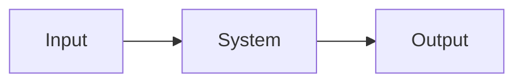

# <System Name>

**Status:** Implemented | Partial | Approved design — not implemented | Planned | Deprecated  
**Last verified against:** `<commit or branch>`  
**Primary ownership:** `<packages and integration files>`  
**Persistence:** `<save schema or none>`

## Purpose

One short paragraph describing the player-facing and architectural responsibility.

## Does Not Own

List adjacent concerns that must remain in other systems.

## Current Capabilities

Describe only behavior that exists on the verified branch. Mark planned behavior separately.

## Ownership and State

### Authoritative

- state that cannot be reconstructed from another source;
- owner package or file.

### Derived

- projections, caches, render data, and summaries rebuilt from authority.

## Main Workflows

1. input or trigger;
2. plan and validation;
3. commit and receipt/events;
4. downstream projection or rendering.

## Integrations

Explain what the system reads, what it emits, and which direction dependencies flow.

## Persistence

State Save version, migration behavior, validation, and what is deliberately derived rather than stored.

## Invariants and Failure Behavior

- deterministic ordering and seed rules;
- revision or stale-plan protection;
- atomicity and cross-system references;
- invalid-state handling.

## Extension Points

List intentional seams already supported by contracts or registries. Do not promise unapproved behavior.

## Current Limitations

List important unsupported behavior so a future worker does not infer it exists.

## Handoff Checklist

- Start reading: `<entry files>`
- Core tests: `<test locations>`
- Browser/runtime tests: `<test locations>`
- Related systems: `<links>`

## Related Documents

- Specs:
- ADRs:
- TDD plans:
- Verification:
- Relevant PRs:
