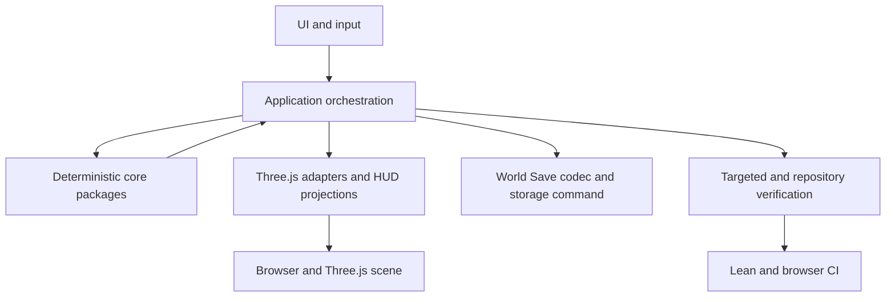

# Architecture and Infrastructure System

**Status:** `CLOSED / PASS` — Architecture and Infrastructure Upgrade v0.1

**Verified runtime baseline:** `master@48919fb3e49d894857b1e0cf23791cea43433b7b`
**Primary ownership:** repository architecture rules, `apps/game` application orchestration, repository verification tooling, CI/browser verification  
**Persistence:** Git-tracked architecture and verification documentation; existing gameplay Save schemas remain unchanged

## Purpose

Define and incrementally enforce the seams that keep deterministic domain systems isolated, make cross-system coordination explicit, reduce `game-bootstrap.ts` blast radius, and let future systems such as Economy, Utilities, Services, Land Value, Traffic, and Density integrate without circular ownership.

This system is an architecture and enforcement boundary. It does not own gameplay state or replace the domain systems documented in the neighboring system handoffs.

## Does Not Own

- Terrain, Water, Roads, Zoning, Buildings, Simulation, or RCI domain authority.
- Three.js scene state or browser UI state.
- Gameplay features such as Economy, Utilities, Services, Traffic, Land Value, Density, or citizen movement.
- Save schema redesign or migration for architectural convenience.
- A permanent `develop` branch.

## Current Capabilities

- Phase 1 baseline audit and the approved seam-first architecture plan are complete.
- Root `AGENTS.md` defines the Verification Ladder and conservative Level 2 map.
- Repository-native architecture contracts enforce acyclic workspace imports, package-to-app and core-to-presentation separation, manifest consistency, and non-DOM core TypeScript boundaries before slow package suites.
- Core browser-global leaks found by enforcement were removed with deterministic, wire-compatible codecs/UTF-8 behavior rather than restoring DOM ambient authority.
- `CommittedWorldStore` composes Terrain, Water, Roads, Zones, Buildings, Simulation, RCI, and candidate-derived placement environments behind one application revision fence.
- Committed-world publication and reads reconstruct canonical defensive domain snapshots so typed-array-backed state cannot be mutated through an application read boundary.
- `DefaultWorldTransactionCoordinator` validates complete candidates before one authoritative publication and reports presentation degradation separately from domain commit status.
- `SaveCoordinator` owns world Save/Load commands against coherent committed state; the Save wire schema remains unchanged.
- `UndoCoordinator` restores the complete prior dependent domain world while only the application publication revision advances.
- Building content is fenced by deterministic fingerprint for RCI planning; Building changes reconcile dwelling/workplace inventory before publication.
- Interactive Terraform/Road/Zone/Building mutations and foreground/background simulation changes publish through the committed-world seam before presentation.
- `PresentationCoordinator` owns ordered full-world adapter synchronization, incremental/no-op publication ports, and committed-world rebuild recovery without owning domain, tool, or Undo state.
- `TemporalPublicationController` keeps the five automatic minute/quanta authority commits ordered and revision-visible while coalescing external presentation/adoption at the application boundary; public single-step commands remain legacy per-commit seams.
- Normal Game verification includes both `apps/game/src/**/*.test.ts` and `apps/game/test/**/*.test.ts`, with repository contracts binding the physical inventory to Vitest discovery.
- Browser tests carry grep-compatible ownership tags while the unfiltered Chromium project remains the release authority; deterministic fixture construction is centralized behind the reviewed browser fixture seam.
- CI keeps Lean as the verification/build owner, uploads exact Game/Terrain Lab build outputs, and makes the Browser job consume those artifacts instead of rerunning Lean verification/builds.
- CI frozen installs disable dependency lifecycle scripts; the local exact-head Level 4 command remains `pnpm verify:full`.

## Ownership and State

### Authoritative

- Domain snapshots remain authoritative inside their owning `*-core` packages.
- `apps/game` remains the composition root and owns application-level coordination.
- `CommittedWorldStore` owns the coherent application publication boundary; it composes but does not duplicate domain facts.
- Save authority remains the existing versioned world envelope until a separately approved Save decision changes it.

### Derived

- Water, occupancy, placement environments, indexes, projections, HUD values, and renderer objects remain derived.
- Application read models compose authoritative snapshots and derived environments but do not become a second domain store.
- Candidate Road/Zone/Building placement environments are derived and provenance-validated before atomic publication when they travel with the committed-world view; they are not post-publication authoritative caches.
- Browser evidence and CI metadata remain verification outputs, not runtime authority.

## Main Workflows

1. Audit actual package imports, ownership, state authority, transactions, tests, and CI.
2. Enforce layer rules with fast repository-native contract checks.
3. Coordinate complete committed-world publication, Save/Load ownership, dependent-world Undo, tick reconciliation, and presentation synchronization from the application layer.
4. Characterize and extract one coherent presentation/bootstrap responsibility at a time without changing gameplay behavior.
5. Classify browser tests and optimize CI without weakening deterministic release verification.
6. Record before/after measurements and close the program with exact-head evidence.

## Integrations

The dependency direction remains inward toward domain packages and outward toward adapters. Core packages must not import `apps/*`, DOM, browser UI, or `*-three` packages. Cross-system policy belongs in application orchestration or explicit domain contracts, not in circular core imports.

## Persistence

The Architecture and Infrastructure program introduces no Save wire-schema or persisted-field change. Existing `WorldSaveV1` through `WorldSaveV5`, `RciSaveV1`, and domain Save contracts remain authoritative. Approved V3/V4 migration may reconstruct derived workplace inventory from persisted active Buildings before Load returns; it must not invent V1/V2 Building-linked state. Any persisted-field, wire-format, or version change must stop, add an ADR, and obtain separate approval before changing code.

## Invariants and Failure Behavior

- Every authoritative fact has one owner.
- A committed-world publication contains mutually valid snapshots and derived environments.
- Application reads preserve canonical defensive domain snapshot semantics; callers cannot mutate committed typed-array state through an exposed read model.
- Cross-system plans derive required placement environments from candidate snapshots and validate required revisions, content fingerprints, and environment provenance before publication.
- Failed or stale pre-publication work publishes no partial state and consumes no deterministic sequence values.
- A publication result of `rejected` means authority is unchanged; `committed` means authority changed and presentation status is reported separately as synchronized or degraded.
- Save reads only committed, coherent state.
- Undo restores a coherent dependent world or executes a complete reverse command; domain snapshots return to their prior content/revisions while the application publication revision advances.
- Presentation and HUD update only after authoritative publication; post-publication presentation failure never rolls back domain authority.
- Full-world presentation recovery rebuilds every registered derived adapter from one committed-world snapshot through `PresentationCoordinator`.
- Incremental/background presentation callbacks do not own or mutate active tool and Undo authority.
- Tick ordering, fixed-point arithmetic, Save migration, and browser determinism remain unchanged unless an ADR explicitly replaces a rule.
- Automatic temporal presentation compares the pre-batch committed world with the final post-Q4 world; dynamic-only batches skip full static synchronization, while static changes perform one full synchronization before one final adoption/notification.

## Extension Points

- Application projections for future Economy, Utilities, Services, Land Value, Traffic, and Density.
- Versioned policy/factor inputs that preserve `rci-core` ownership of RCI authority.
- Explicit ports only where more than one real adapter or a stable test seam exists.
- Repository-native dependency and layer checks before considering a task-orchestration framework.
- Playwright ownership tags and relevant-system projects while retaining a full release project.

## Current Limitations

- `game-bootstrap.ts` remains the composition root and still contains substantial concrete adapter/input wiring; only the duplicated full-world presentation synchronization lifecycle has moved to a bounded coordinator.
- Test/CI Architecture v0.2 is implemented and verified on the tree-identical PR5 candidate and merged runtime tree.
- Before/after measurements, CI evidence, and remaining non-blocking debt are closed in the [authoritative v0.1 closure record](verification/2026-08-08-architecture-infrastructure-v0-1-closure.md).

## Handoff Checklist

- Start reading: [Phase 1 baseline audit](verification/2026-08-07-architecture-infrastructure-phase-1-baseline.md)
- Final milestone evidence: [Architecture and Infrastructure Upgrade v0.1 closure](verification/2026-08-08-architecture-infrastructure-v0-1-closure.md)
- Approved design: [Architecture and Infrastructure Upgrade v0.1](specs/2026-08-07-architecture-infrastructure-upgrade-v0-1.md)
- ADRs: [architecture ADR directory](adrs/)
- TDD plan: [Architecture and Infrastructure Upgrade v0.1](tdd/2026-08-07-architecture-infrastructure-upgrade-v0-1.md)
- Application seams: `apps/game/src/application/committed-world.ts`, `world-transaction-coordinator.ts`, `save-coordinator.ts`, `undo-coordinator.ts`, `presentation-coordinator.ts`
- Bootstrap composition root: `apps/game/src/game-bootstrap.ts`
- Verification authority: [`AGENTS.md`](../../../AGENTS.md)
- Related systems: [World](../world/README.md), [Buildings](../buildings/README.md), [Simulation Time](../simulation-time/README.md), [RCI](../rci/README.md), [Economy](../economy/README.md), [Development Workflow](../development-workflow/README.md)

## Related Documents

- Specification: [Architecture and Infrastructure Upgrade v0.1](specs/2026-08-07-architecture-infrastructure-upgrade-v0-1.md)
- ADRs: [ADR-0001](adrs/0001-application-orchestration-seam.md), [ADR-0002](adrs/0002-complete-world-publication-and-dependent-undo.md), [ADR-0003](adrs/0003-repository-native-boundary-enforcement.md), [ADR-0004](adrs/0004-layered-targeted-verification-and-ci.md)
- TDD plan: [Architecture and Infrastructure Upgrade v0.1](tdd/2026-08-07-architecture-infrastructure-upgrade-v0-1.md)
- Verification: [Phase 1 baseline](verification/2026-08-07-architecture-infrastructure-phase-1-baseline.md), [v0.1 final closure](verification/2026-08-08-architecture-infrastructure-v0-1-closure.md)

## Implementation Slice 1

Repository-native architecture boundary checks enforce declared acyclic workspace imports, package-to-app/core-to-presentation separation, runtime dependency classification, and non-DOM core TypeScript libraries. Confirmed manifest drift is corrected without runtime behavior change, and the architecture gate runs before recursive package tests.

## Implementation Slice 2

The complete committed-world application seam is available in `apps/game/src/application`. It composes Terrain, Water, Roads, Zones, Buildings, Simulation, RCI, and candidate-derived placement environments behind one application revision fence. Typed-array authority is copied on publication and read, environment provenance is validated before replacement, and content fingerprinting ignores adapter function identity. Legacy runtime paths remain compatibility internals only until their bounded extraction; PR 2 did not move Save, Undo, or gameplay mutation ownership.

## Implementation Slice 3

Runtime mutation authority routes through the committed-world transaction seam. Terraform, Road, Zone, Building bulldoze, simulation ticks, Save/Load, and dependent-world Undo all publish one complete candidate revision before presentation. Building mutations reconcile dwelling/workplace RCI inventory before publication, Save reads only `CommittedWorldStore`, Load publishes decoded state through the same coordinator, and Undo restores the complete prior domain world while advancing only the application revision. Presentation failures after publication are recovery events and do not roll domain authority back.

The runtime read side now uses the same authority boundary: `GameRuntime.snapshot()` and `subscribeCommittedWorld()` expose the committed projection, logical stepping goes through `advanceLogicalTick()`, and the browser time/test projection serializes via the runtime `SaveCoordinator` path. `main.ts` no longer decodes Save data, reads storage keys, maintains a second Simulation authority, or reads Building authority back from the Three.js presentation layer.

The Level 4 browser gate exposed a defensive-read bug during this slice: plain frozen typed-array copies lost canonical snapshot getter semantics and allowed mutation planning to mutate the read model. The application read boundary now reconstructs canonical snapshots, and a curated-runtime Road publication regression test protects this contract.

## Implementation Slice 4

`PresentationCoordinator` is the first bounded bootstrap extraction. It owns the ordered full-world presentation synchronization lifecycle and the complete/incremental/no-op `WorldPresentationPort` variants while accepting only explicit callbacks and committed-world input. Concrete Three.js adapters remain wired by `game-bootstrap.ts`, preserving the composition root instead of introducing a God Coordinator.

WebGL context restoration now clears transient previews and asks the same coordinator to rebuild all committed presentation roots from `WorldTransactionCoordinator.snapshot()`, removing the second handwritten Terrain/Water/Grid/Road/Zone/Building/selection/input rebuild sequence. Focused characterization tests lock publication-before-presentation ordering, complete rebuild coverage, background tool/Undo non-ownership, and lifecycle cleanup on adapter failure.

## Implementation Slice 5

Game test discovery now includes `apps/game/test`, and topology contracts bind the current physical test inventory to Vitest collection so browser-independent application tests cannot silently disappear from normal verification. Browser specs are ownership-tagged without replacing the unfiltered Chromium release project, and direct source fixture construction is confined to explicit reviewed seams enforced by an adversarial import-scanner fixture.

Lean CI remains the repository verification and build owner. It archives the exact Game and Terrain Lab preview outputs as `lean-builds`; the Browser job depends on Lean, restores those outputs, installs Chromium, and runs the complete browser suite without rerunning Lean verification or browser builds. Dependency installation disables lifecycle scripts in CI, failure artifacts remain retained, and `pnpm verify:full` remains the exact-head local Level 4 release command.
