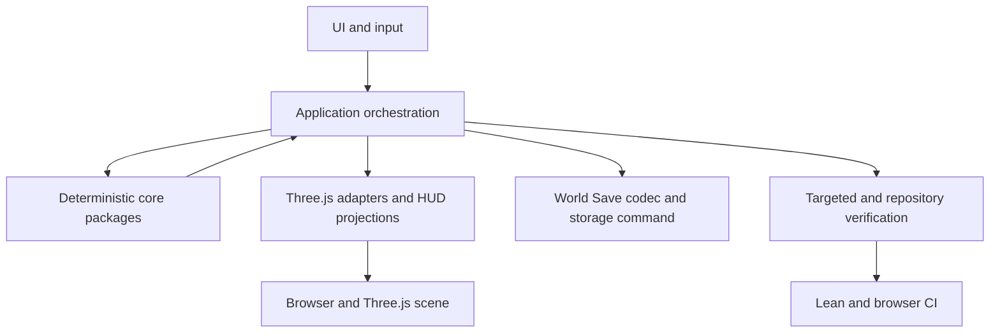

# Architecture and Infrastructure System

**Status:** Implementation in progress — boundary enforcement implemented  
**Last verified against:** `master@c14d5eb34d7ccc61bfdd633a69e3649a26d54a13`  
**Primary ownership:** repository architecture rules, `apps/game` application orchestration, repository verification tooling, CI/browser verification  
**Persistence:** Git-tracked architecture and verification documentation; existing gameplay Save schemas remain unchanged

## Purpose

Define and incrementally enforce the seams that keep deterministic domain systems isolated, make cross-system coordination explicit, reduce `game-bootstrap.ts` blast radius, and let future systems such as Economy, Utilities, Services, Land Value, Traffic, and Density integrate without circular ownership.

This system is a planning and enforcement boundary. It does not own gameplay state or replace the domain systems documented in the neighboring system handoffs.

## Does Not Own

- Terrain, Water, Roads, Zoning, Buildings, Simulation, or RCI domain authority.
- Three.js scene state or browser UI state.
- Gameplay features such as Economy, Utilities, Services, Traffic, Land Value, Density, or citizen movement.
- Save schema redesign or migration for architectural convenience.
- A permanent `develop` branch.

## Current Capabilities

- Phase 1 audit is complete for `origin/master` at `c14d5eb34d7ccc61bfdd633a69e3649a26d54a13`.
- Root `AGENTS.md` defines the current Verification Ladder and conservative Level 2 map.
- Existing domain packages are acyclic and currently show no production core-to-Three.js or package-to-app imports.
- Existing `GameWorldStateStore` atomically publishes Simulation, Buildings, and RCI only.
- Existing `game-world-tick.ts` stages Building Growth, Simulation, and RCI before that partial publication.
- Planning artifacts in this directory define the target architecture and future implementation slices.

No runtime architecture enforcement or bootstrap extraction is implemented by this Planning PR.

## Ownership and State

### Authoritative

- Domain snapshots remain authoritative inside their owning `*-core` packages.
- `apps/game` remains the composition root and owns application-level coordination.
- Future application coordination may own committed-world publication policy, but must not duplicate domain facts.
- Save authority remains the existing versioned world envelope until a separately approved Save decision changes it.

### Derived

- Water, occupancy, placement environments, indexes, projections, HUD values, and renderer objects remain derived.
- Application read models may compose authoritative snapshots and derived environments, but may not become a second domain store.
- Candidate Road/Zone/Building placement environments are derived and provenance-validated before atomic publication when they travel with the committed-world view; they are not post-publication authoritative caches.
- Browser evidence and CI metadata remain verification outputs, not runtime authority.

## Main Workflows

1. Audit actual package imports, ownership, state authority, transactions, tests, and CI.
2. Enforce layer rules with fast repository-native contract checks.
3. Design application seams around complete committed-world publication, Save/Load ownership, dependent-world Undo, tick coordination, and presentation synchronization.
4. Add characterization tests for existing transaction and Save/Load risks.
5. Extract one coherent responsibility from `game-bootstrap.ts` at a time.
6. Classify browser tests and optimize CI without weakening deterministic release verification.
7. Record before/after measurements and close the program with exact-head evidence.

## Integrations

The dependency direction remains inward toward domain packages and outward toward adapters. Core packages must not import `apps/*`, DOM, browser UI, or `*-three` packages. Cross-system policy belongs in application orchestration or explicit domain contracts, not in circular core imports.

## Persistence

The Architecture and Infrastructure program introduces no Save wire-schema or persisted-field change. Existing `WorldSaveV1` through `WorldSaveV5`, `RciSaveV1`, and domain Save contracts remain authoritative. Approved V3/V4 migration may reconstruct derived workplace inventory from persisted active Buildings before Load returns; it must not invent V1/V2 Building-linked state. Any persisted-field, wire-format, or version change must stop, add an ADR, and obtain separate approval before changing code.

## Invariants and Failure Behavior

- Every authoritative fact has one owner.
- A committed-world publication contains mutually valid snapshots and derived environments.
- Cross-system plans derive required placement environments from the candidate snapshots and validate all required before/after revisions and environment provenance before publication.
- Failed or stale pre-publication work publishes no partial state and consumes no deterministic sequence values.
- A publication result of `rejected` means authority is unchanged; `committed` means authority changed and presentation status is reported separately as synchronized or degraded.
- Save reads only committed, coherent state.
- Undo restores a coherent dependent world or executes a complete reverse command; it does not restore one snapshot while leaving dependent state stale.
- Presentation and HUD update only after authoritative publication; post-publication presentation failure never rolls back domain authority.
- Tick ordering, fixed-point arithmetic, Save migration, and browser determinism remain unchanged unless an ADR explicitly replaces a rule.

## Extension Points

- Application projections for future Economy, Utilities, Services, Land Value, Traffic, and Density.
- Versioned policy/factor inputs that preserve `rci-core` ownership of RCI authority.
- Explicit ports only where more than one real adapter or a stable test seam exists.
- Repository-native dependency and layer checks before considering a task-orchestration framework.
- Playwright ownership tags and relevant-system projects while retaining a full release project.

## Current Limitations

- `game-bootstrap.ts` remains a large composition and transaction hub.
- `GameWorldStateStore` does not yet cover Terrain, Water, Roads, or Zones.
- Building bulldoze/Undo dependent RCI paths lack characterization coverage.
- Browser tests have no ownership tags and use direct source imports for fixtures/helpers.
- Core packages inherit DOM ambient types through the shared TypeScript base configuration.
- CI repeats full Lean verification inside the Browser job and does not share build artifacts.

## Handoff Checklist

- Start reading: [Phase 1 baseline audit](verification/2026-08-07-architecture-infrastructure-phase-1-baseline.md)
- Approved design: [Architecture and Infrastructure Upgrade v0.1](specs/2026-08-07-architecture-infrastructure-upgrade-v0-1.md)
- ADRs: [architecture ADR directory](adrs/)
- TDD plan: [Architecture and Infrastructure Upgrade v0.1](tdd/2026-08-07-architecture-infrastructure-upgrade-v0-1.md)
- Runtime seams: `apps/game/src/game-world-state.ts`, `game-world-tick.ts`, `world-save.ts`, `world-undo.ts`
- Bootstrap hotspot: `apps/game/src/game-bootstrap.ts`
- Verification authority: [`AGENTS.md`](../../../AGENTS.md)
- Related systems: [World](../world/README.md), [Buildings](../buildings/README.md), [Simulation Time](../simulation-time/README.md), [RCI](../rci/README.md), [Economy](../economy/README.md), [Development Workflow](../development-workflow/README.md)

## Related Documents

- Specification: [Architecture and Infrastructure Upgrade v0.1](specs/2026-08-07-architecture-infrastructure-upgrade-v0-1.md)
- ADRs: [ADR-0001](adrs/0001-application-orchestration-seam.md), [ADR-0002](adrs/0002-complete-world-publication-and-dependent-undo.md), [ADR-0003](adrs/0003-repository-native-boundary-enforcement.md), [ADR-0004](adrs/0004-layered-targeted-verification-and-ci.md)
- TDD plan: [Architecture and Infrastructure Upgrade v0.1](tdd/2026-08-07-architecture-infrastructure-upgrade-v0-1.md)
- Verification: [Phase 1 baseline](verification/2026-08-07-architecture-infrastructure-phase-1-baseline.md)

## Implementation Slice 1

Repository-native architecture boundary checks enforce declared acyclic workspace imports, package-to-app/core-to-presentation separation, runtime dependency classification, and non-DOM core TypeScript libraries. Confirmed manifest drift is corrected without runtime behavior change, and the architecture gate runs before recursive package tests.

## Implementation Slice 2

The complete committed-world application seam is available in `apps/game/src/application`. It composes Terrain, Water, Roads, Zones, Buildings, Simulation, RCI, and candidate-derived placement environments behind one application revision fence. Typed-array authority is copied on publication and read, environment provenance is validated before replacement, and content fingerprinting ignores adapter function identity. Legacy `GameWorldStateStore` remains the active compatibility path until the transaction/runtime migration in the next slice; PR 2 does not move Save, Undo, or gameplay mutation ownership.

## Implementation Slice 3

Runtime mutation authority now routes through the committed-world transaction seam. Terraform, Road, Zone, Building bulldoze, simulation ticks, Save/Load, and dependent-world Undo all publish one complete candidate revision before presentation. Building mutations reconcile dwelling/workplace RCI inventory before publication, Save reads only `CommittedWorldStore`, load publishes decoded state through the same coordinator, and Undo restores the complete prior domain world while advancing only the application revision. Presentation failures after publication are recovery events and do not roll domain authority back.
