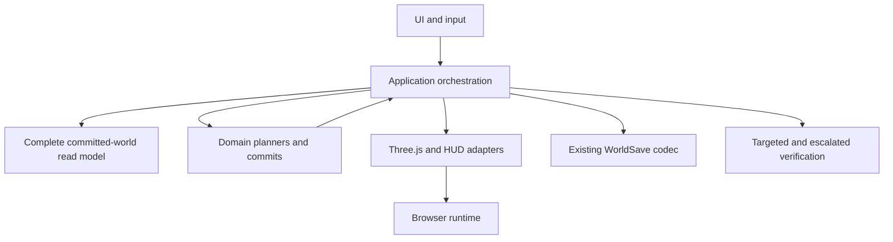
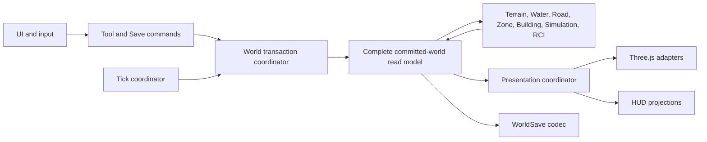
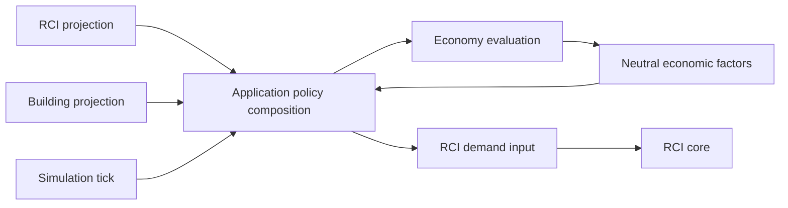

# Architecture and Infrastructure Upgrade v0.1 - Design Specification

**Status:** Implemented — `CLOSED / PASS`
**System:** `architecture-infrastructure`  
**Date:** `2026-08-07`

## Decision Summary

Approve **Option 1: seam-first incremental extraction** for repository architecture and verification infrastructure. The program keeps the modular monolith, deterministic `*-core` packages, `*-three` presentation adapters, existing Save formats, current gameplay behavior, and the trunk-based `master` workflow.

The first architectural seam is application orchestration. `apps/game` will gain explicit, deep modules for complete committed-world publication, transaction coordination, Save/Load command ownership, dependent-world Undo, tick coordination, and presentation synchronization. These are design responsibilities, not mandatory class names. A single `GameRuntime` or `WorldTransaction` God Coordinator is rejected.

Implementation is divided into six phases and multiple implementation PRs. This Planning PR contains only audit evidence, specifications, ADRs, and TDD tasks. It does not change source, manifests, CI behavior, package dependencies, browser configuration, Save schemas, or gameplay behavior.

## Context

The latest repository head is `c14d5eb34d7ccc61bfdd633a69e3649a26d54a13`. The Phase 1 audit found a healthy but uneven architecture:

- production package graph is acyclic and current core packages do not import Three.js, DOM, or applications;
- `game-bootstrap.ts` is 1,322 LOC with 34 imports and owns composition, state, transactions, Save/Load, Undo, presentation, input, evidence, and lifecycle;
- `GameWorldStateStore` atomically publishes only Simulation, Buildings, and RCI;
- Building bulldoze can leave RCI inventory stale before immediate Save or Undo;
- Save/Load command ownership is duplicated between `main.ts` and `game-bootstrap.ts`;
- `main.ts` reads Buildings through renderer presentation state;
- seven tests under `apps/game/test/` are excluded from normal Vitest execution;
- browser tests contain direct source imports and Playwright has no ownership tags;
- Lean and Browser CI duplicate full verification and build/install work;
- core packages inherit DOM ambient types globally and ESLint boundary restrictions cover only three core package groups.

These findings are architecture risks, not permission to refactor during Phase 1.

## Goals

- Make package and layer ownership explicit and enforceable with fast repository-native checks.
- Define complete committed-world authority without duplicating domain facts.
- Preserve atomic publication, deterministic ordering, Save compatibility, and existing gameplay behavior.
- Give Save/Load one application command owner.
- Make Undo restore dependent state coherently.
- Create incremental extraction seams around `game-bootstrap.ts`.
- Make future Economy, Utilities, Services, Land Value, Traffic, and Density integrate through projections and application coordination without circular core imports.
- Ensure normal verification remains package-targeted and Level 3/4 gates remain available.
- Reduce browser and CI wall-clock through relevant selection and artifact reuse, not weakened coverage.
- Produce clear AI navigation, handoff, and PR decomposition documents.

## Non-Goals

- No gameplay features.
- No Economy, Utilities, Services, Traffic, Land Value, Density, taxes, wages, or citizen movement implementation.
- No rewrite of Terrain, Roads, Zoning, Buildings, Simulation, or RCI.
- No Save schema redesign.
- No microservices, generic event bus, DI framework, or abstraction layer without a concrete consumer.
- No Nx/Turborepo migration without measured justification and an accepted ADR.
- No permanent `develop` branch.
- No browser worker increase without evidence that determinism and release behavior remain valid.

## System Boundary



Layer rules:

| Layer | May depend on | Must not depend on |
|---|---|---|
| `*-core` | world contracts and lower deterministic core contracts | DOM, browser UI, `apps/*`, `*-three` |
| `*-three` | corresponding core contracts, Three.js | `apps/*`, authoritative gameplay state |
| application orchestration | core packages, adapters through explicit interfaces, runtime/UI ports | circular core imports, domain duplication |
| `apps/game` | application modules, domain packages, presentation adapters, browser APIs | hidden renderer authority, duplicated Save/Load commands |
| browser tests | public app surfaces and explicit fixture seams | accidental package source-layout coupling |

The current package graph remains the factual source for Phase 2 enforcement. The AGENTS static Level 2 table remains a conservative verification policy and is not replaced by the architecture graph.

## Target Application Architecture



Responsibilities are deliberately split:

- A committed-world read model composes all authoritative snapshots and derived environments needed for a coherent runtime view.
- A transaction coordinator stages, validates, and publishes changes. It does not contain Terrain, RCI, or Economy rules.
- A Save coordinator owns storage-key lookup and one load command path. Existing codecs remain domain/application serialization utilities.
- An Undo coordinator restores a complete dependent-world state or runs a complete reverse command. It does not restore Building snapshots in isolation when RCI inventory depends on them.
- A tick coordinator keeps cross-domain tick ordering in application code. `simulation-core` remains domain-only.
- A presentation coordinator consumes committed state after publication and never becomes authority.
- Existing Terraform, Road, Zone, and Building controllers stay separate because their preview, cancellation, and release contracts differ.

## Authoritative and Derived State

| State | Owner | Rule for application layer |
|---|---|---|
| Terrain heights and revision | `terrain-core` | Compose, never copy as independent authority |
| Water derivation | `water-core` from Terrain | Rebuild/fence against Terrain revision |
| Road codes and revision | `road-core` | Plan/commit through existing revision contracts |
| Zone codes and revision | `zone-core` | Plan/commit through existing revision contracts |
| Building instances and lifecycle | `building-core` | Coordinate dependent RCI reconciliation before publication |
| Simulation tick and sequence | `simulation-core` | Preserve one-tick deterministic ordering |
| RCI records, assignments, demand, gates | `rci-core` | Validate against exact Building/Simulation after-state |
| Render objects and HUD | `*-three` and app UI | Rebuild from committed state only |
| Application read model | `apps/game` | Composition only; no duplicate domain facts |

## Main Workflows

### Cross-system mutation

```text
input command
-> capture committed world revision
-> domain plan(s)
-> cross-system policy and dependent plans
-> derive Road/Zone/Building environments from the candidate snapshots
-> validate every before/after revision, environment provenance, and invariant
-> publish one coherent committed world
-> synchronize renderers and HUD from the committed world
-> record a dependent-world Undo command
```

Any planning, derivation, or validation failure before publication leaves the previous committed world unchanged. Presentation is invoked only after publication; a post-publication adapter failure must have a deterministic recovery path that rebuilds from the committed read model and must never be represented as a rejected transaction.

The failure contract has two distinct cases:

- **Pre-publication failure:** no new authoritative snapshot is published, no dependent environment is made current, and the previous presentation remains valid.
- **Post-publication adapter failure:** the committed world remains authoritative; the presentation coordinator reports degraded state and runs `rebuildFromCommittedWorld` from the published snapshot. It must not attempt to roll back domain authority because publication already succeeded.

### Simulation tick

```text
one committed world
-> plan Building Growth
-> stage Simulation after-state
-> reconcile RCI against exact Building and Simulation after-state
-> validate complete world
-> publish one next world revision
-> update presentation and HUD
```

`rci-core` must reject a commit when either the before-state or after-state Building contract no longer matches the plan.

### Save and Load

```text
Save command -> read one committed world -> encode existing WorldSave schema
Load command -> read one storage value -> decode and validate full world
            -> replace committed world once -> clear transient tool/Undo state
```

Immediate Save after Building bulldoze must not serialize stale RCI references. Legacy V3-V4 migration must produce coherent housing and workplace inventory from persisted Buildings before the load command returns. Legacy V1-V2 contain no persisted Buildings, so migration must return empty derived Building-linked inventory and must not invent workplaces.

### Undo

Undo records must contain either:

- a complete before-world state sufficient to restore all dependent records; or
- a reverse command whose deterministic reconciliation recreates every dependent projection and assignment.

Restoring one Building snapshot while leaving retired RCI inventory unchanged is prohibited.

## Data and Contracts

The implementation may choose names different from the provisional names below, but must preserve these interfaces and invariants:

```ts
type CommittedWorld = Readonly<{
  revision: number;
  terrain: TerrainSnapshot;
  water: WaterSnapshot;
  roads: RoadSnapshot;
  zones: ZoneSnapshot;
  buildings: BuildingSnapshot;
  simulation: SimulationSnapshot;
  rci: RciSnapshot;
  environments: Readonly<{
    road: RoadPlacementEnvironment;
    zone: ZonePlacementEnvironment;
    building: BuildingDevelopmentEnvironment;
  }>;
}>;

type WorldPublication = Readonly<{
  baseRevision: number;
  baseFingerprint: string;
  nextWorld: CommittedWorld;
  nextFingerprint: string;
}>;

type WorldPublicationResult =
  | Readonly<{
      status: 'rejected';
      world: CommittedWorld;
      reason: WorldPublicationRejection;
    }>
  | Readonly<{
      status: 'committed';
      world: CommittedWorld;
      presentation:
        | Readonly<{ status: 'synchronized' }>
        | Readonly<{ status: 'degraded'; recoveryRequired: true }>;
    }>;
```

Required invariants:

- `nextWorld.revision === baseRevision + 1`.
- Water source revision equals the published Terrain revision.
- Every dependent snapshot validates against the exact committed after-state.
- Candidate Road/Zone/Building environments are immutable derived views created and provenance-validated before publication; they are part of the committed-world view, not post-publication caches.
- Publication is one replace operation or no replace operation.
- A rejected result always means authority is unchanged; a committed result remains committed even when presentation is degraded.
- Save and presentation consumers read the same committed object.
- Sequence allocation and deterministic ordering remain unchanged.

Typed-array state uses copy-on-publication and copy-on-read in v0.1. Terrain `heightLevels`, Water `seaTriangleMask`, Road `definitionCodes`, and Zone `definitionCodes` are cloned whenever a world is stored or exposed. `Object.freeze` on an object containing a writable typed array is not sufficient. Tests must mutate both source buffers and returned views and prove committed authority is unchanged.

## Persistence and Migration

No wire schema or Save version changes are part of this approved v0.1 architecture program. Existing `WorldSaveV1` through `WorldSaveV5` and `RciSaveV1` remain the wire contracts.

The program explicitly permits a deterministic compatibility repair during V3-V4 migration: workplace inventory may be reconstructed from already persisted active Buildings and the decoded world Simulation state before the decoded world is returned. V3 has no persisted Simulation and must use its deterministic synthesized Simulation snapshot; V4 decodes Simulation from Save. V1-V2 have no persisted Buildings and must remain empty rather than inventing state. This changes no wire format, does not invent historical Citizens or assignments, and is treated as derived-state reconstruction rather than a new Save authority. Expected migration outputs must be captured in tests and verification evidence. Any change to persisted fields still requires separate approval.

Implementation must add characterization tests before changing ownership:

- Building bulldoze followed immediately by Save and Load.
- Building bulldoze, one background tick, then Undo and RCI validation.
- V3-V4 migration with active Commercial and Industrial Buildings; V1-V2 no-invention behavior.
- Save/Load/resume equivalence for a coherent committed world.

If a fix requires changing a Save schema, stop the implementation PR, write a superseding ADR, and request separate approval.

## Determinism and Performance

- Preserve all existing fixed-point arithmetic, stable comparators, revision fences, growth sequence allocation, and tick cadence.
- Do not use wall-clock time for domain decisions.
- Use package-targeted Level 0/1 commands first.
- Use AGENTS static Level 2 consumers for observable contract changes.
- Root/workspace/tooling changes require Level 3.
- Browser/release/milestone closure requires Level 4.
- Baseline measurements are recorded in the Phase 1 verification record; no target is accepted without actual command output.

The Node architecture contract test is normative for graph, layer, manifest, and browser-fixture rules. ESLint remains the fast style/type-aware lint surface and may mirror high-signal import rules, but passing ESLint alone does not satisfy architecture enforcement.

## Extension Points

Future systems integrate through application projections and explicit factor/policy inputs:



All arrows in this diagram are application-level data flow, not package import direction. Economy must not import RCI internals, and `rci-core` must not import `economy-core`. Utilities and Services must choose their authoritative state explicitly before joining the committed-world transaction. Land Value, Traffic, and Density must consume narrow projections rather than renderer state or direct application globals.

## Acceptance Criteria

- Phase 1 audit record contains package ownership, actual dependency graph, state authority, transaction map, test topology, CI topology, timing output, ranked hotspots, remediation order, and explicit no-refactor items.
- Planning PR contains no runtime source, package manifest, lockfile, CI, Playwright, Save, or gameplay behavior changes.
- Four ADRs record application seam, complete-world publication/Undo, repository-native enforcement, and layered CI verification decisions.
- TDD plan maps each identified risk to a characterization test, implementation task, affected consumers, commit boundary, and final verification level.
- Architecture contract tests are planned before boundary enforcement implementation.
- Future implementation preserves current Save versions and deterministic semantics.
- Every implementation slice updates the relevant living README in the same PR.
- Final program closure includes before/after measurements and exact-head evidence.

## PR Decomposition

| Slice | Scope | Runtime change |
|---|---|---|
| Planning PR | Audit, spec, ADRs, TDD plan, baseline evidence, diagrams | None |
| Implementation PR 1 | Boundary/import/dependency enforcement | None intended; low-risk manifest cleanup only if separately verified |
| Implementation PR 2 | Complete application read-model and coordinator foundation | Behavior-preserving wiring |
| Implementation PR 3 | Save/Load ownership, transaction safety, dependent Undo characterization and fixes | Behavior-preserving consistency fixes |
| Implementation PR 4 | Bounded bootstrap extraction | Behavior-preserving refactor |
| Implementation PR 5 | Test topology, browser classification, targeted CI and artifact reuse | Verification/CI behavior only |
| Closure | Before/after metrics and handoff | Documentation only unless repository policy requires otherwise |

Each implementation PR has its own focused RED/GREEN cycle and escalation gate. No implementation PR begins before this Planning PR is reviewed and approved by ARB.

Task 3 is an execution prerequisite for characterization, so its commit may be developed or stacked before Implementation PR 2; its review/merge grouping remains Implementation PR 5 with the test-topology, browser-classification, and CI work. TDD task order is not a claim that PR merge order changes.

## Related Documents

- System overview: [Architecture and Infrastructure](../README.md)
- ADRs: [0001](../adrs/0001-application-orchestration-seam.md), [0002](../adrs/0002-complete-world-publication-and-dependent-undo.md), [0003](../adrs/0003-repository-native-boundary-enforcement.md), [0004](../adrs/0004-layered-targeted-verification-and-ci.md)
- TDD plan: [Architecture and Infrastructure Upgrade v0.1](../tdd/2026-08-07-architecture-infrastructure-upgrade-v0-1.md)
- Verification: [Phase 1 baseline](../verification/2026-08-07-architecture-infrastructure-phase-1-baseline.md)
- Final evidence: [Architecture and Infrastructure Upgrade v0.1 closure](../verification/2026-08-08-architecture-infrastructure-v0-1-closure.md)
- Current workflow authority: [`AGENTS.md`](../../../../AGENTS.md)
