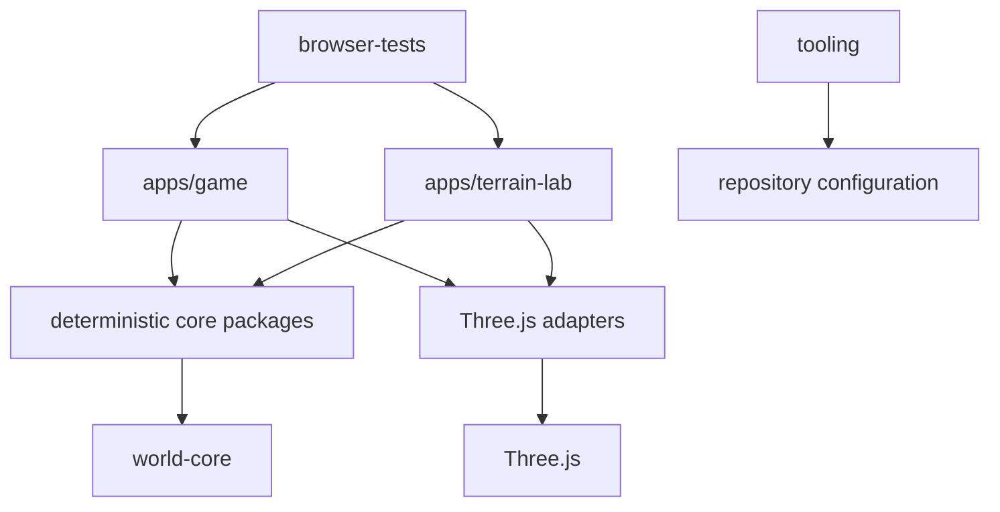
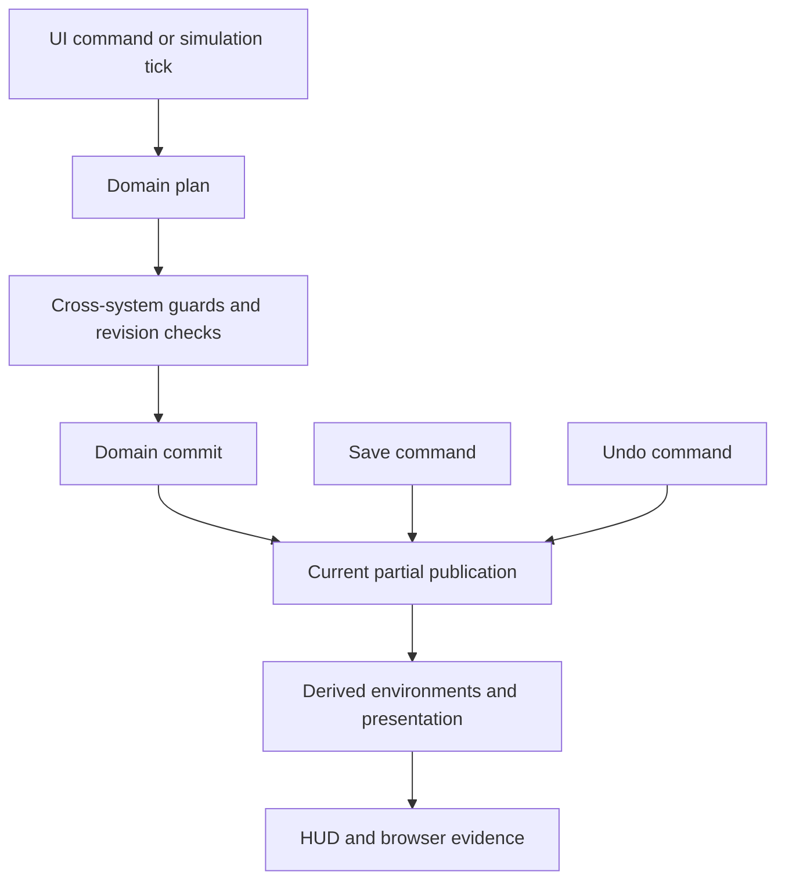

# Architecture and Infrastructure Upgrade v0.1 - Phase 1 Baseline

**Status:** Phase 1 audit complete; planning only  
**System:** `architecture-infrastructure`  
**Audit commit:** `c14d5eb34d7ccc61bfdd633a69e3649a26d54a13`  
**Audit branch:** `chore/architecture-infrastructure-audit`  
**Audit date:** `2026-08-07`

## Scope and Method

This record captures the actual repository state before any Architecture / Infrastructure implementation work. Source, package manifests, TypeScript configuration, tests, Playwright configuration, CI workflow, and current living system docs were inspected from `origin/master`.

The audit used static import/manifest scanning, direct source tracing, test discovery, package test execution, repository verification, and the full browser closure command. No runtime, manifest, CI, Playwright, lockfile, or gameplay file was modified during the audit.

## Repository State

- Latest fetched `origin/master`: `c14d5eb34d7ccc61bfdd633a69e3649a26d54a13`.
- Latest commit: `build(workflow): implement Development Workflow System Improvement v0.1`.
- Workspace: pnpm `10.13.1`, Node engine `>=22.0.0`.
- Local audit runtime: Node `v24.18.0`.
- CI runtime: Node `22`, defined in `.github/workflows/ci.yml:28-35`.
- Workspace shape: 2 applications, 16 packages, root tooling, browser tests, and system documentation.
- Current checkout outside this worktree had an unrelated modified RCI specification. It was not stashed, reset, checked out, cleaned, or edited.

## Package and Layer Map

Manifest and source edges observed:

| Package group | Direct relationships |
|---|---|
| `world-core`, `simulation-core` | No workspace dependencies; shared foundational contracts |
| `terrain-core` | `world-core` |
| `water-core` | `terrain-core`, `world-core`; `shared-testkit` as dev dependency |
| `road-core` | `terrain-core`, `world-core` |
| `zone-core` | `terrain-core`, `world-core` |
| `building-core` | `simulation-core`, `terrain-core`, `world-core`, `zone-core` |
| `rci-core` | `building-core`, `simulation-core`, `world-core`; manifest also declares unused `zone-core` |
| `terrain-generator` | `terrain-core`, `world-core` |
| `camera-input` | `world-core` |
| `*-three` adapters | Corresponding core contracts, `world-core`, and Three.js where needed |
| `shared-testkit` | `world-core`, `terrain-core`; test-only import of `terrain-generator` is declared as runtime dependency |
| `apps/game` | All core and presentation packages plus Three.js |
| `apps/terrain-lab` | Terrain, Water, Road, camera, generator, shared testkit, and presentation adapters |

## Dependency Findings

### Confirmed healthy

- No package dependency cycles detected.
- No TypeScript import cycles detected by static scan.
- No package-to-app imports detected.
- No production core-to-Three.js or core-to-DOM imports detected.
- No TypeScript path aliases or project references exist.
- Package manifests and production import edges otherwise agree.

### Boundary gaps

- Browser tests contain 65 direct relative imports into `packages/*/src` or `apps/*/src` in the measured static scan. This bypasses package exports and couples browser tests to source layout.
- `packages/rci-core/package.json:7-11` declares `zone-core`, but `packages/rci-core/src` has no `zone-core` import.
- `packages/shared-testkit/package.json:7-10` declares `terrain-generator` under runtime dependencies, while only tests import it.
- `tsconfig.base.json:17` provides `DOM` and `DOM.Iterable` to every package, including domain core packages.
- `eslint.config.js:26-40` restricts forbidden imports only for `world-core`, `terrain-core`, and `terrain-generator`; it is not a complete layer policy.

## State Authority Table

| System | Authoritative state | Derived state | Persistence |
|---|---|---|---|
| Terrain | Height lattice, metadata, revision | Surface profiles, topology, meshes, previews, Water | `TerrainSaveV1` |
| Water | No independent authority; source Terrain revision | Wet/dry coverage, shoreline, meshes | Derived from Terrain |
| Roads | Definition codes, revision | Connectivity, access projections, meshes | `RoadSaveV1` |
| Zones | Definition codes, revision | Counts, access, eligible lots, overlays | `ZoneSaveV1` |
| Buildings | Definitions, instances, lifecycle, revision | Footprints, occupancy, frontage, RCI inventory | `BuildingSaveV2` |
| Simulation | Tick, revision, growth sequence | Calendar labels, speed, frame accumulator | `SimulationSaveV1` |
| RCI | Citizens, relationships, households, housing, employment, migration, demand, gates, sequences | Indexes, projections, growth policy, HUD | `RciSaveV1` in `WorldSaveV5` |
| Application store | Runtime revision plus Simulation, Buildings, RCI | Complete-world composition remains in bootstrap locals | Not persisted |
| Presentation | None | Three.js roots, HUD, browser evidence | Not persisted |

The split is documented in `docs/systems/world/README.md:28-30,92-94` and current system handoffs. It is safe for current synchronous paths but not a complete future transaction boundary.

## Cross-System Transaction Map

### Current paths

- Terraform plans and commits Terrain, derives Water, rebuilds environments, refreshes presentation, and records a Terrain Undo entry.
- Road plans validate Terrain, Water, Zone, and Building guards, then commit Road and rebuild dependent environments/presentation.
- Zone plans validate Terrain, Water, Road, and Building occupancy, then commit Zone and rebuild dependent environments/presentation.
- Simulation, Building Growth, and RCI stage through `game-world-tick.ts:28-161` and publish through `GameWorldStateStore`.
- World Save decodes in Terrain -> Water -> Roads -> Zones -> Buildings -> Simulation -> RCI order, then replaces application state through `game-bootstrap.ts:968-995`.
- Undo retains one latest domain snapshot in `world-undo.ts:11-15,116-146`.

### Risks requiring future characterization

1. Building bulldoze updates Buildings without immediate RCI reconciliation (`game-bootstrap.ts:759-795`). Immediate Save can serialize RCI inventory that references a removed Building; Load validation can reject the result.
2. Building Undo restores only `BuildingSnapshot`; retired RCI inventory is not automatically reactivated (`game-bootstrap.ts:1114-1127`).
3. `GameWorldStateStore` cannot fence Terrain, Roads, or Zones with the Simulation/Building/RCI publication.
4. `commitRciTick` checks the planned `buildingsBefore` revision but does not fully fence the `buildingsAfter` identity/content (`packages/rci-core/src/rci-tick.ts:264-297`).
5. Complete-world replacement updates presentation and local references in stages; rollback is best-effort (`game-bootstrap.ts:504-587`).
6. Legacy V3-V4 migration creates derived residential RCI inventory from persisted Buildings but does not materialize workplace inventory before returning the decoded state; V1-V2 have no persisted Buildings and must not invent Building-linked inventory (`world-save.ts:66-76`, `migration-inventory.ts`).
7. Terrain and Water snapshots contain typed-array data that outer `Object.freeze` does not make immutable.

## Bootstrap Hotspot Metrics

| Module | LOC | Import declarations | Role |
|---|---:|---:|---|
| `apps/game/src/game-bootstrap.ts` | 1,322 | 34 | Composition, state, transactions, Save/Load, Undo, rendering, evidence, lifecycle |
| `apps/game/src/game-input.ts` | 569 | 22 | Pointer routing and four tool controllers |
| `apps/game/src/game-ui.ts` | 553 | 7 | UI construction and UI state updates |
| `apps/game/src/world-save-legacy.ts` | 426 | 11 | Legacy world decoding and validation |
| `apps/game/src/interaction-evidence.ts` | 377 | 10 | Browser-facing state/evidence projection |
| `apps/game/src/main.ts` | 291 | 18 | App entrypoint, simulation frame loop, second Save/Load path |
| `apps/game/src/world-undo.ts` | 147 | 5 | Single-entry domain snapshot Undo store |
| `apps/game/src/game-world-tick.ts` | 162 | 5 | Existing Simulation/Building/RCI tick seam |
| `apps/game/src/simulation-runtime.ts` | 67 | 1 | Pure runtime timing adapter |

`bootstrapGame` itself spans `game-bootstrap.ts:334-1321`. Its first safe extraction seam is complete-world staging/replacement around `RuntimeWorldState` and `stageTerrainWorld` (`game-bootstrap.ts:123-218`), not arbitrary line-based file splitting.

## Test Topology

| Layer | Files | Tests | Runner |
|---|---:|---:|---|
| Core/domain packages | 88 | 317 | Vitest |
| Three.js presentation packages | 24 | 77 | Vitest |
| Camera/input | 7 | 65 | Vitest + happy-dom |
| Shared testkit | 3 | 13 | Vitest |
| `apps/game/src` | 47 | 197 | Vitest + happy-dom |
| `apps/game/test` | 2 | 7 | Not included by normal config |
| Tooling | 5 | 27 | Node `node:test` |
| Browser | 22 | 121 | Playwright Chromium |

The normal root command executes 669 unit/package tests plus 27 tooling tests. `apps/game/vitest.config.ts:5-7` includes only `src/**/*.test.ts`; `apps/game/tsconfig.json:4` has an `include` list that omits `test/`.

## CI and Browser Topology

- `.github/workflows/ci.yml:21-37` runs Lean CI with `pnpm check`, a 15-minute timeout, Node 22, and one full repository verification path.
- `.github/workflows/ci.yml:39-56` runs Browser CI only for `full-ci` labels or manual dispatch.
- Browser CI calls `pnpm verify:full`, which repeats install, Lean verification, and builds before Playwright.
- `playwright.config.ts:3-12` uses one Chromium project, `fullyParallel: false`, two workers, and no retries.
- `playwright.config.ts:14-35` starts separate Game and Terrain Lab preview servers.
- Current browser tests have no explicit tags/projects. `--reporter=json` reports empty tag sets.
- Current browser run collects all 121 tests for every full browser invocation.
- Six visual-evidence files contain 12 tests, 37 screenshot calls, and 2 explicit attachments.
- Historical full browser baselines were 10.6m for 117 tests and 12.6m for 107 tests. The current local full browser run was 121 passed in 5.7m with two workers.

## Measured Baseline

Measured in isolated worktree at `c14d5eb`:

| Command | Result | Wall time |
|---|---|---:|
| `pnpm test` | 669 passed | 14.1s |
| `pnpm test:deployment` | 27 passed | 0.68s |
| `pnpm format:check` | pass | 7.84s |
| `pnpm lint` | pass | 7.36s |
| `pnpm typecheck` | pass | 16.77s |
| `pnpm verify` | pass | 27.20s warm |
| `pnpm verify:full` | 121 browser tests passed; clean worktree | 6:23.56 |

The timings are local measurements, not CI SLO claims. `pnpm verify:full` includes install, the complete `pnpm verify`, browser installation, and the browser suite. The browser portion reported `121 passed (5.7m)`.

## Ranked Remediation Order

1. Add architecture contract tests that detect forbidden imports, deep imports, cycles, undeclared workspace imports, and manifest/import mismatches.
2. Add characterization coverage for Building bulldoze Save/Load, Building Undo after tick, legacy workplace migration, RCI after-state fencing, and complete-world rollback.
3. Design and introduce a complete application committed-world/read-model seam without duplicating domain facts.
4. Centralize Save/Load command ownership and dependent-world Undo semantics.
5. Extract bootstrap responsibilities through the new application seams.
6. Include currently excluded `apps/game/test` tests in normal verification.
7. Classify browser tests and create relevant-system projects while preserving full release coverage.
8. Share Lean-built artifacts with Browser CI and remove duplicate work where the evidence remains equivalent.
9. Measure before/after results and document remaining debt.

## Explicitly Do Not Refactor in This Program

- Domain formulas, gameplay rules, RCI behavior, Building Growth behavior, or system Save schemas.
- `simulation-core` to import Buildings or RCI.
- A universal event bus, DI framework, or generic transaction abstraction without concrete adapters.
- Per-tool controller semantics into one generic pointer controller.
- Renderer adapters into domain packages.
- `develop` branch or a second integration trunk.
- Nx/Turborepo before a measured comparison and accepted ADR.
- Browser worker count before deterministic evidence supports the change.

## Audit Limitations

- Static import analysis cannot prove behavior reached through dynamic imports or generated code.
- Local timings use Node 24.18.0 while CI pins Node 22.
- The audit identified high-risk transaction paths and missing characterization coverage; it did not change behavior or claim a fix.
- Architecture enforcement and bootstrap extraction remain future implementation work described in the approved TDD plan.
