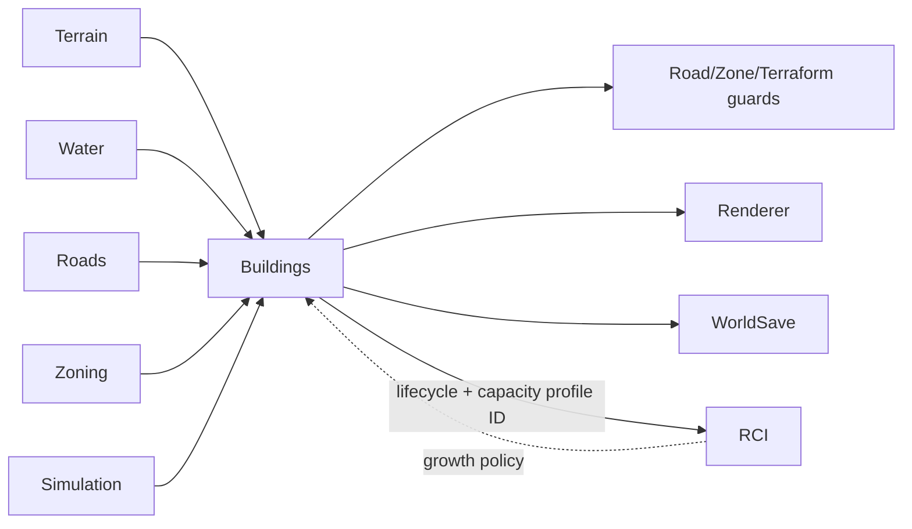

# Buildings System

**Status:** Implemented — explicit macro-hour lifecycle contracts and capacity-profile references added for RCI integration
**Primary ownership:** `packages/building-core`, `packages/building-three`, and `apps/game` growth/bulldoze integration  
**Persistence:** `BuildingSaveV2`

## Purpose

Own versioned Building definitions, authoritative Building instances, deterministic lot selection, rectangular footprints, Road frontage, construction lifecycle, automatic growth, bulldozing, derived world occupancy, and presentation.

## Does Not Own

- Zone authority or RCI demand.
- Citizens, Households, Dwelling occupancy, Workplaces, Employment, Economy, Utilities, or Traffic.
- Simulation clock or frame timing.

## Current Capabilities

- Twelve versioned Residential, Commercial, and Industrial definitions.
- Each definition exposes one versioned `capacityProfileDefinitionId`.
- Canonical rectangular footprints with quarter-turn rotation.
- Deterministic compatible-definition selection and Road-frontage resolution.
- Automatic development evaluation at Simulation hours `00`, `06`, `12`, and `18`.
- Construction and Active lifecycle with duration based on footprint area; runtime lifecycle points use `MacroHourIndex` fields (`constructionStartedAtMacroHourIndex`, `constructionCompletesAtMacroHourIndex`, and `activatedAtMacroHourIndex`) and definition durations use `MacroHourDuration`.
- Stable generated instance IDs through Simulation growth sequence.
- Building bulldoze that preserves the underlying Zone.
- Derived occupied cells shared with Road, Zone, and Terraform guards.
- Save/load migration from legacy active-only instances to lifecycle-aware records.
- Low-poly prototype rendering through `building-three`.

## Ownership and State

`BuildingSnapshot.instances`, Building revision, and versioned definitions are authoritative. Footprints, occupied cells, frontage, candidate ordering, lifecycle counts, render objects, and RCI capacity inventory are derived.

The capacity-profile ID is content metadata only. `building-core` validates its syntax but deliberately does not import `rci-core` or know Dwelling/position capacities. RCI resolves the ID through its registry when an instance becomes active.

## Main Workflows

### Automatic growth

1. Plan one Simulation minute and derive the macro-hour transition.
2. Complete construction whose macro-hour completion boundary has arrived.
3. On a development-evaluation tick, scan eligible zoned placements.
4. Select one placement deterministically from definition priority, weight, macro-hour index, and growth sequence.
5. Add a construction instance with macro-hour lifecycle timestamps and increment the growth sequence.
6. Commit Building and Simulation snapshots together; the application temporal batch publishes the complete five-phase minute only after all phases validate.

### Capacity publication

1. A Building definition references a versioned capacity profile.
2. Construction exposes no capacity.
3. When the Building becomes Active, RCI creates deterministic Dwelling or Workplace inventory.
4. When the Building retires, RCI retires that inventory and reconciles affected assignments.
5. Building Save continues to store definition ID/version rather than copying capacity values.

### Bulldoze

1. Resolve the Building occupying the requested cell.
2. Plan removal against coherent Terrain, Water, Road, Zone, and Building revisions.
3. Commit removal and derived occupancy changes atomically.
4. Preserve the underlying Zone.
5. RCI observes the before/after Building snapshots and handles displaced residents or ended jobs.

## Integrations

## Persistence

`BuildingSaveV2` stores versioned identity, placement, rotation, and lifecycle timestamps. The runtime contract uses explicit macro-hour fields; capacity values, footprint, occupancy, frontage, construction duration, and presentation are resolved from definitions and registries and are not duplicated. `WorldSaveV5` composes Building, Simulation, and RCI histories.

## Invariants and Failure Behavior

- Instance IDs are unique and never reused.
- A footprint is wholly inside the world, on compatible same-zone cells, dry, supported, non-Road, unoccupied, and Road-accessible.
- Occupied footprints do not overlap.
- Definition ID/version pairs and capacity-profile references remain stable for the Save that created them.
- Construction completion occurs no later than the first committed macro-hour boundary at or after its completion index.
- Planning is immutable and revision-fenced; stale environments cannot commit.
- Building-owned lifecycle validation, state derivation, and progress helpers operate on `MacroHourIndex` and `MacroHourDuration` values before comparing construction boundaries.
- Background growth must not switch tools, close menus, or cancel player previews.
- Building never mutates RCI state directly.

## Extension Points

Growth accepts a caller-provided policy so RCI, Land Value, Services, or Economy can influence eligibility and weights without reversing the dependency. Capacity profiles can add content-specific Dwelling or position-group capacity while Building instances retain the same schema.

## Current Limitations

No density upgrades, abandonment, construction cost, utilities, condition, business profitability, or final art assets. People/jobs are managed by RCI rather than this system.

## Handoff Checklist

- Start reading: `packages/building-core/src/contracts.ts`, `building-definitions.ts`, `building-selection.ts`, `building-growth.ts`, lifecycle and serialization files
- Renderer: `packages/building-three`
- Current design history: `docs/superpowers/specs/2026-08-03-building-content-occupancy-foundation-v0-1-design.md`
- Related systems: [Zoning](../zoning/README.md), [Simulation Time](../simulation-time/README.md), [RCI](../rci/README.md)
