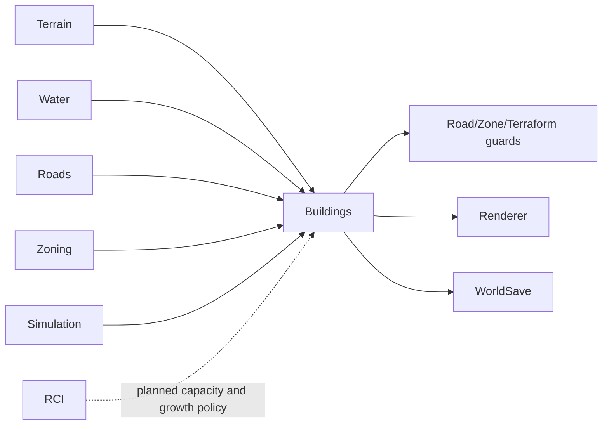

# Buildings System

**Status:** Implemented  
**Last verified against:** `master@012a644391d13e7d47135a1c0e9e3394be667871`  
**Primary ownership:** `packages/building-core`, `packages/building-three`, `apps/game` growth and bulldoze integration  
**Persistence:** `BuildingSaveV2`

## Purpose

Own data-driven Building definitions, authoritative Building instances, deterministic lot selection, rectangular footprints, Road frontage, construction lifecycle, automatic growth, bulldozing, occupancy, and derived presentation.

## Does Not Own

- Zone authority or RCI demand.
- Citizen, Household, dwelling occupancy, workplace employment, Economy, Utilities, or Traffic.
- Simulation clock or frame timing.

## Current Capabilities

- Twelve versioned Residential, Commercial, and Industrial Building definitions.
- Canonical rectangular footprints with quarter-turn rotation.
- Deterministic compatible-definition selection and Road-frontage resolution.
- Automatic development evaluation at Simulation hours `00`, `06`, `12`, and `18`.
- Construction and Active lifecycle with duration based on footprint area.
- Stable generated instance IDs through Simulation growth sequence.
- Building bulldoze that preserves the underlying Zone.
- Derived occupied cells shared with Road, Zone, and Terraform guards.
- Save/load migration from legacy active-only instances to lifecycle-aware records.
- Low-poly prototype rendering through `building-three`.

## Ownership and State

Building definitions are versioned content. `BuildingSnapshot.instances` and Building revision are authoritative. Occupied-cell indexes, frontage, selection candidates, lifecycle counts, render objects, and future RCI capacity inventory are derived from definitions and instances.

## Main Workflows

### Automatic growth

1. Plan one Simulation tick.
2. Complete construction whose completion tick has arrived.
3. On a development evaluation tick, scan eligible zoned placements.
4. Select one placement deterministically using definition priority, weight, tick, and growth sequence.
5. Add a construction instance and increment the growth sequence.
6. Commit Building and Simulation snapshots together.

### Bulldoze

1. Resolve the Building occupying the requested cell.
2. Plan removal against coherent Terrain, Water, Road, Zone, and Building revisions.
3. Commit removal and derived occupancy changes atomically.
4. Preserve the underlying Zone.

## Integrations

## Persistence

`BuildingSaveV2` stores versioned Building identity, placement, rotation, and lifecycle timestamps. Definition-derived footprint, occupancy, frontage, construction duration, and presentation are not duplicated. `WorldSaveV4` also stores Simulation state required to validate lifecycle timing.

## Invariants and Failure Behavior

- Instance IDs are unique and never reused.
- A footprint is wholly inside the world, on compatible same-zone cells, dry, supported, non-Road, unoccupied, and Road-accessible.
- Occupied footprints do not overlap.
- Definition ID/version pairs remain valid for the Save that created them.
- Construction completion occurs no later than the first committed tick at or after its completion tick.
- Planning is immutable and revision-fenced; stale environments cannot commit.
- Background growth must not switch tools, close menus, or cancel player previews.

## Extension Points

RCI will add versioned Residential capacity profiles and Workplace position groups to definitions while keeping Citizen and Employment state outside `building-core`. Growth accepts a caller-provided policy so RCI, Land Value, Services, or Economy can influence eligibility and weights without making Building placement depend directly on those packages.

## Current Limitations

No occupancy by people or jobs, RCI demand gate, density upgrades, abandonment, construction cost, utilities, building condition, business simulation, or final art assets.

## Handoff Checklist

- Start reading: `packages/building-core/src/contracts.ts`, `building-definitions.ts`, `building-selection.ts`, `building-growth.ts`, lifecycle and serialization files
- Renderer: `packages/building-three`
- Current design history: `docs/superpowers/specs/2026-08-03-building-content-occupancy-foundation-v0-1-design.md` and later Growth/Variety documents pending migration
- Related systems: [Zoning](../zoning/README.md), [Simulation Time](../simulation-time/README.md), [RCI](../rci/README.md)
