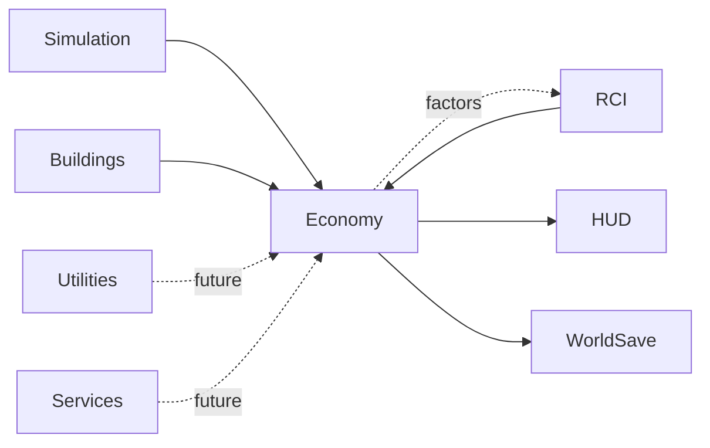

# Economy System

**Status:** Planned  
**Last verified against:** `docs/rci-demand-occupancy-v0-1-planning`  
**Primary ownership:** not assigned  
**Persistence:** none

## Intended Purpose

Model money flows and economic incentives after the RCI population, housing, workplace, and employment foundation is stable.

## Intended Responsibilities

Potential responsibilities include:

- city revenue, expenditure, budgets, and treasury;
- taxation and policy rates;
- Household income, affordability, and cost-of-living projections;
- wages and Workplace operating economics;
- construction, maintenance, Utilities, and Service costs;
- economic factors supplied to RCI demand, migration, and growth policy.

These are boundaries, not approved formulas.

## Does Not Own

- Citizen, Household, relationship, housing, or employment authority.
- Building placement and construction lifecycle.
- Simulation time, Traffic pathfinding, Utilities delivery, or City Service capacity.
- RCI demand engine internals; Economy should contribute through registered factors or policy inputs.

## Current Integration

None. No authoritative Economy state, currency, tax rate, wage, price, budget, or business balance exists on `master` or the RCI planning branch.

## Expected Integrations

## Decisions Intentionally Deferred

- Currency and fixed-point precision.
- Accounting cadence and transaction ledger versus aggregate balances.
- Tax categories and collection timing.
- Household income and affordability model.
- Wage, productivity, profit, bankruptcy, and business ownership.
- Construction and maintenance cost ownership.
- Budget failure, debt, bonds, and subsidies.
- Interaction with Land Value, Education, Traffic, Utilities, and Services.

## Extension Boundary Reserved by RCI

RCI registries and factor interfaces may accept future Economy contributions, but RCI v0.1 must not hard-code taxes, wages, rent, prices, or profitability. Employment assignment identifies who works where; Economy will decide what that work pays only after its own design is approved.

## Handoff Checklist

- Read first: [RCI](../rci/README.md), [Buildings](../buildings/README.md), [Simulation Time](../simulation-time/README.md)
- Create an Economy specification before adding production state.
- Record fixed-point/accounting authority in an ADR before defining Save contracts.
