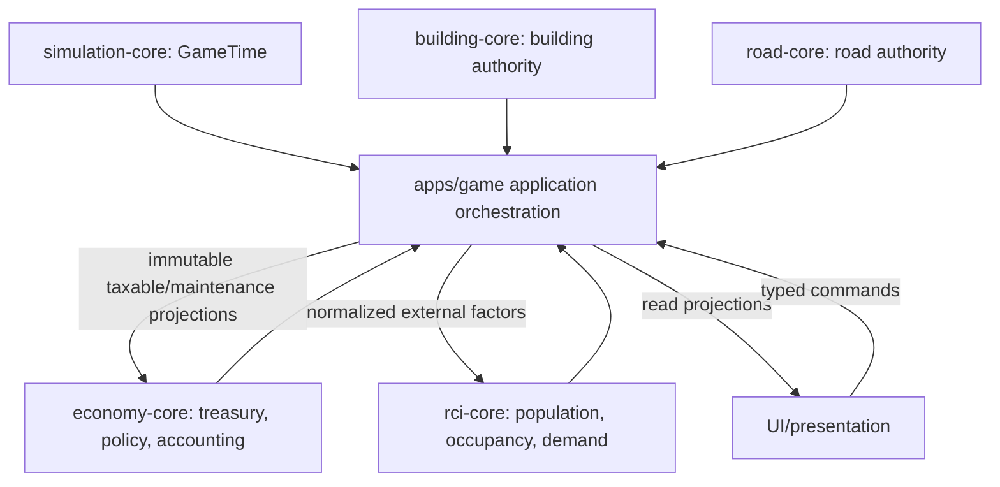
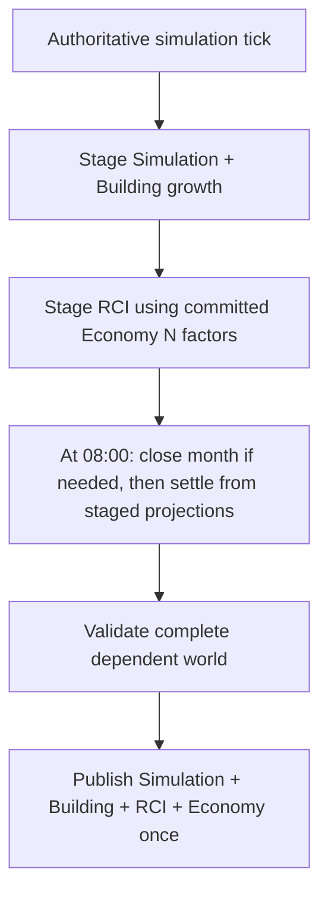
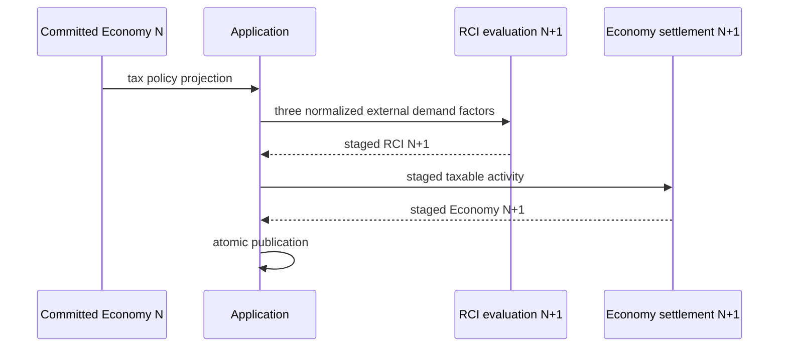
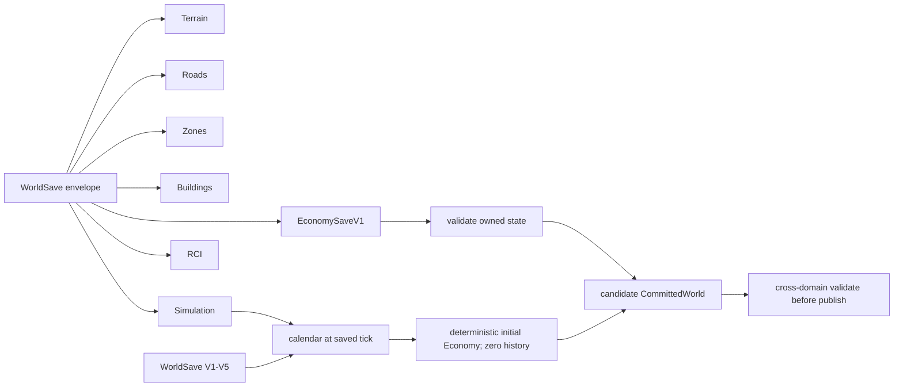

# Economy Foundation v0.1 Specification

**Status:** Design complete; ready for implementation approval

**Baseline:** `master@f970805fdc6640aa923fded69897c5a43361c970`

**Production implementation:** not started

## Decision Summary

Economy Foundation v0.1 adds a deterministic aggregate municipal economy without introducing personal or business microeconomics. A new framework-independent `economy-core` package owns money, treasury, policy, accounting, rules, quotes, deltas, and settlement. `apps/game` composes immutable RCI/Road/Building projections and uses the existing committed-world coordinator for atomic publication.

Irreversible choices are recorded in the accompanying ADRs. Balance values remain versioned data rather than scattered constants.

## Goals

- Make treasury, R/C/I tax revenue, municipal spending, and recurring road maintenance authoritative.
- Charge road construction, terraform, and bulldoze commands; keep zoning and private RCI growth free.
- Reject unaffordable paid commands before publication with typed results.
- Publish world and Economy changes atomically and undo exact command deltas.
- Settle daily and close accounting monthly from canonical GameTime.
- Supply lagged, deterministic tax-pressure factors to RCI.
- Persist Economy and migrate older world saves deterministically.
- Expose a compact HUD and Budget panel through application projections and commands.

## Non-Goals

Citizen wallets, salaries, household balances, rent, mortgages, personal wealth, business accounts or profit/loss, bankruptcy, loans, bonds, inflation, imports/exports, markets, production chains, utility billing, service-department budgets, individual taxation, land value, abandonment, density upgrades, and traffic productivity are outside v0.1.

## Ownership and Dependencies



`economy-core` imports no Three.js, UI, browser clock, or concrete Road/Building/RCI implementation. Neither RCI, Road, nor Building imports Economy. Application adapters translate authoritative snapshots into narrow Economy inputs.

## Domain Language

| Term | Meaning |
|---|---|
| `MoneyMinor` | Signed safe integer in hundredths of one monetary unit |
| `BasisPoints` | Integer rate where 10,000 bp is 100% |
| Treasury | Current municipal cash balance; may be negative after recurring settlement |
| Taxable activity | Aggregate occupied R/C/I units supplied as an immutable projection |
| Quote | Deterministic positive cost derived from a validated domain plan and Economy rules |
| Economy delta | Signed, categorized, revision-fenced proposed change |
| Receipt | Published command identity and exact delta used for compensating undo |
| Accounting period | One calendar month of aggregate revenue, expense, and adjustment totals |
| Settlement | Once-only daily tax and maintenance application at 08:00 |

## Deterministic Arithmetic

```ts
type MoneyMinor = number;
type BasisPoints = number;
```

- Both are validated safe integers; persisted JSON uses numbers.
- `100` minor units equal `1.00`; `10_000` bp equal 100%.
- Products use `bigint` intermediates. Division rounds halves away from zero, then rejects results outside `Number.MIN_SAFE_INTEGER...MAX_SAFE_INTEGER`.
- Apply multiplication before division: `roundHalfAwayFromZero(baseMinor * rateBp / 10_000)`.
- Tax rates are bounded by the active rules. Revenue and costs are non-negative; deltas and treasury are signed.
- `NaN`, infinity, fractional inputs, silent saturation, and floating-point authoritative multiplication are invalid.

## Versioned Rules

`EconomyRulesV1` contains:

- rules identity/version and arithmetic limits;
- initial treasury and default/minimum/maximum R/C/I rates;
- daily taxable base per occupied residential dwelling and occupied commercial/industrial position;
- road construction per added cell and road maintenance per occupied road cell;
- terraform raise/lower/flatten per changed vertex;
- bulldoze per removed road cell or building footprint cell;
- neutral tax rate, tax-pressure span, and RCI factor weight.

The foundation rules asset is the single balance authority. v0.1 starts with these explicit values:

| Rule | Value |
|---|---:|
| Initial treasury | `10_000_000` minor (`100,000.00`) |
| Default/neutral R, C, I tax | `700` bp (7%) |
| Allowed tax range | `0...2_000` bp |
| Daily residential base per occupied dwelling | `10_000` minor |
| Daily commercial base per occupied position | `15_000` minor |
| Daily industrial base per occupied position | `12_000` minor |
| Road construction per added cell | `50_000` minor |
| Road maintenance per occupied cell/day | `100` minor |
| Terraform raise/lower per changed vertex | `2_500` minor |
| Terraform flatten per changed vertex | `3_500` minor |
| Bulldoze per removed road/building footprint cell | `10_000` minor |
| Tax-pressure full span | `2_000` bp from neutral |
| RCI tax factor weight | `250` milli-weight |

Contract tests freeze these in `economy-rules.foundation.v1`. Later tuning requires a new versioned asset, not formula or caller edits.

## Authoritative Snapshot

```text
EconomySnapshotV1
├─ revision
├─ rulesVersion
├─ treasuryBalanceMinor
├─ taxPolicy { residentialBp, commercialBp, industrialBp }
├─ currentPeriod
│  ├─ year, month
│  ├─ taxRevenue { residential, commercial, industrial }
│  ├─ expenses { roadConstruction, terraform, bulldoze, roadMaintenance }
│  └─ refundsMinor
├─ previousPeriod | null
├─ lastDailySettlementTick
└─ lastMonthlyCloseTick | null
```

Period totals are aggregate audit state, not a transaction ledger. Population, employment, buildings, roads, demand, and calendar fields are never duplicated. Net is derived as tax revenue plus refunds minus expenses.

## Revenue and Expense Inputs

Application creates:

```text
TaxableActivityProjection
├─ occupiedResidentialDwellings
├─ occupiedCommercialPositions
└─ occupiedIndustrialPositions

RoadMaintenanceProjection
└─ occupiedRoadCells
```

The RCI snapshot already owns dwelling occupancy and workplace assignments. Commercial and industrial occupied positions are capacity minus channel vacancies. This aggregate model is deterministic and avoids inventing wages, profits, household income, or per-building accounts. Its trade-off is intentionally coarse revenue; richer productivity belongs to a later milestone.

Daily channel revenue is:

```text
activity count × configured daily taxable base × channel tax bp / 10,000
```

Each channel is rounded once after the complete product. Road maintenance is occupied road cells times its configured daily cost. Inputs must be non-negative safe integers.

## Player Action Costs and Affordability

| Action | Quote basis | v0.1 policy |
|---|---|---|
| Build road | added road cells | paid |
| Terraform raise/lower/flatten | changed vertices and operation | paid |
| Bulldoze road/building | removed cells/footprint cells | paid |
| Zone | — | free |
| Automatic/private RCI growth | — | free |

Quotes derive from the staged domain plan, never pointer movement or UI intent. A positive-cost command is rejected when `treasuryBalanceMinor < quote.totalMinor`. Recurring settlement may cross below zero; while negative, paid commands remain rejected. There is no bankruptcy or debt policy.

Application results are discriminated unions with stable codes such as `insufficient-funds`, `stale-revision`, `invalid-quote`, `invalid-policy`, `overflow`, and the owning domain's typed validation failures. Presentation never parses error text.

## Atomic Paid World Transaction

```mermaid
flowchart LR
  Command --> Plan["Plan domain command"]
  Plan --> Quote["Quote from validated plan"]
  Quote --> Funds["Check affordability"]
  Funds --> Stage["Stage domain + Economy delta"]
  Stage --> Derive["Derive dependent world"]
  Derive --> Validate["Cross-domain validation + fingerprint"]
  Validate --> Publish["One atomic publication"]
  Publish --> Present["Best-effort presentation"]
```



Economy joins `CommittedWorld` and its fingerprint/validation. The existing transaction coordinator remains the publication authority. No Economy debit or world mutation is visible before the single publish. A planning, quote, validation, or publication failure consumes no money. A presentation failure after publication cannot roll back authoritative state.

Transaction identity is deterministic from command kind and base committed-world revision; no clock or random UUID is authoritative.

## Undo and Redo

A published paid command stores one in-memory undo record containing the domain-specific inverse and exact Economy receipt. Undo plans the inverse against the current committed world and adds an exact refund to the current Economy snapshot. It does not restore the prior whole Economy snapshot, so intervening daily/monthly settlement is preserved.

- Undo is atomic and revision-fenced; failure changes nothing and retains the undo opportunity.
- A refund is recorded in the current period, including when the original expense belongs to a closed month. Closed accounting history is not rewritten.
- Successful undo clears the one-step record, preventing a double refund.
- Undo records remain session-only, matching the current architecture, and are cleared by reset/load; they are not persisted.
- v0.1 does not add redo. A future redo is a fresh command at current rules, requoted and rechecked for affordability.
- LIFO ordering is retained. If later authoritative changes make the inverse invalid, undo returns a typed rejection rather than forcing an inconsistent world.

## Simulation Cadence and Ordering

GameTime remains authoritative: one tick is one hour, 24 ticks one day, 30 days one month, 12 months one year. Pause produces no ticks; Step produces exactly one normal tick.



Settlement occurs only on a transition into 08:00 and is fenced by `lastDailySettlementTick`. On Day 1 08:00, Economy first closes the old current period and opens the new calendar month, then records that day's settlement in the new period. The first initialized or migrated snapshot marks the latest eligible daily boundary so loading never fabricates historical settlement.

## Lagged Economy to RCI Feedback



For each channel, application maps actual tax rate relative to the rules' neutral rate into a clamped signed milli-pressure, with the rules' pressure span mapping to ±100,000. Lower-than-neutral tax is positive; higher is negative. Application adapts these values into RCI's existing external factor contract using a versioned rules weight. `rci-core` does not import Economy and Economy does not import RCI. Same-tick recursive calculation is forbidden.

Tax-policy commands are typed Economy-only committed-world transactions. New policy affects RCI at the next daily evaluation.

## Persistence and Migration

The implementation must inspect the then-current save authority before naming the envelope; against this baseline, the next schema is `WorldSaveV6` containing `EconomySaveV1`.



`EconomySaveV1` stores revision, rules version, treasury, tax policy, current/previous periods, and settlement markers only. Older saves receive the configured initial treasury/default policy, a zeroed current period matching their saved calendar, null previous period, and markers that prevent retroactive settlement. No historical accounting is fabricated. Save → load → continue must equal uninterrupted execution from the save point.

## Presentation

Application exposes an immutable `EconomyViewProjection` for:

- compact HUD: treasury, current income, expenses, and net;
- Budget panel: R/C/I revenue, road and action expenses, tax rates, current month, previous month, and net;
- typed affordability and tax-policy outcomes.

Tax controls call an application command boundary. Presenters never mutate snapshots or calculate authoritative money. Complex charts are excluded.

## Hard Invariants

- Same initial save + commands + ticks produces the same treasury, policy, accounts, closes, and RCI factors.
- Failed plan, validation, or publication consumes no money.
- Presentation failure cannot alter treasury.
- Daily settlement and monthly close occur at most once per eligible tick.
- Pause causes zero economic progression; Step is exactly one normal tick.
- Undo reverses the exact command delta without erasing later settlement.
- Derived projections are not persisted or duplicated.
- Every candidate snapshot and save is revision-, range-, and arithmetic-valid.
- Save/load continuation equals uninterrupted simulation.

## PR Decomposition and Verification

1. Economy Core Foundation — Level 2 package/contract verification; Level 3 final gate.
2. Treasury and Accounting — Level 2 package consumers; Level 3 final gate.
3. Settlement and Projections — affected RCI/Road/Building tests; Level 3 final gate.
4. Paid Actions and Undo — affected interaction/browser tags plus Level 3; Level 4 because dependent-world publication and Undo are release-critical.
5. RCI Feedback and Persistence — migration/replay tests, affected RCI browser tags, Level 3 and Level 4.
6. Budget UI and Milestone Closure — targeted `@rci`, `@interaction`, `@smoke` during development; canonical full Level 4 release verification for closure.

Use the repository's existing verification commands and exact-head evidence discipline. Do not duplicate Lean work in Browser CI or broaden retries/timeouts to obtain a pass.

## Acceptance

The milestone is complete only when all scoped gameplay, determinism, persistence, UI, architecture, CI, browser acceptance, artifact hygiene, and performance gates in the TDD plan pass on the exact release candidate. This planning PR changes documentation only and does not begin production implementation.
