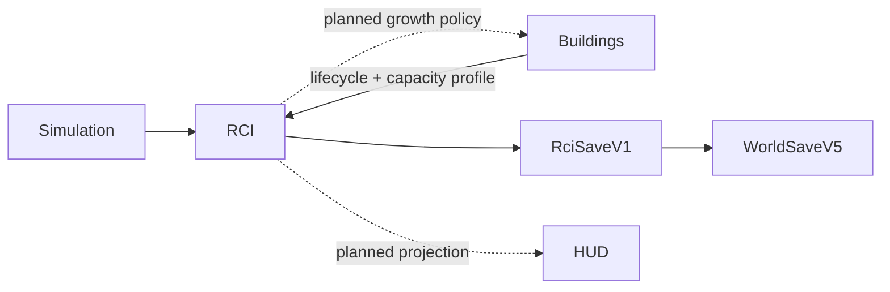

# RCI Demand & Occupancy System

**Status:** Partial — PR 1–3 contracts, population, housing, and migration implementation written  
**Current stacked head:** `feat/rci-housing-migration-v0-1`  
**Primary ownership:** `packages/rci-core`; `apps/game` owns world-envelope composition and later runtime orchestration  
**Persistence:** `RciSaveV1` inside `WorldSaveV5`

## Purpose

Provide deterministic authority for Citizens, Relationships, Households, housing, Workplaces, Employment, migration, R/C/I demand, and growth gates without coupling domain state to rendering or UI.

## Implemented Capabilities

### Core contracts and persistence

- Framework-free `@web-three-city/rci-core` package.
- Stable IDs, normalized immutable records, bounded revisions, and persisted monotonic sequences.
- Extensible validated registries and canonical Save ordering.
- `RciSaveV1` inside `WorldSaveV5` with structured decode errors.
- Prior V1–V4 world saves migrate to valid RCI state and derive empty Dwelling inventory from active Residential Buildings without inventing Citizens.

### Population, Household, and relationship lifecycle

- Tick-derived age and age bands; daily lifecycle at canonical 08:00.
- Normalized Household membership and independent family/partner graph.
- Deterministic working-age qualifications.
- Versioned fertility/mortality profiles compiled to integer daily hazards.
- Atomic birth/death/history mutation, ordered events, and stale-plan fences.

### Housing and migration

- Building definitions publish versioned capacity-profile references without importing RCI.
- Active Residential Buildings materialize deterministic `dwelling:<buildingInstanceId>:<unitIndex>` records; construction exposes no capacity.
- Retired Buildings retire Units, end active housing assignments, and enqueue displaced Households atomically.
- One active home per Household and one active Household per Unit.
- Housing reconciliation uses minimum adequate capacity and stable Unit ID; relocation never creates new overcrowding.
- Birth may retain an existing Household in overcrowded housing and exposes that pressure as a projection.
- Displaced Households receive priority over incoming requests and expire exactly 720 ticks after displacement.
- Expiry performs a final relocation attempt and otherwise emigrates the entire Household while retaining historical records.
- Incoming queue generation uses a fixed-point accumulator, daily/queue caps, deterministic archetype selection, and no Citizen preallocation.
- Successful materialization creates Citizens, qualifications, Household, memberships, relationships, and one housing assignment atomically.
- Housing-side emigration factors are ordered by stable factor ID and evaluated in fixed-point units.

## Authority

### Authoritative

- Citizen and historical-presence records.
- Relationship records.
- Household and membership history.
- Qualification history.
- Dwelling Unit and housing-assignment history.
- Incoming and displaced Household queues.
- Workplace and Employment-assignment schemas.
- Demand and persisted growth-gate state.
- Deterministic seed, fixed-point accumulators, revisions, and ID sequences.

PR 1–3 currently mutate Population, Relationship, Household, Qualification, Housing, and Migration authorities. PR 4–5 add Employment and Demand behavior.

### Derived

Current Household, home, work, qualification, age bands, resident counts, capacity, vacancy, overcrowding, employment totals, compatible vacancies, family projections, and HUD values are rebuilt and not persisted as duplicate authority.

## Current Tick Workflow

```text
validate Simulation/Building/RCI revisions
→ synchronize Dwelling inventory from Building lifecycle
→ detect daily 08:00 boundary
→ evaluate aging, qualification, fertility, and mortality
→ accumulate deterministic incoming requests
→ relocate displaced Households
→ materialize incoming Households into adequate vacant Units
→ expire unresolved displacement into Household emigration
→ validate complete proposed RCI snapshot
→ commit planned snapshot with stale-revision fences
```

Employment, Demand, and app-level atomic world composition are added by PR 4–6 without changing the normalized authority model.

## Integrations



`rci-core` consumes stable Building and Simulation contracts. `building-core` and `simulation-core` never import `rci-core`.

## Persistence

`RciSaveV1` stores bounded revisions, normalized authority arrays, queues, Demand/gates, deterministic state, and every ID sequence. Definitions, indexes, projections, processed events, renderer state, and UI state are excluded.

Historical Citizens, memberships, relationships, qualifications, Dwelling Units, housing assignments, displaced entries, and incoming requests round-trip canonically. Continuous execution and encode/decode/resume must produce equal snapshots.

## Invariants and Failure Behavior

- One authoritative source for each fact.
- Stable IDs are never reused; failed plans consume no sequence values.
- Definitions and cross-registry references must resolve.
- A resident has exactly one active Household membership.
- A Household and Unit each have at most one active housing assignment.
- Incoming requests contain no Citizen IDs and materialize only with sufficient capacity.
- Displaced Households remain resident until relocation or atomic Household emigration.
- Relocation does not create new overcrowding.
- Death/emigration are terminal current-presence transitions; historical records remain addressable.
- Order-sensitive work uses explicit stable comparators.
- Untrusted Save decode returns structured errors; invalid or stale plans never partially publish state.

## Extension Points

Registries and strategies allow new relationship types, qualifications, requirements, occupations, Residential/Workplace capacity profiles, migration archetypes, population-rate profiles, pressure factors, demand factors, and matching policies without changing historical entity schemas.

## Current Limitations

Not yet written on this branch:

- Workplace inventory and Employment reconciliation,
- Employment-side emigration pressure,
- R/C/I Demand, growth gates, and caller-supplied Building Growth policy,
- atomic game runtime composition, HUD, browser acceptance, and final benchmarks.

These are delivered by stacked PR 4–6 branches and verified together at the final integration gate.

## Handoff Checklist

- Design: [RCI Demand & Occupancy Foundation v0.1](specs/2026-08-06-rci-demand-occupancy-foundation-v0-1.md)
- Authority ADR: [Citizen records as population authority](adrs/0001-citizen-records-as-population-authority.md)
- TDD packet: [execution index](tdd/README.md)
- PR 1 evidence: [Core contracts and Save V1](verification/2026-08-06-rci-pr1-core-contracts-save-v1.md)
- PR 2 evidence: [Population lifecycle](verification/2026-08-06-rci-pr2-population-lifecycle.md)
- PR 3 evidence: [Housing and migration](verification/2026-08-06-rci-pr3-housing-migration.md)
- Next plan: [PR 4 — Workplaces and Employment](tdd/2026-08-06-rci-pr4-workplaces-employment.md)
- Related systems: [World](../world/README.md), [Buildings](../buildings/README.md), [Simulation Time](../simulation-time/README.md), [Economy](../economy/README.md)
