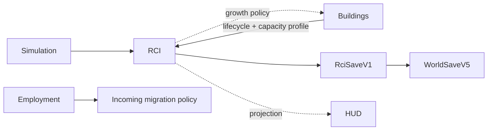

# RCI Demand & Occupancy System

**Status:** Partial — PR 1–4 contracts, population, housing, migration, and Employment implementation written  
**Current stacked head:** `feat/rci-employment-v0-1`  
**Primary ownership:** `packages/rci-core`; `apps/game` owns world-envelope composition and later runtime orchestration  
**Persistence:** `RciSaveV1` inside `WorldSaveV5`

## Purpose

Provide deterministic authority for Citizens, Relationships, Households, housing, Workplaces, Employment, migration, R/C/I demand, and growth gates without coupling domain state to rendering or UI.

## Implemented Capabilities

### Core and population

- Stable immutable normalized records, revisions, sequences, registries, validation, and canonical Save V1.
- Tick-derived age, independent Household/family history, deterministic qualifications, and daily 08:00 birth/death lifecycle.

### Housing and migration

- Versioned Residential capacity profiles resolved from active Building lifecycle.
- Deterministic Dwelling inventory and normalized housing history.
- Adequate-capacity best-fit relocation, displaced-first processing, and exact 720-tick expiry.
- Fixed-point incoming accumulator, versioned archetypes, atomic Household materialization, and historical emigration.

### Workplaces and Employment

- Active Commercial/Industrial Buildings materialize deterministic `workplace:<buildingInstanceId>` records from versioned Workplace capacity profiles.
- Workplace retirement ends active assignments while retaining history.
- Position groups carry capacity, minimum qualification requirement, and optional occupation reference.
- Reconciliation preserves every still-valid assignment before considering new matches.
- Unemployed Working-Age residents are processed in stable Citizen ID order.
- Candidate order minimizes qualification distance, then uses stable Workplace and position-group IDs.
- Matching never exceeds group capacity and never displaces a valid worker.
- After unemployed matching, at most one controlled upgrade may move a worker to a vacant better-fit position on a daily boundary.
- Employment projection derives working-age population, employment, unemployment, total capacity, vacancy, compatible vacancy, and underemployment.
- Compatible vacant jobs feed the incoming migration request policy.
- Employment-side emigration factors extend the shared stable fixed-point pressure contract.

## Authority

### Authoritative

Citizen presence, qualifications, Relationships, Households/memberships, Dwelling Units/housing assignments, Workplaces/Employment assignments, migration queues, Demand/gates, deterministic accumulators, revisions, and ID sequences.

### Derived

Current Household, home, job, qualification, age bands, resident/capacity/vacancy/overcrowding totals, compatible jobs, underemployment, family projections, RCI scorecards, and HUD values.

## Current Tick Workflow

```text
validate Simulation/Building/RCI revisions
→ synchronize Dwelling inventory
→ synchronize Workplace inventory
→ evaluate daily population lifecycle when crossing 08:00
→ preserve/end Employment assignments by current validity
→ match unemployed residents to closest-qualified vacant positions
→ perform at most one daily non-displacing best-fit upgrade
→ derive compatible vacant job supply
→ accumulate incoming requests on daily boundary
→ relocate displaced Households
→ materialize incoming Households
→ expire unresolved displacement into Household emigration
→ validate complete proposed RCI snapshot
→ commit with stale-revision fences
```

Demand and app-level atomic world composition are added by PR 5–6 without changing normalized authority.

## Integrations



`rci-core` consumes Building and Simulation contracts. `building-core` and `simulation-core` never import `rci-core`.

## Persistence

`RciSaveV1` stores normalized history, queues, Demand/gates, fixed-point state, revisions, seed, and every sequence. Registry definitions, indexes, projections, events, renderer state, and UI state are excluded. Historical Workplace and Employment assignments round-trip with every other RCI authority.

## Invariants and Failure Behavior

- One authoritative source for each fact; derived indexes are rebuildable.
- Failed plans consume no IDs and publish no partial state.
- One active Household membership, home, and job per eligible authority.
- Position occupancy never exceeds capacity.
- Active Employment requires resident Working-Age Citizen, active Workplace, active qualification, and satisfied requirement.
- Valid assignments are stable; upgrade requires vacant better fit, cannot reduce employment, and is capped at one per day.
- Incoming materialization and relocation require sufficient housing capacity.
- Historical records remain addressable after death, emigration, retirement, or assignment endings.
- Order-sensitive work uses explicit stable comparators and integer fixed-point values.

## Extension Points

Definition registries and strategy contracts support new relationship/qualification/occupation types, capacity profiles, migration archetypes, rate/pressure/demand factors, and future Education or Economy policies without changing historical entity schemas.

## Current Limitations

Not yet written on this branch:

- R/C/I Demand evaluation, smoothing, persisted hysteresis, and Building Growth policy,
- atomic game runtime composition, compact HUD, browser acceptance, and final benchmark/closure evidence.

These are delivered by stacked PR 5–6 and verified together at the final integration gate.

## Handoff Checklist

- Design: [RCI Demand & Occupancy Foundation v0.1](specs/2026-08-06-rci-demand-occupancy-foundation-v0-1.md)
- TDD packet: [execution index](tdd/README.md)
- PR 1 evidence: [Core contracts and Save V1](verification/2026-08-06-rci-pr1-core-contracts-save-v1.md)
- PR 2 evidence: [Population lifecycle](verification/2026-08-06-rci-pr2-population-lifecycle.md)
- PR 3 evidence: [Housing and migration](verification/2026-08-06-rci-pr3-housing-migration.md)
- PR 4 evidence: [Workplaces and Employment](verification/2026-08-06-rci-pr4-workplaces-employment.md)
- Next plan: [PR 5 — Demand and Building Growth policy](tdd/2026-08-06-rci-pr5-demand-growth-policy.md)
- Related systems: [World](../world/README.md), [Buildings](../buildings/README.md), [Simulation Time](../simulation-time/README.md), [Economy](../economy/README.md)
