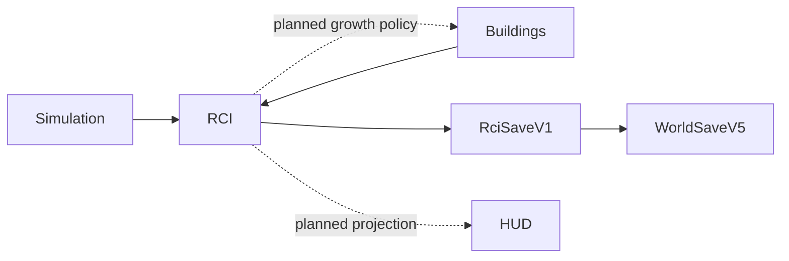

# RCI Demand & Occupancy System

**Status:** Partial — PR 1 contracts/save and PR 2 population lifecycle implemented  
**Last implementation head:** `feat/rci-population-lifecycle-v0-1`  
**Primary ownership:** `packages/rci-core`; `apps/game` owns world-envelope composition and future runtime orchestration  
**Persistence:** `RciSaveV1` inside `WorldSaveV5`

## Purpose

Provide deterministic authority for Citizens, Relationships, Households, housing, Workplaces, Employment, migration, R/C/I demand, and growth gates without coupling those domains to rendering or UI.

## Implemented Capabilities

### Core contracts and persistence

- Framework-free `@web-three-city/rci-core` package.
- Stable IDs and normalized immutable records.
- Extensible validated registries for definitions used across RCI domains.
- Revisioned bounded snapshots and persisted monotonic sequences.
- Canonical stable ordering, complete-state validation, and structured Save errors.
- Lossless `RciSaveV1` encode/decode inside `WorldSaveV5`.
- Deterministic migration from prior world saves to a valid empty RCI state.

### Population, Household, and relationship lifecycle

- Citizen age and age bands derive from deterministic Simulation ticks; age is not duplicated in Save.
- Daily lifecycle evaluates only across the canonical 08:00 boundary.
- Household membership is normalized history, independent from family relationships.
- Biological-parent edges are directional and permanent; partner history is canonical undirected and endable.
- Working-age qualification bootstrap is deterministic and persisted as assignment history.
- Fertility and mortality use versioned annual-rate profiles compiled to integer daily hazards.
- Birth creates Citizen, Household membership, mother edge, optional father edge, sequences, and events atomically.
- Death retains Citizen history while ending active residence, qualifications, and partner state according to lifecycle policy.
- Ordered domain events and plan/commit revision fences make lifecycle replayable and stale-plan safe.

## Authority

### Authoritative

- Citizen and historical-presence records.
- Relationship records.
- Household and membership history.
- Qualification history.
- Dwelling, housing-assignment, Workplace, and Employment-assignment records.
- Incoming and displaced queues.
- Demand and growth-gate state.
- Deterministic seed, fixed-point accumulators, revisions, and ID sequences.

Schemas for all of these authorities exist. PR 1–2 currently mutate Population, Relationship, Household, and Qualification authorities. PR 3–5 add Housing, Migration, Employment, and Demand behavior.

### Derived

Current Household, home, work, qualifications, age bands, histograms, capacity totals, vacancies, Employment totals, family projections, and HUD values are reconstructed and are not persisted as duplicate authority.

## Current Tick Workflow

```text
validate Simulation/Building/RCI revisions
→ detect daily 08:00 boundary
→ evaluate age-band transitions
→ award deterministic working-age qualifications
→ evaluate fertility and mortality
→ apply normalized history changes
→ order domain events
→ validate complete proposed RCI snapshot
→ commit planned snapshot with stale-revision fences
```

Housing, Employment, Demand, and app-level atomic world composition are added by PR 3–6 without changing the authority model above.

## Integrations



`rci-core` consumes stable Building and Simulation contracts. `building-core` and `simulation-core` never import `rci-core`.

## Persistence

`RciSaveV1` stores bounded revisions, normalized record arrays, queues, Demand/gates, deterministic state, and every ID sequence. Runtime indexes, projections, processed events, registry definitions, renderer state, and UI state are excluded.

Historical Citizens, memberships, relationships, and qualifications round-trip canonically. Continuous lifecycle execution and encode/decode/resume are required to produce equal snapshots and event results.

## Invariants and Failure Behavior

- One authoritative source for each fact.
- Stable IDs are never reused; failed plans consume no sequence values.
- Input arrays are copied, sorted canonically, and frozen.
- Definitions and cross-registry references must resolve.
- A resident has exactly one active Household membership.
- A Citizen has at most one active partner and at most one biological mother/father edge per child.
- Death is terminal; historical records remain addressable.
- Daily decisions are based on the pre-mutation candidate set and explicit stable ordering.
- Untrusted Save decode returns structured errors; invalid or stale plans never partially publish state.

## Extension Points

Registries and strategy interfaces allow new relationship types, qualifications, requirements, occupations, capacity profiles, migration archetypes, population-rate profiles, demand factors, qualification resolvers, and rate policies without changing historical entity schemas.

## Current Limitations

Not yet implemented on this branch:

- Dwelling inventory, housing assignment, relocation, and displacement,
- incoming migration materialization and household emigration pressure,
- Workplace inventory and Employment reconciliation,
- R/C/I Demand, growth gates, and caller-supplied Building Growth policy,
- atomic game runtime composition, HUD, and browser acceptance.

These are delivered by stacked PR 3–6 branches and verified together at the final integration gate.

## Handoff Checklist

- Design: [RCI Demand & Occupancy Foundation v0.1](specs/2026-08-06-rci-demand-occupancy-foundation-v0-1.md)
- Authority ADR: [Citizen records as population authority](adrs/0001-citizen-records-as-population-authority.md)
- TDD packet: [execution index](tdd/README.md)
- PR 1 evidence: [Core contracts and Save V1](verification/2026-08-06-rci-pr1-core-contracts-save-v1.md)
- PR 2 evidence: [Population lifecycle implementation](verification/2026-08-06-rci-pr2-population-lifecycle.md)
- Next plan: [PR 3 — Housing, Migration, Relocation, and Displacement](tdd/2026-08-06-rci-pr3-housing-migration-displacement.md)
- Related systems: [World](../world/README.md), [Buildings](../buildings/README.md), [Simulation Time](../simulation-time/README.md), [Economy](../economy/README.md)
