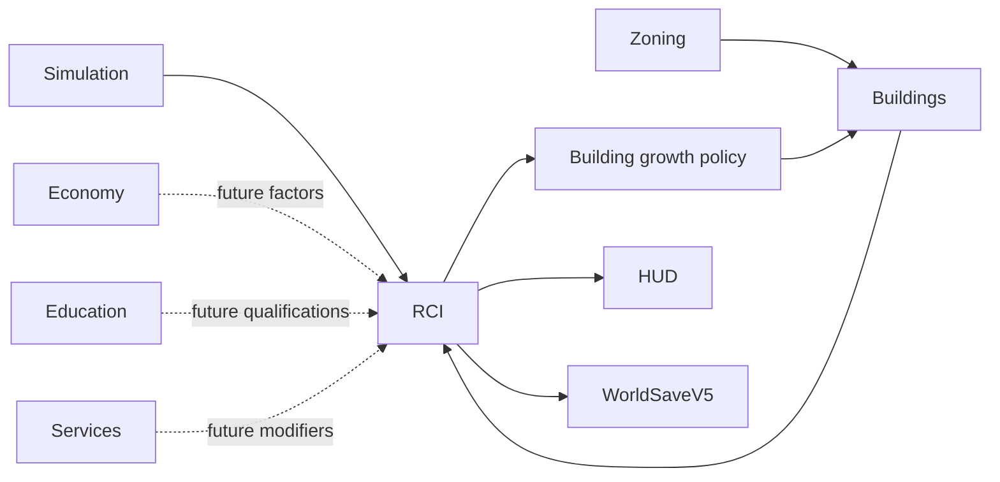

# RCI Demand & Occupancy System

**Status:** Approved design — not implemented  
**Last verified against:** `docs/rci-demand-occupancy-v0-1-planning`  
**Planned ownership:** `packages/rci-core`, `apps/game` world-tick orchestration and HUD integration  
**Planned persistence:** `RciSaveV1` inside `WorldSaveV5`

## Purpose

Add citizen-based population, family relationships, flexible Households, dwelling occupancy, workplaces, employment, migration, R/C/I demand, and demand-controlled automatic growth while preserving deterministic Save/Load and mobile-scale simulation.

## Does Not Own

- Building placement, footprints, construction, or rendering.
- Simulation clock and calendar.
- Taxes, budgets, wages, rent, Utilities, Traffic, City Services, Education gameplay, or Citizen AI.
- Zone painting or Road topology.

## Approved Capabilities

- Stable Citizen identities with resident, emigrated, and deceased history.
- First-class directional parent and canonical undirected partner relationships.
- Flexible Household membership independent from family relationships.
- Residential Dwelling Units derived from versioned Building capacity profiles.
- Workplace position groups with extensible qualification and optional occupation definitions.
- Historical Household membership, housing, qualification, and employment assignments.
- Deterministic aging, daily fertility/mortality hazards, immigration, relocation, displacement, and emigration.
- Incoming Household requests and a displaced queue with a `720`-tick grace period.
- Stability-first best-fit employment matching and controlled underemployment upgrades.
- Fixed-point target-buffer RCI demand with smoothing and factor registries.
- Authoritative per-zone growth gates using threshold and hysteresis.
- Deterministic end-of-tick reconciliation and one atomic world-tick commit.

None of these capabilities is production runtime behavior until the implementation PRs are merged.

## Planned Authority

### Authoritative

- Citizens and historical presence.
- Relationship records.
- Households and membership history.
- Qualification history.
- Dwelling and Workplace inventory derived at Building activation but persisted as RCI records where required by the approved spec.
- Housing and Employment assignment history.
- Incoming and displaced queues.
- Demand and growth-gate state.
- Deterministic seeds, accumulators, and ID sequences.

### Derived

- Current Household, home, work, and qualification projections.
- Age and four age bands: EarlyChildhood `0–5`, SchoolAge `6–17`, WorkingAge `18–64`, Seniors `65+`.
- Age histograms by sex definition.
- Population, vacancies, unemployment, underemployment, housing pressure, and HUD statistics.
- Sibling, grandparent, and extended-family relationships.
- Building growth policy exposed to the Building system.

## Planned Main Workflow

1. Plan the next Simulation tick and Building lifecycle transition.
2. Materialize/retire Dwelling and Workplace inventory from Building changes.
3. Evaluate daily age transitions, birth, death, and migration when scheduled.
4. Append and deterministically sort domain invalidations.
5. Reconcile housing, prioritizing displaced Households before incoming requests.
6. Reconcile employment while preserving valid assignments.
7. Recompute projections, RCI demand, and hysteresis gates.
8. Validate the complete proposed RCI/Building/Simulation state.
9. Commit the tick atomically or publish no change.

## Integrations

`rci-core` may import stable Building and Simulation contracts. `building-core` and `simulation-core` must not import `rci-core`.

## Persistence

`RciSaveV1` is planned as a lossless normalized record store inside `WorldSaveV5`. Prior World Saves initialize an empty RCI state without inventing historical Citizens. Save decode must validate all cross-record references and produce the same future results as continuous execution.

## Invariants and Failure Behavior

- One authority for each fact; current projections are not persisted twice.
- Stable IDs are never reused and failed plans consume no sequence numbers.
- Historical records remain referentially valid.
- Resident Citizens have exactly one active Household membership.
- Active Dwelling and Employment assignments satisfy uniqueness and capacity rules.
- Daily hazards and matching use stable ordering and deterministic counter-based sampling, never `Math.random()`.
- Demand uses fixed-point arithmetic and the growth gate is persisted because hysteresis cannot be reconstructed from current demand alone.
- Any invalid sub-plan rejects the complete tick.

## Extension Points

Definition registries keep relationship types, qualifications, employment requirements, position groups, occupations, migration archetypes, capacity profiles, rate profiles, and demand factors open for future content. Strategy contracts allow Education, Economy, Land Value, Health, Services, Pollution, Traffic accessibility, or detailed careers to influence policies without changing entity authority.

## Current Limitations

The system is not implemented. The approved v0.1 also excludes marriage-market simulation, adoption, full occupations, salaries, commute/pathfinding, rendered Citizens, homelessness gameplay, building abandonment, and density upgrades.

## Handoff Checklist

- Canonical design: [RCI Demand & Occupancy Foundation v0.1](specs/2026-08-06-rci-demand-occupancy-foundation-v0-1.md)
- Authority decision: [ADR-0001](adrs/0001-citizen-records-as-population-authority.md)
- Implementation plan: to be written under `tdd/` after written-spec approval
- Related systems: [Buildings](../buildings/README.md), [Simulation Time](../simulation-time/README.md), [Zoning](../zoning/README.md), [Economy](../economy/README.md)
- Planning PR: #25
