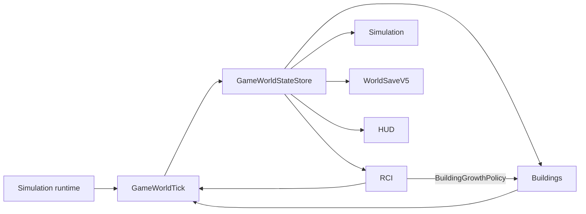

# RCI Demand & Occupancy System

**Foundation status:** Implemented, verified, and merged  
**Foundation baseline:** `master` at `9409e301d2710db856b584fc555d5c4f714bba62`  
**Post-closure correction:** PR #32 manually accepted; exact-head automated verification and merge pending  
**Primary ownership:** `packages/rci-core`; `apps/game` owns atomic world orchestration, Save composition, and HUD presentation  
**Persistence:** `RciSaveV1` inside `WorldSaveV5`

## Purpose

Provide deterministic authority for Citizens, Relationships, Households, housing, Workplaces, Employment, migration, R/C/I Demand, and Growth gates while keeping rendering, input tools, and UI outside the domain package.

## Delivery Status

RCI Foundation v0.1 was delivered through PR #26–#31 and closed on the exact verified source tree `75a04d244a3e27a7f6a89d46f90bd676d60626d4`. The final squash-merged `master` commit has the same tree.

Manual gameplay later identified a fully-occupied Growth deadlock. PR #32 corrects the Demand target-buffer definitions. The original saved city now recovers naturally without a reset or Save migration:

```text
Initial deadlock
Population 4 | Households 3 | Housing 3/3 | Employment 4/4
Demand R -32 closed | C -29 closed | I -47 closed

Manual recovery result
Population 67 | Households 32 | Housing 32/34 | Employment 50/50
Buildings 37
Demand R +43 open | C +22 open | I +22 open
```

This manual result is accepted. PR #32 remains outside the `master` baseline until its own exact-head Lean CI and Full browser verification complete.

## Current Capabilities

### Population and Household lifecycle

- Stable immutable normalized records, bounded revisions, persisted ID sequences, extensible registries, complete-state validation, and canonical Save output.
- Tick-derived age and age bands; daily lifecycle evaluates only at the canonical `08:00` boundary.
- Household membership is independent from family and partner relationships.
- Deterministic qualifications, fertility, mortality, birth, death, and historical-record retention.
- Ordered domain events and stale-plan commit fences.

### Housing and migration

- Versioned Residential capacity profiles resolved from active Building definitions.
- Deterministic Dwelling inventory and normalized housing-assignment history.
- Adequate-capacity best-fit relocation, displaced-first processing, and exact `720`-tick displacement expiry.
- Fixed-point incoming request accumulation, five versioned migration archetypes, and atomic Household materialization.
- Historical Household emigration and fixed-point housing pressure factors.
- Prior World Saves derive inventory from active Buildings without inventing Citizens or occupancy.

### Workplaces and Employment

- Deterministic Workplace inventory from active Commercial and Industrial Buildings.
- Versioned position-group capacities, qualification requirements, and optional occupations.
- Stability-first matching preserves valid workers before processing unemployed residents.
- Closest-qualified stable matching, capacity bounds, and no worker displacement.
- At most one vacant better-fit controlled upgrade per daily boundary.
- Employment projections and compatible vacancies feed migration policy.
- Employment-side pressure factors share the same ordered fixed-point contract.

### Demand and Building Growth

- Extensible Residential, Commercial, and Industrial Demand factors evaluated from derived projections.
- Stable factor ordering and bounded integer scores in `-100_000..100_000`.
- Integer smoothing into authoritative Demand state.
- Persisted hysteresis gates: `>=15_000` opens, `<=5_000` closes, and the neutral band retains prior state.
- Residential target-buffer Demand uses wholly vacant Dwelling Units relative to active Households; spare beds inside an assigned Dwelling Unit are not vacant housing.
- Commercial and Industrial target-buffer Demand normalizes vacancy pressure against a 20% vacant-position target with a minimum target of one position.
- A fully occupied city can recover closed R/C/I Growth gates through later daily Demand evaluations.
- Negative Demand suppresses future Growth but never abandons existing Buildings or Zones.
- RCI derives a caller-supplied `BuildingGrowthPolicy`; Building Core never imports RCI.
- Demand magnitude affects eligible-zone selection weight deterministically.

The corrected target-buffer behavior above is implemented in PR #32 and becomes the authoritative runtime contract after that PR is merged.

### Game integration and presentation

- `GameWorldStateStore` publishes Simulation, Building, and RCI snapshots as one world revision.
- `planGameWorldTick` stages Building Growth, Simulation advancement, RCI reconciliation, validation, and receipts before publication.
- Failure or stale revision leaves the committed state unchanged.
- Existing Terraform, Road, Zone, Building, undo, and pointer workflows remain outside background RCI orchestration.
- `WorldSaveV5` round-trips Simulation, Buildings, and `RciSaveV1` atomically with V1–V4 migration.
- Compact HUD shows Population, Households, Housing, Employment, and signed R/C/I Demand/gate state.
- HUD updates are projection-only and do not change active tools or pointer sessions.

## Authoritative State

- Citizen and historical-presence records.
- Relationships.
- Households and membership history.
- Qualification history.
- Dwelling Units and housing assignments.
- Workplaces and Employment assignments.
- Incoming and displaced queues plus fixed-point attraction accumulator.
- Smoothed R/C/I Demand and Growth gates.
- Deterministic seed, bounded revisions, and all generated-ID sequences.

## Derived State

Current Household, home, job, qualification, age bands, demographics, family projections, capacities, vacancies, overcrowding, unemployment, compatible vacancies, underemployment, factor contributions, raw Demand targets, Building Growth policy, scorecards, and HUD values.

## Canonical Tick Pipeline

```text
read one committed GameWorldState
→ plan Building Growth with the current RCI policy
→ stage Simulation + Building result
→ synchronize Dwelling and Workplace inventory
→ evaluate daily Population lifecycle at 08:00
→ reconcile Employment
→ derive compatible vacancy supply and accumulate migration requests
→ reconcile Housing, materialization, displacement, and expiry
→ derive RCI projection
→ evaluate and smooth ordered Demand factors
→ update persisted hysteresis gates
→ validate the complete staged state
→ atomically publish one new GameWorldState revision
→ update renderers and HUD from committed snapshots
```

## Integrations



Dependency direction remains acyclic: `building-core` and `simulation-core` do not import `rci-core`; `apps/game` composes them.

## Persistence

`RciSaveV1` stores normalized histories, queues, accumulator, Demand, gates, seed, revisions, and every sequence. Registry definitions, indexes, projections, events, policy objects, renderer state, active tools, pointer sessions, and HUD DOM are rebuilt.

`WorldSaveV5` is the current envelope. V1–V4 decode in dependency order and initialize deterministic RCI authority from decoded Simulation and active Building inventory. Decode is all-or-nothing. PR #32 changes only derived Demand factor inputs and evaluation; it requires no Save schema migration.

## Invariants and Failure Behavior

- One authoritative source for each fact; every projection is rebuildable.
- Stable IDs are never reused and failed plans consume no sequence values.
- A resident has exactly one active Household membership.
- A Household and Dwelling Unit have at most one active housing assignment each.
- An eligible Citizen has at most one active Employment assignment.
- Housing and position capacities cannot be exceeded by reconciliation.
- Relocation and incoming materialization require adequate vacant housing.
- Demand must use the same wholly vacant Dwelling Unit authority required by Household materialization.
- A target-buffer factor at full occupancy must be able to exceed its Growth-gate opening threshold.
- Valid workers are not displaced; upgrades require an already-vacant better fit.
- Order-sensitive work uses explicit stable comparators and integer arithmetic.
- Growth gates persist because neutral-band behavior depends on prior state.
- Invalid Save, stale plan, or failed staged transaction publishes no partial world state.
- Background simulation cannot switch tools, close menus, alter previews, or append undo records.

## Extension Points

Registries and policies support new relationship, qualification, occupation, capacity, migration, lifecycle-rate, pressure, and Demand definitions. Future Education, Economy, Land Value, Services, Utilities, Traffic, and Citizen AI can consume projections or add factors without replacing historical entity schemas.

## Current Limitations

- No Economy, wages, taxes, business profitability, utilities, services, traffic, Land Value, abandonment, density upgrades, Education gameplay, or Citizen movement AI.
- HUD is intentionally compact and read-only.
- Scale baseline covers `5,000` Citizens; larger performance budgets are not yet hard release gates.

## Handoff Index

- Design: [RCI Demand & Occupancy Foundation v0.1](specs/2026-08-06-rci-demand-occupancy-foundation-v0-1.md)
- Authority ADR: [Citizen records as population authority](adrs/0001-citizen-records-as-population-authority.md)
- TDD execution packet: [execution index](tdd/README.md)
- PR 1: [Core contracts and Save](verification/2026-08-06-rci-pr1-core-contracts-save-v1.md)
- PR 2: [Population lifecycle](verification/2026-08-06-rci-pr2-population-lifecycle.md)
- PR 3: [Housing and migration](verification/2026-08-06-rci-pr3-housing-migration.md)
- PR 4: [Workplaces and Employment](verification/2026-08-06-rci-pr4-workplaces-employment.md)
- PR 5: [Demand and Growth policy](verification/2026-08-06-rci-pr5-demand-growth.md)
- PR 6: [Game integration](verification/2026-08-06-rci-pr6-game-integration.md)
- Foundation closure: [RCI Foundation v0.1](verification/2026-08-06-rci-foundation-v0-1-closure.md)
- Post-closure correction: [Fully-occupied Growth deadlock](verification/2026-08-06-rci-occupied-dwelling-demand-deadlock.md)
- Related systems: [World](../world/README.md), [Buildings](../buildings/README.md), [Simulation Time](../simulation-time/README.md), [Economy](../economy/README.md)
