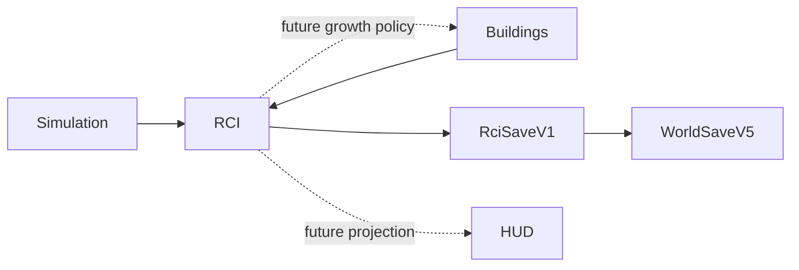

# RCI Demand & Occupancy System

**Status:** Partial — PR 1 foundation implemented  
**Last verified against:** `feat/rci-core-contracts-v0-1@4fde0f366aeceac1266465040eb3f852b186ca75`  
**Primary ownership:** `packages/rci-core`; `apps/game` owns world-envelope composition  
**Persistence:** `RciSaveV1` inside `WorldSaveV5`

## Purpose

Provide deterministic authority for future Citizens, Relationships, Households, housing, Workplaces, Employment, migration, R/C/I demand, and growth gates without coupling those domains to rendering or UI.

## Delivered in PR 1

- Framework-free `@web-three-city/rci-core` package.
- Stable ID contracts and normalized immutable record shapes.
- Extensible validated registries for sex, relationship, qualification, requirement, position-group, occupation, migration, capacity, demand-factor, and population-rate definitions.
- Foundation sex, relationship, qualification, and employment-requirement definitions.
- Revisioned bounded snapshots and persisted monotonic ID sequences.
- Canonical stable ordering and immutable snapshot construction.
- Local and cross-domain validation against Building and Simulation snapshots.
- Lossless canonical `RciSaveV1` encode/decode with structured compatibility errors.
- `WorldSaveV5` composition and deterministic migration from prior saves to an empty RCI state at the saved Simulation tick.

PR 1 establishes storage and validation only. It does not run population or RCI simulation.

## Authority

### Authoritative

- Citizen and historical-presence records.
- Relationship records.
- Household and membership history.
- Qualification history.
- Dwelling, housing-assignment, Workplace, and Employment-assignment records.
- Incoming and displaced queues.
- Demand and growth-gate state.
- Deterministic seed, fixed-point accumulator, revisions, and ID sequences.

The schemas exist in PR 1; later PRs create and mutate these records through tested planners.

### Derived

Current Household, home, work, qualifications, age bands, histograms, capacity totals, vacancies, Employment totals, family projections, and HUD values remain reconstructible and are not persisted as duplicate authority.

## Current Workflow

1. Construct immutable definition registries.
2. Create an empty RCI snapshot at the current Simulation tick or decode `RciSaveV1`.
3. Canonicalize authoritative arrays by explicit stable IDs.
4. Validate revisions, sequences, definitions, references, uniqueness, presence, and Demand bounds.
5. Reject the complete decode on any invalid or incompatible state.

Lifecycle and reconciliation workflows begin in PR 2.

## Integrations

`rci-core` may consume stable Building and Simulation contracts. `building-core` and `simulation-core` do not import `rci-core`.

## Persistence

`RciSaveV1` stores explicit bounded revisions, normalized record arrays, queues, Demand/gates, deterministic state, and all ID sequences. Runtime indexes, projections, processed events, registry definitions, renderer state, and UI state are excluded.

`WorldSaveV5` contains Terrain, Roads, Zones, Buildings V2, Simulation V1, and RCI V1. V1–V4 worlds migrate to an empty RCI snapshot at the decoded Simulation tick. PR 1 deliberately does not invent Citizens, Households, Dwelling inventory, Workplace inventory, or historical records during migration.

## Invariants and Failure Behavior

- One authoritative source for each fact.
- Stable IDs are never reused; next-sequence values must exceed persisted generated IDs.
- Input arrays are copied, sorted canonically, and frozen.
- Definition IDs and cross-registry references must resolve.
- Historical and active references must point to known entities and Buildings.
- Resident/Historical presence, active assignments, Demand values, and evaluated ticks must be coherent.
- Untrusted Save decode returns structured `Result` errors; invalid state is never partially published.

## Extension Points

Registries allow new relationship types, qualifications, requirements, occupations, capacity profiles, migration archetypes, population-rate profiles, and demand factors without changing entity IDs or assignment-history schemas. Later systems such as Education, Economy, Services, Health, Traffic, and Citizen AI attach through these contracts.

## Current Limitations

Not yet implemented:

- age projections and daily lifecycle,
- birth, death, immigration, and emigration,
- Dwelling/Workplace inventory synchronization,
- housing and Employment reconciliation,
- R/C/I Demand and growth policy,
- atomic runtime tick and HUD.

These are delivered sequentially by PRs 2–6.

## Handoff Checklist

- Design: [RCI Demand & Occupancy Foundation v0.1](specs/2026-08-06-rci-demand-occupancy-foundation-v0-1.md)
- Authority ADR: [Citizen records as population authority](adrs/0001-citizen-records-as-population-authority.md)
- TDD packet: [execution index](tdd/README.md)
- PR 1 evidence: [Core contracts and Save V1](verification/2026-08-06-rci-pr1-core-contracts-save-v1.md)
- Next plan: [PR 2 — Population, Relationships, Households, and Daily Lifecycle](tdd/2026-08-06-rci-pr2-population-relationships-lifecycle.md)
- Related systems: [World](../world/README.md), [Buildings](../buildings/README.md), [Simulation Time](../simulation-time/README.md), [Economy](../economy/README.md)
