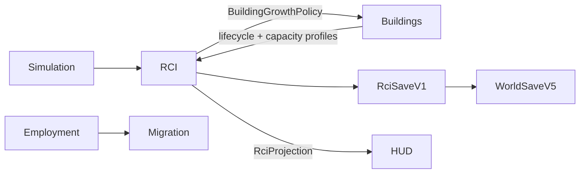

# RCI Demand & Occupancy System

**Status:** Partial — PR 1–5 domain implementation written; game integration and final verification remain  
**Current stacked head:** `feat/rci-demand-growth-v0-1`  
**Primary ownership:** `packages/rci-core`; `apps/game` owns atomic runtime composition and HUD  
**Persistence:** `RciSaveV1` inside `WorldSaveV5`

## Purpose

Provide deterministic authority for Citizens, Relationships, Households, housing, Workplaces, Employment, migration, R/C/I Demand, and growth gates without coupling domain state to rendering or UI.

## Implemented Capabilities

### Population and Household lifecycle

- Stable immutable authority, canonical Save, tick-derived age, normalized Household/family history, deterministic qualifications, and daily 08:00 birth/death lifecycle.

### Housing and migration

- Versioned Residential capacity profiles and deterministic Dwelling inventory.
- Adequate-capacity relocation, displaced-first reconciliation, 720-tick expiry, fixed-point incoming queue, atomic Household materialization, and historical emigration.

### Workplaces and Employment

- Versioned Workplace capacity profiles and deterministic inventory.
- Stability-first matching, closest-qualified vacancies, capacity enforcement, and one non-displacing daily best-fit upgrade.
- Employment projection and compatible job supply for migration.

### R/C/I Demand and Building Growth

- Extensible factor definitions evaluate from derived Population, Housing, Migration, and Employment projections.
- Factors and contributions are ordered by stable definition ID.
- All scores use integer fixed-point values in `-100_000..100_000`; no floating accumulation is persisted.
- Target-buffer evaluation produces raw Residential, Commercial, and Industrial targets.
- Integer smoothing updates authoritative Demand only on daily boundaries.
- Persisted Growth gates use hysteresis: Demand `>=15_000` opens, `<=5_000` closes, and `6_000..14_000` retains prior state.
- Negative Demand closes growth but does not abandon existing Buildings or remove Zones.
- `createBuildingGrowthPolicy()` maps gates and positive Demand magnitude into caller-supplied zone eligibility/weight.
- Building Core defines the generic policy contract and default open policy, but never imports RCI.
- Policy-aware placement can choose across eligible zone origins while preserving deterministic selection.

## Authority

### Authoritative

Citizen presence, qualifications, Relationships, Households/memberships, Dwelling Units/housing assignments, Workplaces/Employment assignments, migration queues/accumulator, smoothed Demand, Growth gates, deterministic seed, bounded revisions, and ID sequences.

### Derived

Current Household/home/job/qualification, demographic and family views, capacities, vacancies, unemployment, compatible jobs, underemployment, factor contributions, raw Demand targets, Building Growth policy, scorecards, and HUD values.

## Tick Pipeline

```text
validate Simulation/Building/RCI revisions
→ synchronize Dwelling and Workplace inventory
→ daily Population lifecycle at 08:00
→ Employment validity, unemployed matching, and one controlled upgrade
→ compatible job projection and incoming request accumulation
→ Housing relocation/materialization/displacement expiry
→ derive RCI projection
→ evaluate ordered Demand factors
→ apply integer smoothing
→ update persisted hysteresis gates
→ validate complete proposed RCI snapshot
→ commit with stale-revision fences
```

The game runtime composes this RCI plan with Building Growth and Simulation atomically in PR 6.

## Integrations



## Persistence

`RciSaveV1` stores normalized histories, queues, fixed-point accumulator, smoothed Demand, gates, revisions, seed, and every sequence. Raw factor contributions, indexes, projections, policy objects, events, renderer state, and UI state are rebuilt.

## Invariants and Failure Behavior

- One authoritative source for each fact; all projections are rebuildable.
- Failed/stale plans consume no IDs and publish no partial state.
- Resident, home, job, and capacity cardinality rules are enforced.
- Valid Employment is stable and never displaced by upgrades.
- Relocation/materialization require adequate housing capacity.
- Demand values are finite bounded integers; factor ordering is explicit.
- Gate state persists because neutral-band behavior cannot be derived from current Demand alone.
- Building Growth policy is caller-provided and cannot create a package dependency cycle.
- Historical records remain addressable after terminal lifecycle changes.

## Extension Points

Definition registries and strategy contracts support new classifications, capacity profiles, migration archetypes, rate/pressure/Demand factors, matching policies, Education, Economy, Land Value, Services, and Utilities without replacing historical entity schemas.

## Current Limitations

Not yet written on this branch:

- atomic game-world planner/store integration,
- runtime Save/Load ownership wiring,
- compact HUD and browser acceptance,
- benchmark and final closure verification.

These are delivered by PR 6 and then the whole PR 2–6 stack is tested and repaired at the final gate.

## Handoff Checklist

- Design: [RCI Demand & Occupancy Foundation v0.1](specs/2026-08-06-rci-demand-occupancy-foundation-v0-1.md)
- TDD packet: [execution index](tdd/README.md)
- PR 1: [Core contracts and Save](verification/2026-08-06-rci-pr1-core-contracts-save-v1.md)
- PR 2: [Population lifecycle](verification/2026-08-06-rci-pr2-population-lifecycle.md)
- PR 3: [Housing and migration](verification/2026-08-06-rci-pr3-housing-migration.md)
- PR 4: [Workplaces and Employment](verification/2026-08-06-rci-pr4-workplaces-employment.md)
- PR 5: [Demand and Growth policy](verification/2026-08-06-rci-pr5-demand-growth.md)
- Next plan: [PR 6 — Game integration and closure](tdd/2026-08-06-rci-pr6-game-integration-hud-verification.md)
- Related systems: [World](../world/README.md), [Buildings](../buildings/README.md), [Simulation Time](../simulation-time/README.md), [Economy](../economy/README.md)
