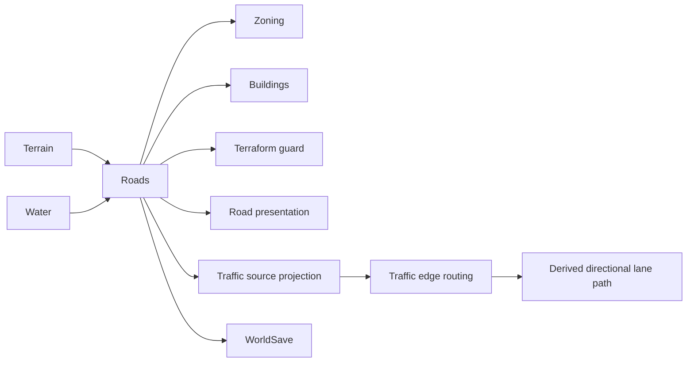

# Roads System

**Status:** Road Type Authority v1, PR2 Road Presentation, and PR3 Lane-aware Traffic implemented; PR3 release gate/owner visual acceptance pending  
**Base:** `master@b58fe261e2ae417a09f2393d44b099321cdc2e5c` after PR2 Lane Geometry + Road Presentation  
**PR3 verification:** exact-head evidence is recorded on PR #82  
**Primary ownership:** `packages/road-core`, `packages/road-three`, `apps/game` tool integration  
**Persistence:** `RoadSaveV1`

## Purpose

Own authoritative Road occupancy and Road definition identity, deterministic stroke mutation/replacement, cardinal connectivity, terrain/ramp validity, rendering input, and Road access consumed by Zoning and Building development.

## Does Not Own

- Terrain or Water state.
- Zoning rights or Building occupancy.
- Traffic routing, differentiated speed/capacity, lane movement, congestion, or vehicle ownership.
- Population access or commute simulation.
- Renderer meshes or lane-marking geometry as authority.

## Current Capabilities

- Canonical Road definition catalog with stable monotonic codes:
  - `1` — `basic-road` / Local Street — width `0.72`
  - `2` — `collector-road` / Collector Road — width `0.82`
  - `3` — `arterial-road` / Arterial Road — width `0.92`
- Build a Road on an empty cell.
- Replace an occupied Road cell with a different Road definition as one Road transaction without changing occupancy.
- Treat a same-definition build as `road:no-change`.
- Bulldoze any occupied Road definition back to empty.
- Drag strokes with reversible tail erase during preview for the existing game Road workflow.
- Place on flat terrain and supported single-axis ramps.
- Reject wet cells, invalid terrain, invalid ramp topology, incoherent revisions, malformed snapshots, and unknown Road definition codes.
- Derive N/E/S/W connection masks and rebuild cells whose connectivity or Road definition changed.
- Persist definition bytes through the existing `RoadSaveV1` shape and reconstruct derived rendering after load.
- Provide Road occupancy/access inputs to Zone and Building systems.
- Participate in Terraform and Zone occupancy guards.
- Derive data-driven Local / Collector / Arterial Road presentation with definition-specific carriageway widths and semantic center-divider geometry.
- Suppress center-divider geometry across junction interiors.
- Expose Local Street / Collector Road / Arterial Road / Bulldoze through the compact Road Build workflow.
- Preserve Road definition codes `1/2/3` into the Traffic source projection while deriving Traffic cardinal connectivity from any occupied Road type.
- Feed PR3 Traffic profiles where Local / Collector / Arterial have increasing free-flow speed and capacity while Road remains the authority for definition identity and carriageway width.
- Support Traffic-derived left-hand directional lane paths whose visual offset follows the committed Road width without turning lane geometry into Road state.

## Ownership and State

`RoadSnapshot.definitionCodes` and Road revision are authoritative. One byte-sized definition code exists per world cell. Road definition IDs/codes are catalog authority; connection masks, cell views, meshes, lane geometry, preview geometry, Road-access projections, Traffic graphs, and Traffic lane paths are derived.

Stable Road codes are compatibility contracts. A retired numeric Road code must never be reused for a different Road meaning.

## Mutation Semantics

```text
empty + Road type     → create
different Road type   → replace / upgrade
same Road type        → no-change
bulldoze              → empty
```

A replacement increments Road revision and marks the target as topology/presentation changed even when its cardinal connection mask is unchanged. Replacement does not count as an added or removed occupied Road cell.

## Main Workflow

1. Input provides an ordered canonical cell stroke and selected `RoadDefinitionId`.
2. The planner validates Road state, Terrain/Water revision coherence, cells, and the selected Road definition.
3. It derives proposed definition bytes, added/removed occupancy, definition/connectivity changes, and dirty chunks.
4. Commit rechecks base revisions and reconstructs the proposed state before mutation.
5. Commit rejects changes outside the requested cells or derived topology that does not match the plan.
6. Renderer and dependent environments rebuild from the committed snapshot.

## Integrations



Road definition identity remains a Road concern. The Game Traffic source projection preserves codes `1/2/3` and treats every non-empty Road definition as connected Road occupancy. `traffic-core` owns differentiated free-flow speed/capacity and keeps canonical routing edge-based. `traffic-three` derives production left-hand lane centerlines and deterministic straight/left/right junction connectors from that canonical route. Road width only supplies derived presentation geometry; Traffic lane state is not persisted back into Road.

## Persistence

`RoadSaveV1` remains schema version `1`. It stores dimensions, Road revision, and base64-encoded `Uint8Array` definition codes. Codes `0`, `1`, `2`, and `3` round-trip through the existing wire shape; legacy saves containing only `0/1` remain compatible. Connectivity, lane geometry, Traffic lane paths, and meshes are never persisted and are rebuilt.

## Invariants and Failure Behavior

- Exactly one Road definition code per world cell.
- Valid canonical codes are currently `0..3`; unknown codes fail closed.
- `basic-road` remains canonical code `1` for compatibility.
- Road snapshots match world dimensions.
- Placement environments use coherent Terrain and Water revisions.
- Connectivity is derived from cardinal neighboring occupied Road cells, regardless of whether the occupied neighbor is Local, Collector, or Arterial.
- Traffic projection preserves Road definition identity; it does not collapse codes `2/3` back to Local code `1`.
- PR3 differentiates Traffic semantics without making Traffic profile values part of Road authority.
- A Road definition replacement marks the target changed even when occupancy/connectivity is unchanged; active canonical Traffic trip identity remains stable while its derived lane presentation can be re-prepared.
- Invalid or stale plans do not mutate state.
- Road renderer/Traffic consumers cannot become Road authority.

## Road Lane & Vehicle Life Realism v1

The approved production program is specified in:

- `specs/2026-08-17-road-lane-vehicle-life-realism-v1.md`
- `tdd/2026-08-17-road-lane-vehicle-life-realism-v1.md`

The implementation order is intentionally staged:

```text
PR1 Road Type Authority
→ PR2 Lane Geometry + Road Presentation
→ PR3 Lane-aware Traffic
→ PR4 Vehicle Life Authority
→ PR5 Mobility Assignment + WorldSaveV8
→ PR6 Persistent Parking + Vehicle Presentation
→ PR7 Release Verification
```

PR3 keeps canonical Traffic routing edge-based and derives only presentation lane geometry. Production handedness is left-hand traffic. Each current single-cell two-way Road exposes one directional travel lane per direction for presentation; opposing trips therefore occupy opposite physical sides of the carriageway. Straight, left, and right movement use deterministic junction connectors; immediate U-turn generation is not supported.

## Current Limitations

Local / Collector / Arterial now have distinct Road presentation plus differentiated Traffic speed/capacity and lane-aware vehicle presentation. The current Road footprint is still one gameplay cell wide and supports one directional travel lane each way. There are still no one-way Roads, multi-cell four/six-lane avenues, bridges, tunnels, lane changing/overtaking, traffic controls, transit, maintenance, or economic Road cost. Vehicle ownership and persistent parking remain PR4+ work.

A real four-lane avenue must use a future multi-cell Road-footprint design rather than compressing four lanes into the current single Road cell.

## Handoff Checklist

- Canonical authority: `packages/road-core/src/contracts.ts`
- Snapshot validation: `packages/road-core/src/road-snapshot.ts`
- Mutation/replacement: `packages/road-core/src/road-mutation.ts`
- Persistence: `packages/road-core/src/serialization.ts`
- Renderer: `packages/road-three`
- Traffic Road profiles: `packages/traffic-core/src/road-profile.ts`
- Game Traffic occupancy projection: `apps/game/src/traffic-source-projection.ts`
- Directional lane derivation: `packages/traffic-three/src/directed-lane-path.ts`
- Junction connectors: `packages/traffic-three/src/intersection-lane-connector.ts`
- Game lane presentation projection: `apps/game/src/traffic-presentation-projection.ts`
- Related systems: [Terrain](../terrain/README.md), [Water](../water/README.md), [Zoning](../zoning/README.md), [Buildings](../buildings/README.md), [Traffic](../traffic/README.md)
- Historical foundation design: `docs/superpowers/specs/2026-07-29-road-network-foundation-v0-1-design.md`
