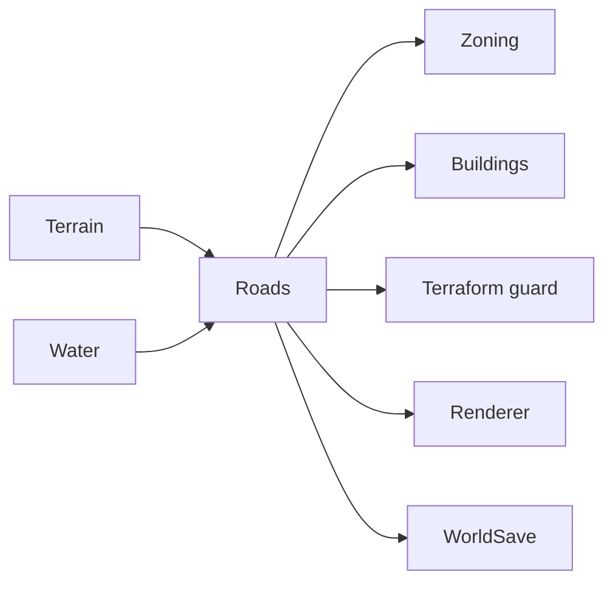

# Roads System

**Status:** Implemented  
**Last verified against:** `master@012a644391d13e7d47135a1c0e9e3394be667871`  
**Primary ownership:** `packages/road-core`, `packages/road-three`, `apps/game` tool integration  
**Persistence:** `RoadSaveV1`

## Purpose

Own authoritative Road occupancy, deterministic stroke mutation, cardinal connectivity, terrain/ramp validity, rendering input, and Road access consumed by Zoning and Building development.

## Does Not Own

- Terrain or Water state.
- Zoning rights, Building occupancy, traffic, pathfinding, capacity, or maintenance costs.
- Population access or commute simulation.

## Current Capabilities

- Build and bulldoze `basic-road` cells.
- Drag strokes with reversible tail erase during preview.
- Place on flat terrain and supported single-axis ramps.
- Reject wet cells, invalid terrain, invalid ramp topology, and incoherent revisions.
- Derive N/E/S/W connection masks and rebuild topology-changed neighbors.
- Persist Road codes and reconstruct rendering after load.
- Provide Road occupancy and access inputs to Zone and Building systems.
- Participate in Terraform and Zone occupancy guards.

## Ownership and State

`RoadSnapshot.definitionCodes` and Road revision are authoritative. Connection masks, cell views, meshes, preview geometry, and Road-access projections are derived.

## Main Workflow

1. Input produces an ordered canonical cell stroke.
2. The planner validates Terrain/Water revisions and each requested cell.
3. It returns added, removed, topology-changed cells, dirty chunks, and proposed Road codes.
4. Commit rechecks base revisions and proposed-state validity.
5. Renderer and dependent environments rebuild from the committed snapshot.

## Integrations

## Persistence

`RoadSaveV1` stores dimensions, revision, and definition codes. Connectivity and meshes are rebuilt. World-load validation checks every occupied Road cell against decoded Terrain and derived Water.

## Invariants and Failure Behavior

- One Road definition code per cell.
- Road snapshots match world dimensions.
- Placement environments use coherent Terrain and Water revisions.
- Connectivity is derived from cardinal neighboring Road cells.
- Invalid or stale plans do not mutate state.
- Topology changes include neighboring cells whose connection masks changed.

## Extension Points

The current contract can evolve toward multiple versioned Road definitions, capacity, speed, cost, upgrades, bridges, or traffic adapters. Those features must not make renderer meshes authoritative and should expose narrow network/access projections to consumers.

## Current Limitations

Only one basic Road definition exists. No intersections with lane semantics, bridges, tunnels, one-way Roads, traffic, transit, maintenance, or economic cost.

## Handoff Checklist

- Start reading: `packages/road-core/src/contracts.ts`, mutation, connectivity, serialization, and policy files
- Renderer: `packages/road-three`
- Related systems: [Terrain](../terrain/README.md), [Water](../water/README.md), [Zoning](../zoning/README.md), [Buildings](../buildings/README.md)
- Historical design: `docs/superpowers/specs/2026-07-29-road-network-foundation-v0-1-design.md`
