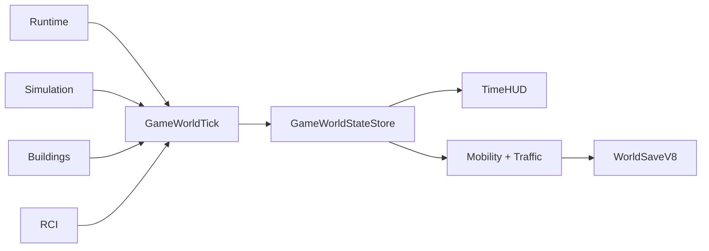

# Simulation Time System

**Status:** Implemented — minute-authority core and Game transaction integration are complete; release/owner verification remains open 
**Primary ownership:** `packages/simulation-core`, `apps/game/src/simulation-runtime.ts`, and time HUD integration  
**Persistence:** `SimulationSaveV3` inside `WorldSaveV8`; V1/V2 hour saves migrate explicitly

## Purpose

Own deterministic in-game time, calendar derivation, tick planning/commit, time-speed presentation, and the sequencing state used by Building Growth. Domain-specific lifecycle and Demand rules remain outside `simulation-core`.

## Does Not Own

- Real-time rendering frame loops.
- Building, RCI, Economy, or population rules.
- Wall-clock catch-up while the page is hidden.
- Atomic cross-domain publication.

## Current Capabilities

- `1 committed Simulation minute = 1 in-game minute`.
- Calendar: `24` hours/day, `30` days/month, `12` months/year.
- Initial time: Year 1, Month 1, Day 1, `08:00` (`absoluteGameMinute = 480`).
- Speeds: Paused `0×`, Normal `1×`, Fast `2×`, Faster `4×`.
- Step advances exactly one game minute while paused.
- `macroHourIndex = floor(absoluteGameMinute / 60)` preserves existing hourly Building, RCI, and Economy semantics. Minute transitions that do not cross a macro hour do not run that work.
- Building development evaluation hours remain `00`, `06`, `12`, and `18`; the RCI daily lifecycle/Demand boundary remains crossing into `08:00`.
- Runtime clamps frame delta and resets accumulated time on speed or visibility changes.
- Revision, `absoluteGameMinute`, and Building growth sequence persist across Save/Load.
- `apps/game` has a minute-boundary transaction that stages macro-hour work, Mobility due boundaries, and a coherent world candidate before publication.
- Traffic uses a subordinate four-quanta-per-game-minute cursor; minute and transport-quantum publication are separate atomic transaction classes.

## Ownership and State

`SimulationSnapshot` is authoritative for revision, `absoluteGameMinute`, and `growthSequence`. `macroHourIndex`, calendar labels, age/date projections, lifecycle boundary checks, speed-button state, and accumulated real milliseconds are derived or runtime-only.

## Main Workflow

1. Runtime accepts a bounded real-time delta and current speed.
2. Each completed simulated second requests a game-minute boundary according to the selected speed.
3. The minute transaction derives whether a macro-hour boundary is crossed and runs Building/RCI/Economy only when due.
4. Mobility resolves due schedule boundaries at the new game minute; Traffic admission/progression then occurs in its own ordered transport quanta.
5. The application validates the complete staged world and publishes one atomic world revision per transaction.
6. Time HUD and RCI HUD derive values from committed state.

## Integrations

`simulation-core` does not import Building or RCI packages. `apps/game` owns orchestration and dependency direction.

## Persistence

`SimulationSaveV3` stores revision, `absoluteGameMinute`, and growth sequence. V1/V2 `absoluteTick` values migrate exactly to `absoluteTick * 60`, rejecting unsafe numeric overflow. Runtime speed and accumulated real milliseconds are not persisted. `WorldSaveV8` composes Simulation V3 with Mobility V2 and Traffic V2; V7 remains a decode/migration input.

## Invariants and Failure Behavior

- Ticks and revisions are non-negative safe integers.
- A minute plan advances exactly one `absoluteGameMinute`.
- Stale or invalid plans do not commit.
- Paused runtime emits no automatic minute boundaries; Step emits one minute only while paused.
- Frame rate and callback batching do not change committed domain results.
- Save/load/resume must match continuous execution from the same committed minute and Traffic cursor.
- A failed Building, RCI, Economy, Mobility, or Traffic stage prevents publication of the staged Simulation snapshot.

## Extension Points

Additional systems schedule work from `absoluteGameMinute`, derived macro-hour transitions, and calendar projections, never wall-clock time. New daily/monthly policies belong in their domain packages and join the application-level staged minute transaction without adding domain dependencies to `simulation-core`.

## Current Limitations

No seasonal calendar, leap years, offline progress, general event scheduler, variable-length calendar ticks, or persisted runtime speed. The legacy `absoluteTick` compatibility facade remains only for migration/test callers; the runtime authority is `absoluteGameMinute` with subordinate transport quanta. Exact-head browser, Sonar, and owner visual acceptance are release gates outside this system package.

## Handoff Checklist

- Core: `packages/simulation-core/src/contracts.ts`, `calendar.ts`, `simulation-mutation.ts`, `serialization.ts`
- Runtime: `apps/game/src/simulation-runtime.ts`
- Atomic orchestration: `apps/game/src/game-minute-transaction.ts`, `traffic-transport-transaction.ts`
- UI: `apps/game/src/game-time-ui.ts`, `game-time-presentation.ts`
- Related systems: [Buildings](../buildings/README.md), [RCI](../rci/README.md), [Citizen Mobility](../citizen-mobility/README.md), [Traffic](../traffic/README.md), [World](../world/README.md)
- [ADR-0001 — Minute calendar with derived macro-hour compatibility](adrs/0001-minute-calendar-macro-hour-compatibility.md)
