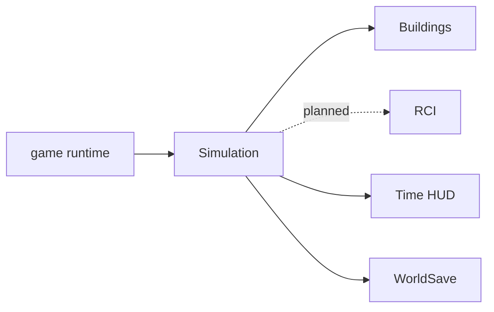

# Simulation Time System

**Status:** Implemented  
**Last verified against:** `master@012a644391d13e7d47135a1c0e9e3394be667871`  
**Primary ownership:** `packages/simulation-core`, `apps/game/src/simulation-runtime.ts`, time HUD integration  
**Persistence:** `SimulationSaveV1`

## Purpose

Own deterministic in-game time, calendar derivation, tick planning/commit, time-speed presentation, and the sequencing state currently used by automatic Building growth.

## Does Not Own

- Real-time rendering frame loops.
- Building, RCI, Economy, or population rules.
- Wall-clock catch-up while the page is hidden.

## Current Capabilities

- `1 tick = 1 in-game hour`.
- Calendar: `24` hours/day, `30` days/month, `12` months/year.
- Initial time: Year 1, Month 1, Day 1, `08:00` (`absoluteTick = 8`).
- Speeds: Paused `0×`, Normal `1×`, Fast `2×`, Faster `4×`.
- Step advances exactly one tick while paused.
- Development evaluation hours: `00`, `06`, `12`, and `18`.
- Runtime clamps frame delta and resets accumulated time on speed or visibility changes.
- Simulation revision, absolute tick, and Building growth sequence persist across Save/Load.

## Ownership and State

`SimulationSnapshot` is authoritative for revision, `absoluteTick`, and `growthSequence`. Calendar labels, age/date projections, elapsed days, speed-button state, and accumulated real milliseconds are derived or runtime-only.

## Main Workflow

1. Runtime accepts a bounded real-time delta and current speed.
2. Each completed simulated second emits one game tick callback.
3. Domain planners calculate changes from the current Simulation snapshot.
4. Tick commit validates the plan, increments revision and absolute tick, and applies the supplied next growth sequence.
5. UI derives calendar and lifecycle summaries from committed state.

## Integrations

## Persistence

`SimulationSaveV1` stores revision, absolute tick, and growth sequence. Runtime speed and accumulated real milliseconds are not persisted. Older World Saves create a deterministic initial Simulation snapshot and seed growth sequence from existing Building count.

## Invariants and Failure Behavior

- Ticks and revisions are non-negative safe integers.
- A tick plan advances exactly one absolute tick.
- Stale or invalid plans do not commit.
- Paused runtime emits no automatic ticks; Step emits one tick only while paused.
- Frame rate and callback batching must not change committed domain results.
- Save/load/resume must match continuous execution from the same committed tick.

## Extension Points

Additional systems should schedule work from `absoluteTick` and calendar projections, not wall-clock time. RCI may add daily lifecycle evaluation and end-of-tick reconciliation while `simulation-core` remains unaware of domain-specific events.

## Current Limitations

No seasonal calendar, leap years, offline progress, event scheduler, variable-length ticks, or persisted runtime speed.

## Handoff Checklist

- Start reading: `packages/simulation-core/src/contracts.ts`, `calendar.ts`, `simulation-mutation.ts`, `serialization.ts`
- Runtime: `apps/game/src/simulation-runtime.ts`
- UI: `apps/game/src/game-time-ui.ts`, `game-time-presentation.ts`
- Related systems: [Buildings](../buildings/README.md), [RCI](../rci/README.md)
