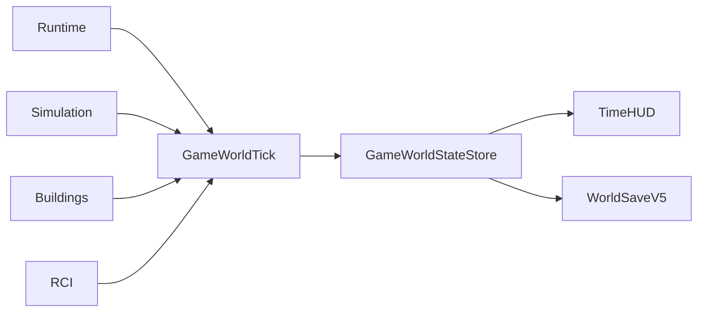

# Simulation Time System

**Status:** Implemented — final stacked verification pending  
**Primary ownership:** `packages/simulation-core`, `apps/game/src/simulation-runtime.ts`, and time HUD integration  
**Persistence:** `SimulationSaveV1` inside `WorldSaveV5`

## Purpose

Own deterministic in-game time, calendar derivation, tick planning/commit, time-speed presentation, and the sequencing state used by Building Growth. Domain-specific lifecycle and Demand rules remain outside `simulation-core`.

## Does Not Own

- Real-time rendering frame loops.
- Building, RCI, Economy, or population rules.
- Wall-clock catch-up while the page is hidden.
- Atomic cross-domain publication.

## Current Capabilities

- `1 tick = 1 in-game hour`.
- Calendar: `24` hours/day, `30` days/month, `12` months/year.
- Initial time: Year 1, Month 1, Day 1, `08:00` (`absoluteTick = 8`).
- Speeds: Paused `0×`, Normal `1×`, Fast `2×`, Faster `4×`.
- Step advances exactly one tick while paused.
- Building development evaluation hours: `00`, `06`, `12`, and `18`.
- RCI daily lifecycle/Demand boundary: crossing into `08:00`.
- Runtime clamps frame delta and resets accumulated time on speed or visibility changes.
- Revision, absolute tick, and Building growth sequence persist across Save/Load.
- Application orchestration stages the next Simulation snapshot with Building and RCI results before atomic publication.

## Ownership and State

`SimulationSnapshot` is authoritative for revision, `absoluteTick`, and `growthSequence`. Calendar labels, age/date projections, lifecycle boundary checks, speed-button state, and accumulated real milliseconds are derived or runtime-only.

## Main Workflow

1. Runtime accepts a bounded real-time delta and current speed.
2. Each completed simulated second requests one game tick.
3. Application planners calculate Building and RCI changes from the current Simulation snapshot.
4. Simulation commit validates the one-tick plan and supplied next growth sequence.
5. The application validates the complete staged world and publishes one atomic world revision.
6. Time HUD and RCI HUD derive values from committed state.

## Integrations

`simulation-core` does not import Building or RCI packages. `apps/game` owns orchestration and dependency direction.

## Persistence

`SimulationSaveV1` stores revision, absolute tick, and growth sequence. Runtime speed and accumulated real milliseconds are not persisted. Older World Saves create a deterministic initial Simulation snapshot and seed growth sequence from existing Building count. V5 restores Simulation and RCI evaluated ticks together.

## Invariants and Failure Behavior

- Ticks and revisions are non-negative safe integers.
- A tick plan advances exactly one absolute tick.
- Stale or invalid plans do not commit.
- Paused runtime emits no automatic ticks; Step emits one tick only while paused.
- Frame rate and callback batching do not change committed domain results.
- Save/load/resume matches continuous execution from the same committed tick.
- A failed Building or RCI stage prevents publication of the staged Simulation snapshot.

## Extension Points

Additional systems schedule work from `absoluteTick` and calendar projections, never wall-clock time. New daily/monthly policies belong in their domain packages and join the application-level staged tick without adding domain dependencies to `simulation-core`.

## Current Limitations

No seasonal calendar, leap years, offline progress, general event scheduler, variable-length ticks, or persisted runtime speed.

## Handoff Checklist

- Core: `packages/simulation-core/src/contracts.ts`, `calendar.ts`, `simulation-mutation.ts`, `serialization.ts`
- Runtime: `apps/game/src/simulation-runtime.ts`
- Atomic orchestration: `apps/game/src/game-world-tick.ts`
- UI: `apps/game/src/game-time-ui.ts`, `game-time-presentation.ts`
- Related systems: [Buildings](../buildings/README.md), [RCI](../rci/README.md), [World](../world/README.md)
