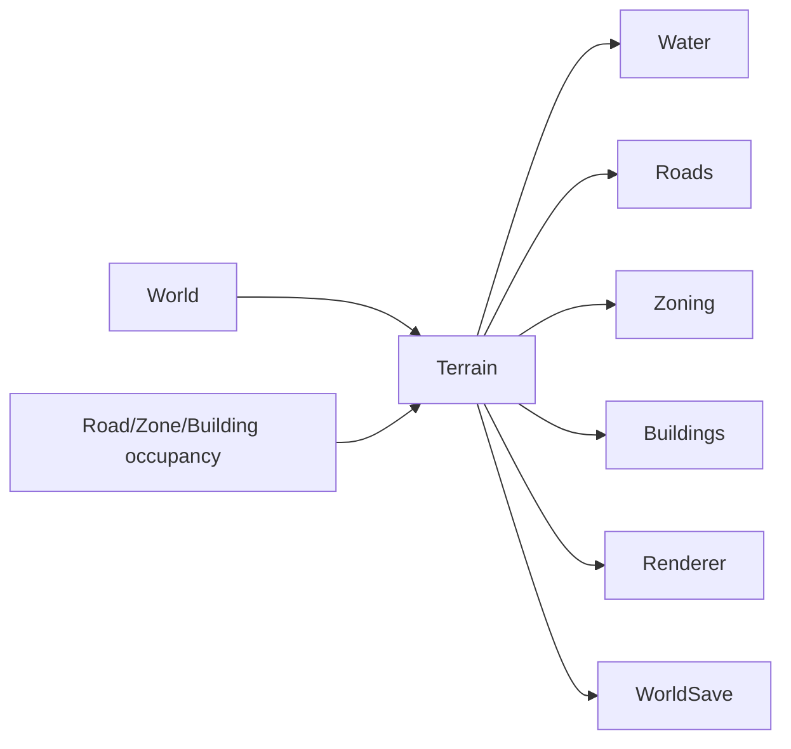

# Terrain System

**Status:** Implemented  
**Last verified against:** `master@012a644391d13e7d47135a1c0e9e3394be667871`  
**Primary ownership:** `packages/terrain-core`, `packages/terrain-three`, `apps/game` tool integration  
**Persistence:** `TerrainSaveV1`

## Purpose

Own the deterministic quantized heightfield, terrain surface classification, terraforming plans, chunk dirty regions, canonical mesh data, and derived rendering input for the playable world.

## Does Not Own

- Water authority; Water is derived from Terrain.
- Road, Zone, or Building occupancy.
- Player input routing or Three.js scene lifecycle outside the renderer adapter.

## Current Capabilities

- Shared-vertex height lattice on a `128 × 128` cell world.
- Height-aware cell triangulation and canonical seam normals.
- Flat and supported single-axis ramp surface classification.
- Raise, Lower, and Flatten tools with `1 × 1`, `3 × 3`, and `5 × 5` brushes.
- Preview-first interaction, commit on release, and world Undo integration.
- One-level-per-stroke changes with support cells where required.
- Chunk-scoped rebuilds and outer diorama skirt generation.
- Placement guards that reject terrain changes affecting occupied Road, Zone, or Building cells.

## Ownership and State

Terrain height levels and revision are authoritative. Surface profiles, triangles, normals, chunk meshes, previews, grid overlays, and Water are derived.

## Main Workflows

1. Convert pointer input into a canonical cell stroke and brush footprint.
2. Plan the requested Raise, Lower, or Flatten operation without mutation.
3. Apply height limits, continuity, support, and occupancy guards.
4. Return accepted/rejected cells, target heights, dirty chunks, and a proposed snapshot.
5. Commit only when the plan is valid and revisions still match.
6. Re-derive Water and rebuild affected Terrain/Water/render chunks.

## Integrations

## Persistence

`TerrainSaveV1` stores authoritative heightfield state. Meshes, normals, Water, and previews are rebuilt after load. Decode validates dimensions, levels, and topology assumptions before publishing a snapshot.

## Invariants and Failure Behavior

- Height values are quantized safe integers within world limits.
- Neighbor continuity and supported shape rules prevent interior vertical cliffs.
- Planning is immutable; stale or invalid plans do not change the snapshot.
- Dirty chunks include every chunk whose geometry or seam normals may change.
- Rendering is derived and cannot become terrain authority.

## Extension Points

Terrain content can add presentation materials, biome projections, erosion inputs, or additional tools if they preserve the canonical height lattice and explicit mutation contracts. Any new supported surface shape must update Road, Zone, Building, Water, Save, and test contracts together.

## Current Limitations

No diagonal/twisted buildable surfaces, arbitrary sculpting, caves, overhangs, erosion simulation, or runtime terrain material painting.

## Handoff Checklist

- Start reading: `packages/terrain-core/src/index.ts`, `height-lattice.ts`, `shape-classifier.ts`, `terraform-contracts.ts`, `terraform-plan.ts`
- Renderer: `packages/terrain-three`
- Related systems: [World](../world/README.md), [Water](../water/README.md), [Roads](../roads/README.md), [Zoning](../zoning/README.md), [Buildings](../buildings/README.md)
- Historical specs remain under `docs/superpowers/specs/` pending migration.
