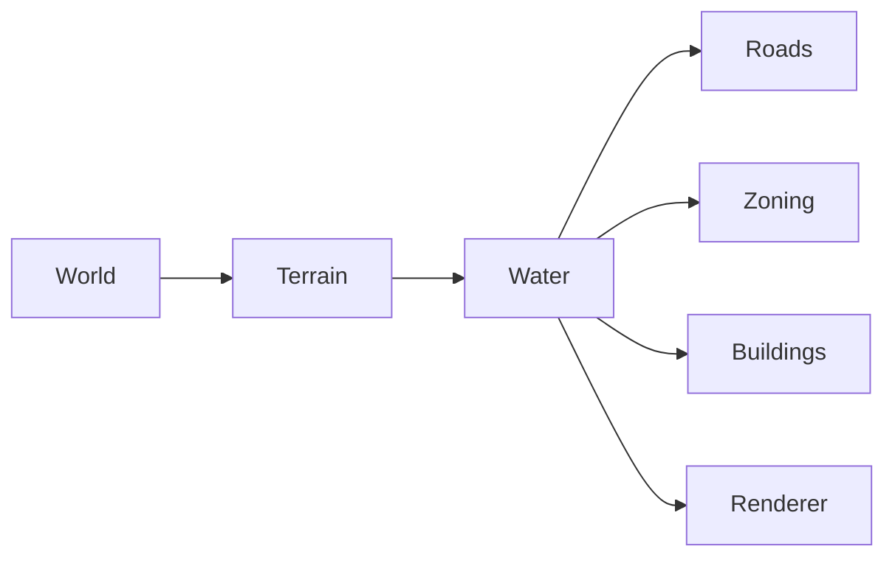

# Water System

**Status:** Implemented, derived  
**Last verified against:** `master@012a644391d13e7d47135a1c0e9e3394be667871`  
**Primary ownership:** `packages/water-core`, `packages/water-three`  
**Persistence:** not stored independently; derived from `TerrainSaveV1`

## Purpose

Derive deterministic water coverage and shoreline presentation from Terrain and sea level, and provide dry/wet placement policy to Roads, Zones, Buildings, and world validation.

## Does Not Own

- Terrain heights or sea-level configuration.
- Independent fluid simulation, water volume, flow, or weather.
- Road, Zone, Building, or Terraform mutation policy.

## Current Capabilities

- Rebuild a Water snapshot from a specific Terrain revision.
- Classify dry and submerged cells consistently for placement environments.
- Produce chunked water and shoreline render data.
- Render the diorama water face down to the canonical base.
- Participate in stale-plan and coherent-world revision checks.

## Ownership and State

Terrain is authoritative. Water records the source Terrain revision and derived coverage needed for runtime queries. Water mesh and materials are derived presentation.

## Main Workflow

1. Terrain is created, loaded, or committed.
2. `water-core` derives Water using Terrain, sea level, and world configuration.
3. The result is validated against the source Terrain revision.
4. Placement environments expose `isDry(cell)` and related queries.
5. `water-three` rebuilds affected visual chunks.

## Integrations

## Persistence

Water is intentionally omitted from the world Save because it can be reconstructed exactly. Load fails if Water derivation cannot produce a coherent result from decoded Terrain.

## Invariants and Failure Behavior

- `water.sourceTerrainRevision` equals the Terrain revision used to derive it.
- Identical Terrain and world configuration produce identical Water.
- No mutation plan may combine Water and Terrain from different revisions.
- Failed derivation prevents publishing a partially loaded world.

## Extension Points

Future tides, canals, pumps, pollution, or dynamic fluids would require an explicit decision about whether Water remains fully derived or gains authoritative state. Existing placement consumers should continue to depend on narrow environment queries rather than renderer data.

## Current Limitations

No flow, depth-dependent gameplay, waves affecting simulation, flooding, drainage, tides, or player-created water.

## Handoff Checklist

- Start reading: `packages/water-core/src/index.ts`, derivation and contracts under `packages/water-core/src/`
- Renderer: `packages/water-three`
- Related systems: [Terrain](../terrain/README.md), [Roads](../roads/README.md), [Zoning](../zoning/README.md), [Buildings](../buildings/README.md)
