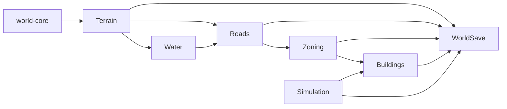

# World System

**Status:** Implemented  
**Last verified against:** `master@012a644391d13e7d47135a1c0e9e3394be667871`  
**Primary ownership:** `packages/world-core`, `apps/game/src/world-save.ts`, game transaction orchestration  
**Persistence:** versioned `world-save` envelope

## Purpose

Provide shared world configuration, coordinates, result contracts, cross-system Save composition, and the application-level transaction boundary that keeps Terrain, Water, Roads, Zones, Buildings, and Simulation coherent.

## Does Not Own

- Domain rules for Terrain, Roads, Zones, Buildings, or simulation growth.
- Three.js rendering or UI state.
- RCI population state until `WorldSaveV5` is implemented.

## Current Capabilities

- Canonical map configuration: `128 × 128`, chunk size `16`, quantized height range, sea level, and diorama base.
- Shared cell/vertex coordinate contracts and bounds validation.
- Result and error helpers used by core packages.
- `WorldSaveV1` through `WorldSaveV4` migration and validation.
- Cross-domain environment reconstruction after load.
- Validation that persisted Roads, Zones, Buildings, Water derivation, and Simulation lifecycle remain coherent.

## Ownership and State

`world-core` owns stable world primitives and configuration. Each domain owns its own snapshot. `apps/game` owns composition: it builds domain environments, coordinates atomic world mutations, and encodes/decodes the world envelope.

Water is derived from Terrain and is not independently authoritative. Occupancy used by placement guards is derived from active domain snapshots.

## Main Workflows

1. Create or load Terrain.
2. Derive Water from the Terrain revision.
3. Decode and validate Roads, Zones, Buildings, and Simulation in dependency order.
4. Rebuild placement environments and derived occupancy.
5. Reject the entire load when a cross-domain invariant fails.
6. Publish one coherent decoded world state to runtime and rendering.

## Integrations

## Persistence

- `WorldSaveV1`: Terrain + Roads
- `WorldSaveV2`: adds Zones
- `WorldSaveV3`: adds Buildings V1
- `WorldSaveV4`: Buildings V2 + Simulation V1
- `WorldSaveV5`: planned to add RCI V1

Older versions receive deterministic defaults for systems that did not yet exist. Load validation fails closed rather than repairing ambiguous state silently.

## Invariants and Failure Behavior

- Domain revisions used in an environment must describe the same world state.
- Save decode is all-or-nothing.
- Derived Water revision must match Terrain.
- Persisted occupied cells must remain valid against reconstructed environments.
- Completed construction cannot remain encoded as under construction at or before the saved tick.

## Extension Points

New persisted systems extend the world envelope with an explicit schema version, decoder validation, migration defaults, and a decoded-state field. Cross-domain orchestration remains in the application layer rather than moving domain rules into `world-core`.

## Current Limitations

There is no generic transaction engine or event store. Cross-domain composition is explicit TypeScript code. RCI is not part of the persisted world on `master`.

## Handoff Checklist

- Start reading: `packages/world-core/src/index.ts`, `packages/world-core/src/config.ts`, `apps/game/src/world-save.ts`
- Related systems: [Terrain](../terrain/README.md), [Water](../water/README.md), [Roads](../roads/README.md), [Zoning](../zoning/README.md), [Buildings](../buildings/README.md), [Simulation Time](../simulation-time/README.md)
