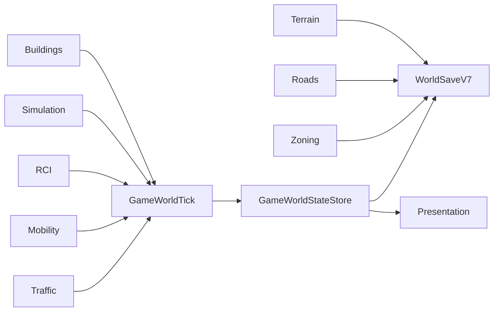

# World System

**Status:** Implemented — WorldSaveV7 Mobility/Traffic release candidate; owner visual acceptance pending 
**Primary ownership:** `packages/world-core`, `apps/game/src/world-save.ts`, `game-world-state.ts`, and `game-world-tick.ts`  
**Persistence:** versioned `world-save` envelope through `WorldSaveV7`

## Purpose

Provide shared world configuration, coordinates, result contracts, cross-system Save composition, and the application boundary that keeps Terrain, Water, Roads, Zones, Buildings, Simulation, and RCI coherent.

## Does Not Own

- Domain rules inside Terrain, Roads, Zones, Buildings, Simulation, or RCI.
- Three.js presentation, tool state, pointer state, or undo history.
- Citizen identity, housing, Employment, migration, Demand, Mobility, or Traffic domain policy.

## Current Capabilities

- Canonical map configuration and coordinate contracts.
- Shared `Result` and contract-error patterns.
- `WorldSaveV1` through `WorldSaveV7` decode and deterministic migration.
- Cross-domain environment reconstruction after load.
- Fail-closed validation of Roads, Zones, Buildings, Simulation, and RCI references.
- `GameWorldStateStore` atomically owns the currently published Simulation, Building, RCI, Economy, Mobility, and Traffic snapshots.
- `planGameWorldTick` stages Building Growth, Simulation advancement, RCI reconciliation, Mobility/Traffic progression, validation, and receipts before one world revision is published.
- Invalid or stale staged work leaves the committed world unchanged.
- Mobility and Traffic snapshots are read observationally; presentation reads cannot overwrite newer committed state.

## Ownership and State

Each domain owns its snapshot. `apps/game` owns composition, migration order, atomic publication, and the handoff to renderers/HUD. Water, occupancy maps, indexes, projections, and policy objects remain derived.

## Main Workflows

### World tick

1. Read one committed `GameWorldState`.
2. Plan Building Growth using the current RCI policy.
3. Stage Simulation and Building snapshots.
4. Plan RCI against the exact before/after Building and Simulation revisions.
5. Validate the complete staged state.
6. Replace the store once with the next world revision.
7. Update all presentation and HUD projections from committed snapshots only.

### Save/load

1. Decode Terrain and derive Water.
2. Decode Roads, Zones, Buildings, Simulation, RCI, Economy, Mobility, and Traffic in dependency order.
3. Rebuild placement environments and derived occupancy.
4. Decode `RciSaveV1`, Economy, Mobility, and Traffic, or deterministically migrate older saves from valid upstream authority.
5. Validate Traffic graph provenance against Roads/Buildings and Mobility references against RCI Home/Employment authority.
6. Reject the complete load if any domain or cross-domain invariant fails.
7. Replace the complete application world and synchronize the atomic state store.

## Integrations

## Persistence

- `WorldSaveV1`: Terrain + Roads
- `WorldSaveV2`: adds Zones
- `WorldSaveV3`: adds Buildings V1
- `WorldSaveV4`: Buildings V2 + Simulation V1
- `WorldSaveV5`: adds RCI V1
- `WorldSaveV6`: upgrades Simulation and adds Economy V1
- `WorldSaveV7`: adds Mobility V1 and Traffic V1

V1–V6 migration preserves existing authority, creates stationary Mobility state from current real RCI Citizens, and starts with no synthetic historical or catch-up Traffic trips.

## Invariants and Failure Behavior

- Save decode and world-tick publication are all-or-nothing.
- Domain revisions in a staged plan describe one coherent world transition.
- Derived Water revision matches Terrain.
- Persisted occupied cells remain valid against reconstructed environments.
- RCI evaluated ticks and references validate against decoded Building/Simulation authority.
- State replacement requires the expected world revision and exactly one next revision.
- Background ticks do not mutate active tools, previews, pointer sessions, or undo history.

## Extension Points

A new persisted system extends the world envelope with an explicit schema version, deterministic migration, decoded-state field, validation, atomic tick composition where applicable, system documentation, and compatibility tests.

## Current Limitations

The atomic store composes Simulation, Buildings, RCI, Economy, Mobility, and Traffic because those domains participate in background ticks. Terrain, Roads, Zones, and Water continue through their existing explicit world transactions and complete-world replacement boundary.

## Handoff Checklist

- Core contracts: `packages/world-core/src/index.ts`
- Save: `apps/game/src/world-save.ts`, `world-save-legacy.ts`
- Atomic state: `apps/game/src/game-world-state.ts`
- Tick orchestration: `apps/game/src/game-world-tick.ts`
- Related systems: [Terrain](../terrain/README.md), [Water](../water/README.md), [Roads](../roads/README.md), [Zoning](../zoning/README.md), [Buildings](../buildings/README.md), [Simulation Time](../simulation-time/README.md), [RCI](../rci/README.md), [Citizen Mobility](../citizen-mobility/README.md), [Traffic](../traffic/README.md)
- Accepted successor design: [ADR-0001 — WorldSaveV9 Temporal Unit Migration](adrs/0001-world-save-v9-temporal-unit-migration.md). Implementation remains deferred and does not alter the current writer in PR #83.
