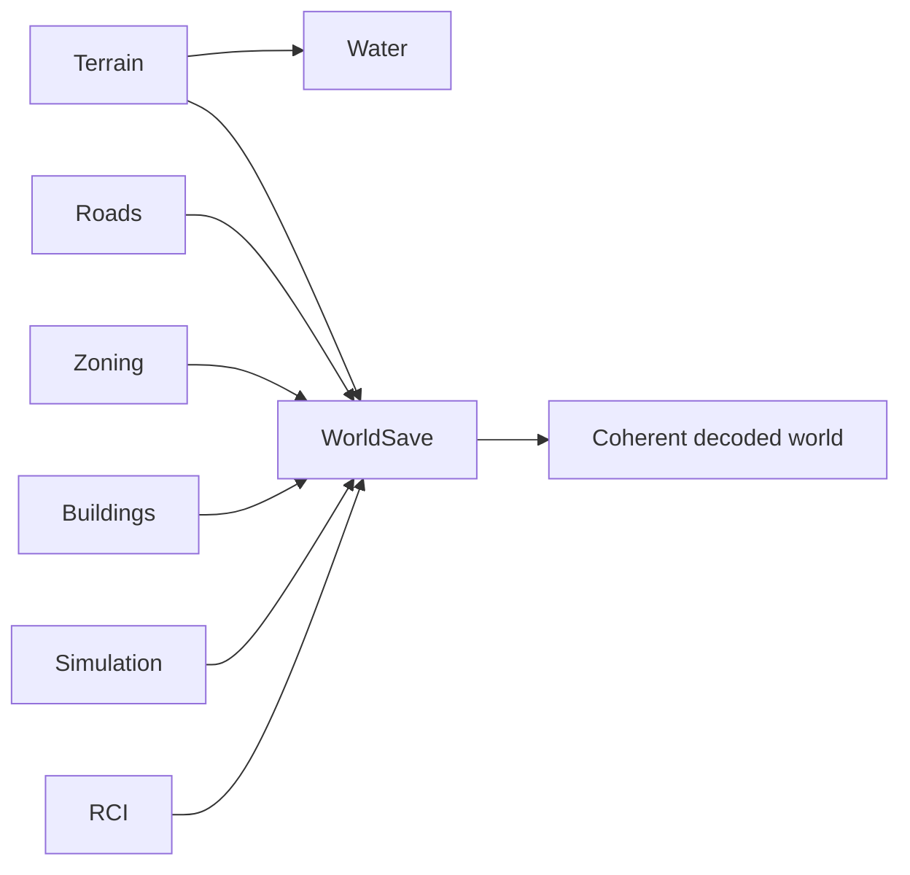

# World System

**Status:** Implemented  
**Last verified against:** `feat/rci-core-contracts-v0-1@4fde0f366aeceac1266465040eb3f852b186ca75`  
**Primary ownership:** `packages/world-core`, `apps/game/src/world-save.ts`, game transaction orchestration  
**Persistence:** versioned `world-save` envelope through `WorldSaveV5`

## Purpose

Provide shared world configuration, coordinates, result contracts, cross-system Save composition, and the application-level boundary that keeps Terrain, Water, Roads, Zones, Buildings, Simulation, and persisted RCI authority coherent.

## Does Not Own

- Domain rules for Terrain, Roads, Zones, Buildings, Simulation, or RCI.
- Three.js rendering or UI state.
- Citizen lifecycle, housing matching, Employment matching, or Demand evaluation.

## Current Capabilities

- Canonical map configuration and coordinate contracts.
- Shared `Result` and contract-error patterns used by core packages.
- `WorldSaveV1` through `WorldSaveV5` decode and deterministic migration.
- Cross-domain environment reconstruction after load.
- Validation of persisted Roads, Zones, Buildings, Water derivation, Simulation lifecycle, and RCI references.
- Fail-closed V5 decode when `RciSaveV1` is invalid or incompatible.

## Ownership and State

Each domain owns its snapshot. `apps/game` owns Save composition and migration order. Water and placement occupancy are derived and are not persisted as independent authority.

The V5 facade keeps the existing V1–V4 decoder byte-for-byte in `world-save-legacy.ts`, reducing regression risk while adding RCI composition in `world-save.ts`.

## Main Workflows

1. Decode Terrain and derive Water.
2. Decode and validate Roads, Zones, Buildings, and Simulation in dependency order.
3. Rebuild placement environments and derived occupancy.
4. For V5, decode and validate `RciSaveV1` against the decoded Building and Simulation snapshots.
5. For V1–V4, create an empty deterministic RCI snapshot at the decoded Simulation tick.
6. Reject the complete load if any domain or cross-domain invariant fails.
7. Return one coherent decoded world state.

## Integrations

## Persistence

- `WorldSaveV1`: Terrain + Roads
- `WorldSaveV2`: adds Zones
- `WorldSaveV3`: adds Buildings V1
- `WorldSaveV4`: Buildings V2 + Simulation V1
- `WorldSaveV5`: adds RCI V1

Legacy migration preserves existing domain snapshots and initializes empty RCI authority without inventing Citizens, Households, assignments, or history. Later RCI PRs extend deterministic migration with active Building inventory only when those capacity systems exist.

## Invariants and Failure Behavior

- Save decode is all-or-nothing.
- Domain revisions used in an environment must describe the same world state.
- Derived Water revision must match Terrain.
- Persisted occupied cells must remain valid against reconstructed environments.
- Completed construction cannot remain encoded as under construction at or before the saved tick.
- V5 RCI definitions, references, revisions, sequences, and evaluated ticks must validate against decoded Building and Simulation authority.

## Extension Points

A new persisted system extends the world envelope with an explicit schema version, decoder validation, deterministic migration default, decoded-state field, system documentation update, and compatibility tests. Domain rules remain outside `world-core`.

## Current Limitations

`WorldSaveV5` persists the RCI foundation, but PR 1 does not create population, Dwelling inventory, Workplace inventory, or active assignments. Atomic world-tick orchestration is delivered by RCI PR 6.

## Handoff Checklist

- Start reading: `packages/world-core/src/index.ts`, `apps/game/src/world-save.ts`, `apps/game/src/world-save-legacy.ts`
- RCI persistence: [RCI System](../rci/README.md)
- Related systems: [Terrain](../terrain/README.md), [Water](../water/README.md), [Roads](../roads/README.md), [Zoning](../zoning/README.md), [Buildings](../buildings/README.md), [Simulation Time](../simulation-time/README.md)
