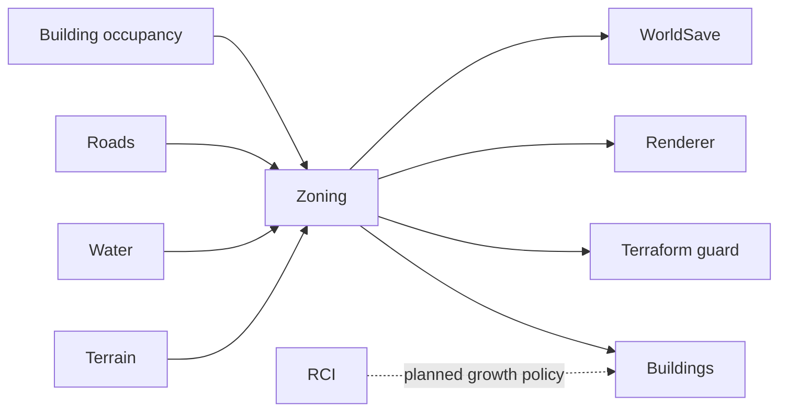

# Zoning System

**Status:** Implemented  
**Last verified against:** `master@012a644391d13e7d47135a1c0e9e3394be667871`  
**Primary ownership:** `packages/zone-core`, `packages/zone-three`, `apps/game` tool integration  
**Persistence:** `ZoneSaveV1`

## Purpose

Own Residential, Commercial, and Industrial land-use rights, deterministic paint/remove strokes, Road-access requirements, placement guards, zone rendering, and the zoned-lot input consumed by Building development.

## Does Not Own

- Building placement, construction, occupancy, or population.
- RCI demand or the decision to allow a zone category to grow.
- Road network topology or Terrain/Water authority.

## Current Capabilities

- Paint Residential, Commercial, and Industrial zones.
- Remove zones while preserving unrelated world state.
- Drag strokes with effective, unchanged, and invalid-cell reporting.
- Require a valid Road access route within the supported frontage distance.
- Reject wet, unsupported, Road-occupied, conflicting, or Building-occupied cells.
- Persist Zone codes and derive per-cell overlay colors.
- Block Terraform transactions that affect zoned cells.
- Feed eligible zoned lots to automatic Building development.

There is no manual “Develop Zone” command. Development is automatic and must not interrupt an active zoning preview or change the selected player tool.

## Ownership and State

`ZoneSnapshot.definitionCodes` and Zone revision are authoritative. Zone counts, overlays, Road-access projections, eligible lots, and UI summaries are derived.

## Main Workflow

1. Input produces an ordered stroke and requested zone operation.
2. The planner validates Terrain, Water, Road, occupancy, and current Zone revisions.
3. Cells are classified as changed, unchanged, or invalid.
4. Commit rechecks revisions and applies one immutable snapshot transition.
5. Building development and rendering read the committed Zone snapshot.

## Integrations

## Persistence

`ZoneSaveV1` stores dimensions, revision, and zone definition codes. Road access, counts, occupancy guards, and overlays are rebuilt. World-load validation checks every zoned cell against Terrain, Water, Roads, and then reconstructed Building occupancy.

## Invariants and Failure Behavior

- One zone definition code or empty state per cell.
- Zone dimensions match the world.
- Placement environments use coherent Terrain, Water, Road, and occupancy revisions.
- Every committed zoned cell satisfies Terrain, Water, Road occupancy, non-zone occupancy, and Road-access policy.
- Invalid cells may be reported without corrupting valid snapshot state.
- Stale plans never commit.

## Extension Points

Zone definitions and policy can later add density, mixed use, district rules, land value, services, or affordability. RCI must control growth through a policy input rather than moving population logic into `zone-core`.

## Current Limitations

Only three zone categories exist. No density levels, mixed-use zoning, districts, land value, desirability, abandonment, upgrade paths, or economic cost.

## Handoff Checklist

- Start reading: `packages/zone-core/src/contracts.ts`, stroke planning, Road access, serialization, and policy files
- Renderer: `packages/zone-three`
- Runtime/UI: `apps/game` zoning tools and presentation
- Related systems: [Roads](../roads/README.md), [Buildings](../buildings/README.md), [RCI](../rci/README.md)
